&emsp;&emsp;因为公司制作资产项目时，经常需要把文件发送给外包或者客户，但是一个个文件整理发送，特别是 Maya 文件位置移动后，里面使用的路径也需要更新，如果逐个文件更改路径显然非常麻烦。因此打包工具的作用就是再打包后实现打开即可用，简化打包方和接收方的操作。

&emsp;&emsp;其实早在之前就已经开发过打包工具，但是由于当时对 Qt 还不是很熟悉，没有掌握 MVC 框架的知识，而且刚接触 Cgtw，对它的接口以及使用方法都没有深入研究过，因此开发出来的工具十分拙劣，基本都是参考 Cgtw 原有的打包工具而修改开发出来的。

## 一、打包工具的更迭
1. 🙄 Cgtw 的打包工具  
&emsp;&emsp;这是 Cgtw 的自带的打包工具，只有单纯的复制文件功能。  
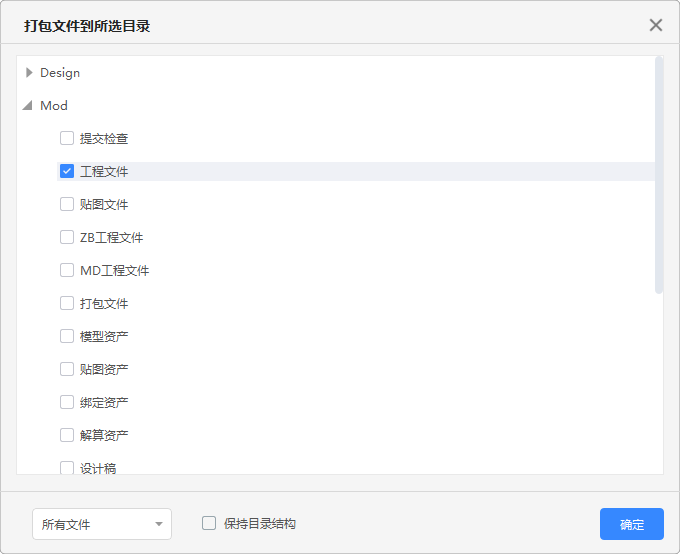  

2. 😲 打包工具 2  
&emsp;&emsp;这是模仿 Cgtw 开发出来的打包工具，添加了对 Maya 场景的处理。在 Cgtw 的界面基础上，还添加了资产/镜头、打包路径、项目、当前选择文件夹路径、文件夹显示文件列表的显示。  
&emsp;&emsp;由于没有使用 MVC 框架，像视图使用的都是 QListWidget、 QTreeWidget，而不是 QListView、QTreeView等，因此如果有修改需求，则代码改动会很大，以至于后面已经不想再维护这个工具，而是去开发新一代的打包工具。  
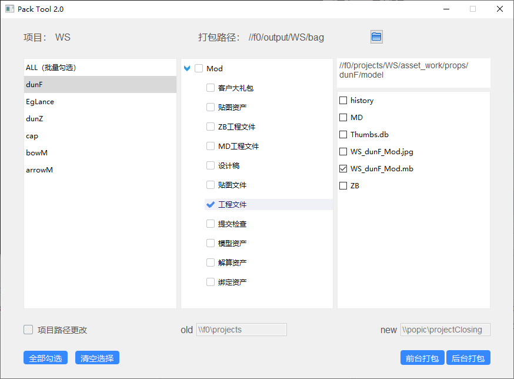  


1. 😇 打包工具 3  
&emsp;&emsp;基本上打包工具 3 已经是整个界面、内置方法全都重写了，由于是自己整理编写的，因此对里面的方法和原理都比较熟悉，下面就重点讲一下这个工具吧！  
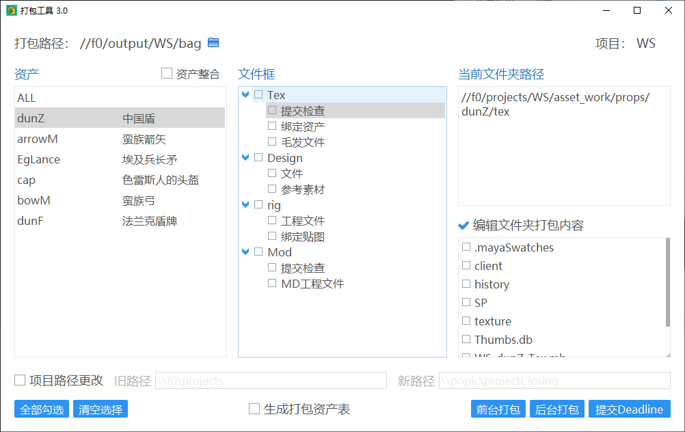  

---

## 二、功能演示说明
### 🥕 启动工具
1. Cgtw 中选中需要打包的 资产/镜头，启动 “打包工具 3.0”。  
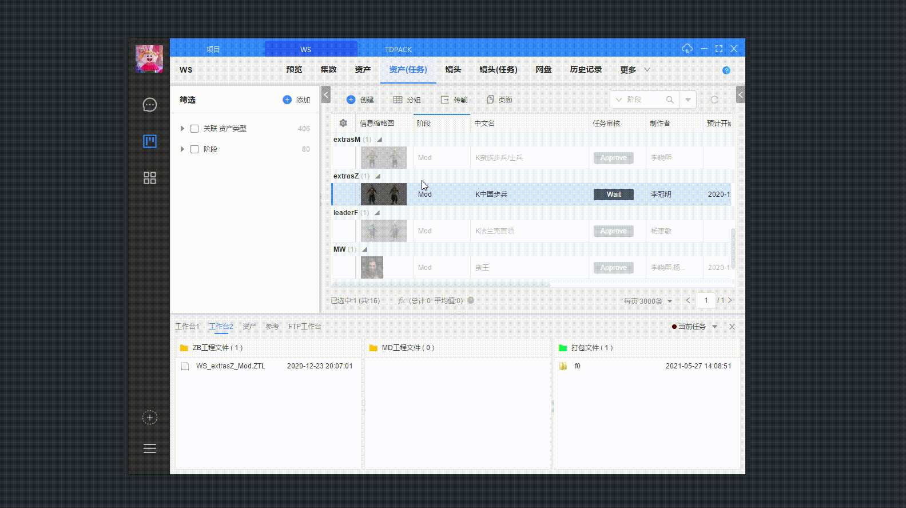

2. 等待读取打包信息、界面加载。  
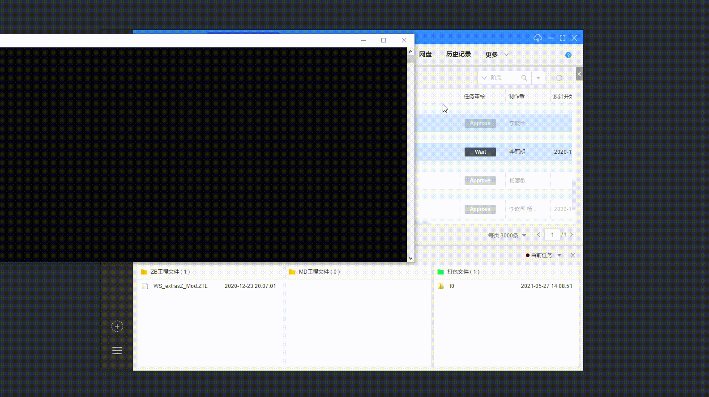

### 🥕 设置打包信息
1. 修改打包路径  
&emsp;&emsp;默认为项目设定的打包路径，如果想打包到其他文件夹也可以自行设定。  
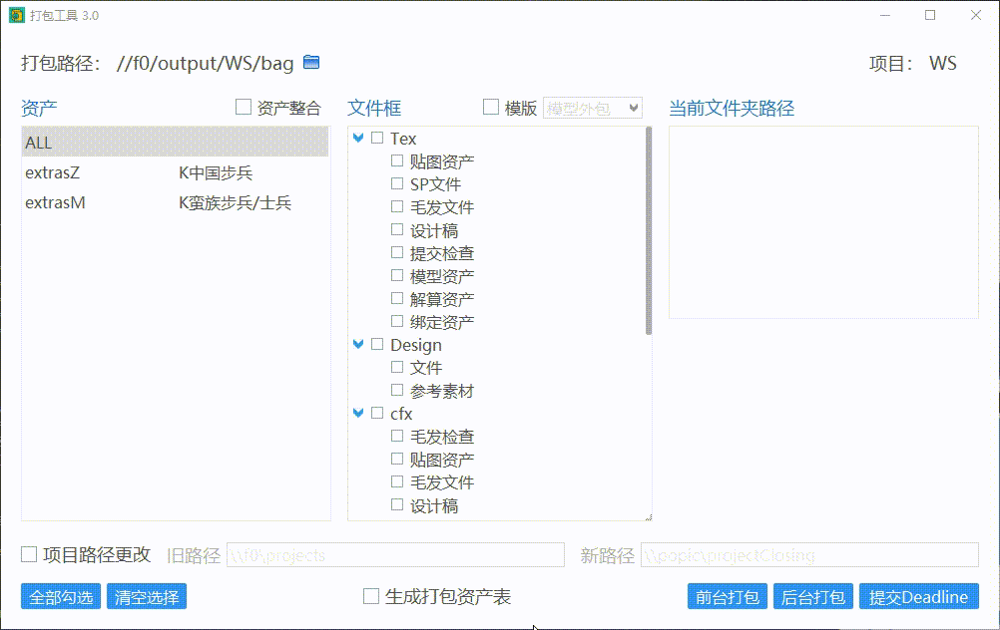

1. 资产整合  
&emsp;&emsp;对于资产打包阶段，勾选“资产整合”会对资产列表中的所有资产分别整合，对绑定、贴图、毛发阶段资产整合到一个文件里，并且输出整合信息。  
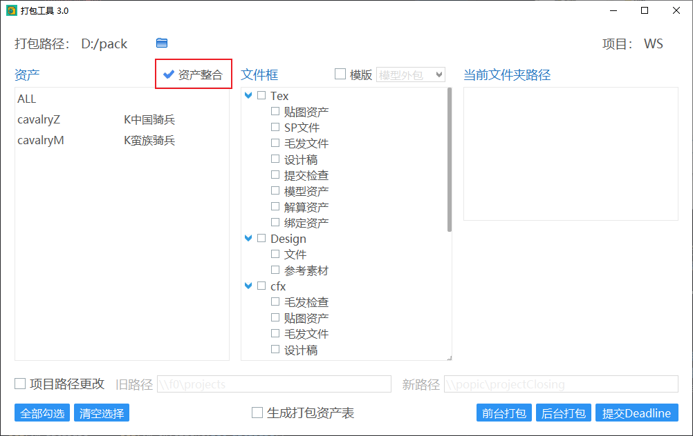

1. 使用打包模版  
&emsp;&emsp;可以通过选择预设的打包模版快速选择需要打包的文件夹。  
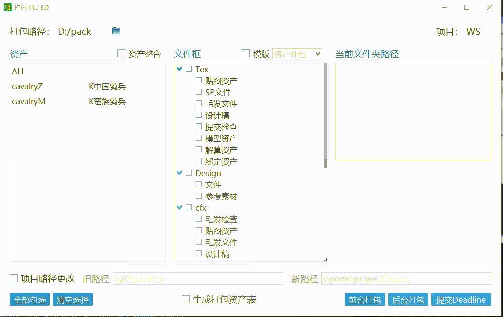

1. 项目路径更改  
&emsp;&emsp;假如项目经过移动，而maya场景文件没有修改对应引用路径，则需要通过勾选“项目路径更改”，填写新旧项目路径进行打包。  
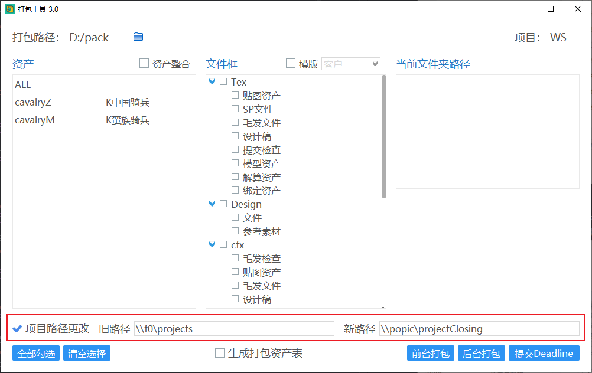

1. 批量选择  
&emsp;&emsp;在资产中选择 ALL，之后在文件框中勾选文件夹会对所有资产的文件夹进行统一勾选。  
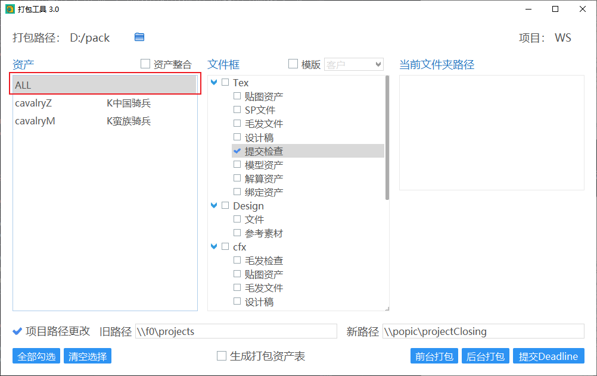

1. 勾选文件夹  
&emsp;&emsp;在选好资产后，点击文件夹，会在右边显示文件夹路径，勾选文件夹则表示该文件夹的内容会被打包。勾选阶段会把阶段以下的文件夹全部勾选。  
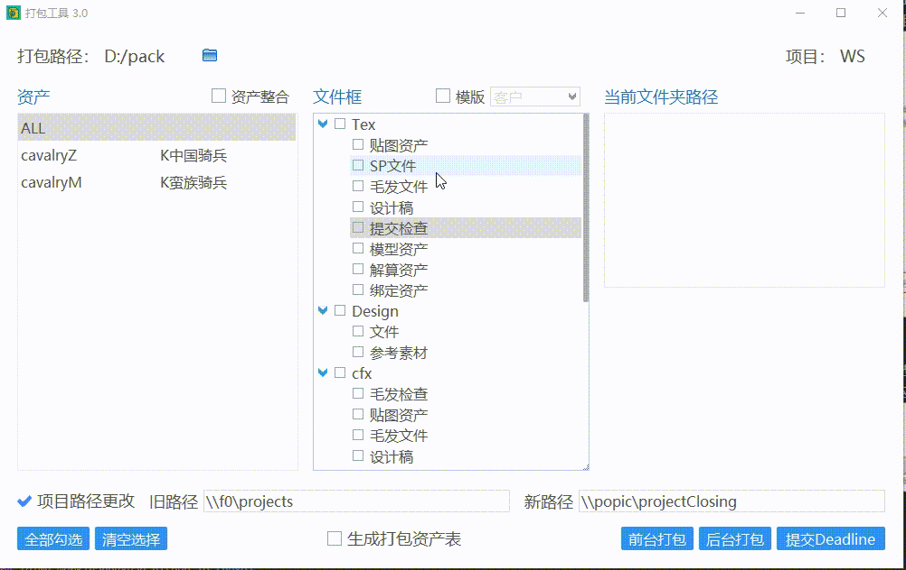

1. 编辑文件夹内打包的文件  
&emsp;&emsp;在默认情况下，该工具仅会打包 Cgtw 文件框内符合显示规则的文件和文件夹，如果需要打包文件框的其他文件，则可以在选择资产、文件框后，勾选“编辑文件夹打包内容”，再勾选需要打包的文件和文件夹。  
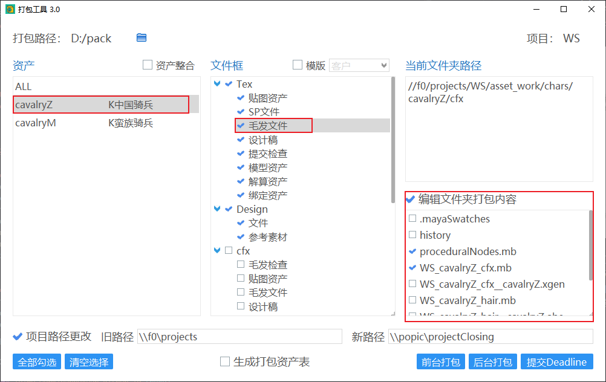

1. 生成打包资产表  
&emsp;&emsp;勾选“生成打包资产表”，在打包结束后会在打包路径下生成一个“项目打包记录表.xlsx”的文件，描述本次资产整合的情况。  
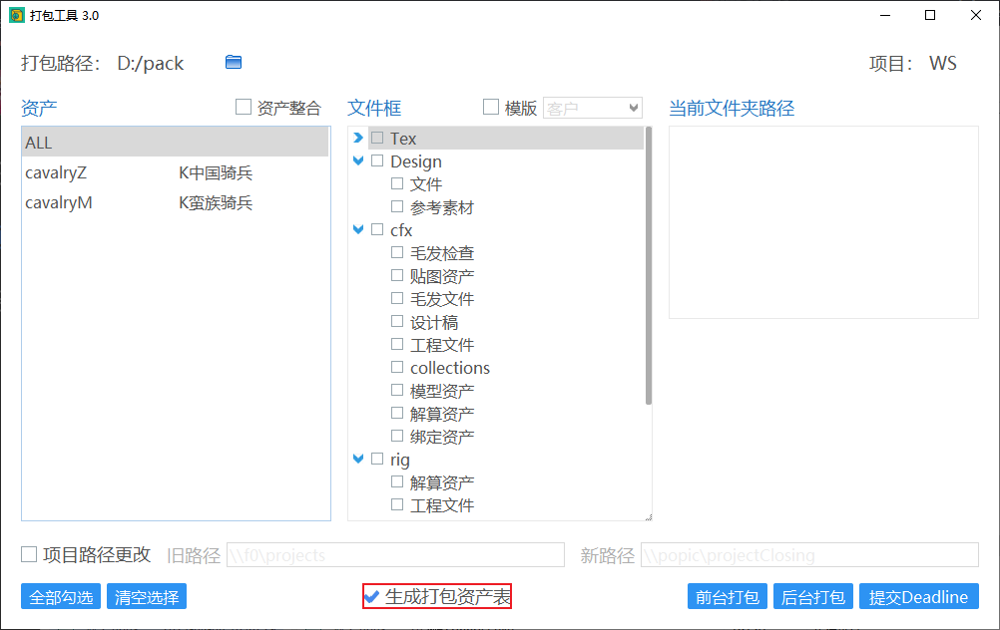  
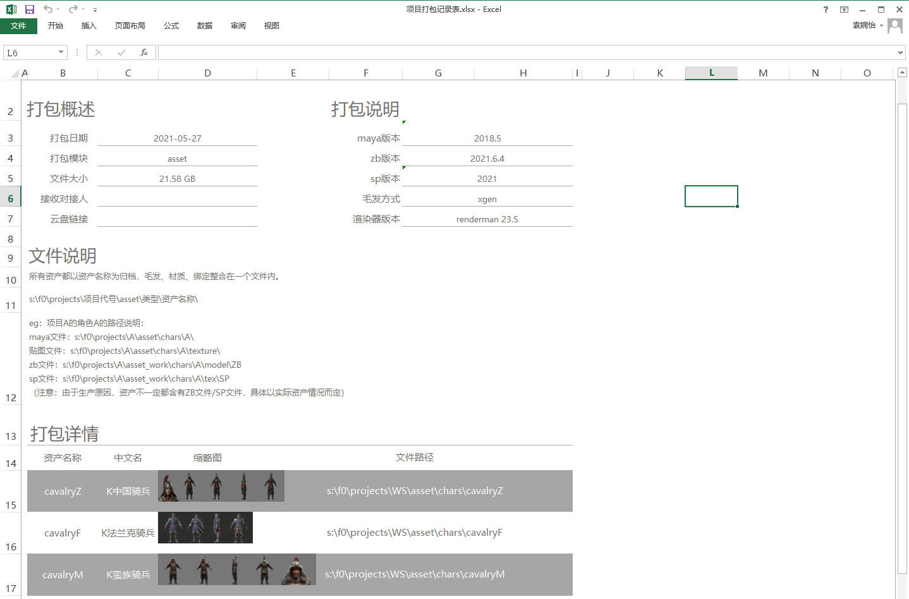

### 🥕 打包方式
&emsp;&emsp;打包方式有三种：前台打包、后台打包和提交Deadline。  
1. 前台打包：打包 maya 文件时前台打开文件进行打包。
2. 后台打包：打包 maya 文件时后台打开文件进行打包。
3. 提交Deadline：把打包任务提交到 Deadline，由渲染农场分配机器进行打包。

### 🥕 打包进度
&emsp;&emsp;如果使用前台打包或后台打包，开始打包后会弹出进度条以及打包信息窗口。  
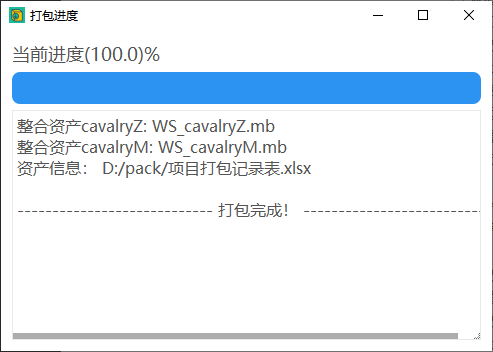

### 🥕 打包文件存放
&emsp;&emsp;所有勾选需要打包的文件都会打包到打包路径下，而且会继承原路径（整合资产除外，具体规则在“项目打包记录表”中）。
&emsp;&emsp;Maya 文件内引用的文件会放在 s: 盘符下，当外包和客户映射一个 s: 盘并把打包文件放在该盘下，打开 maya 文件后能够读取到对应的引用文件。
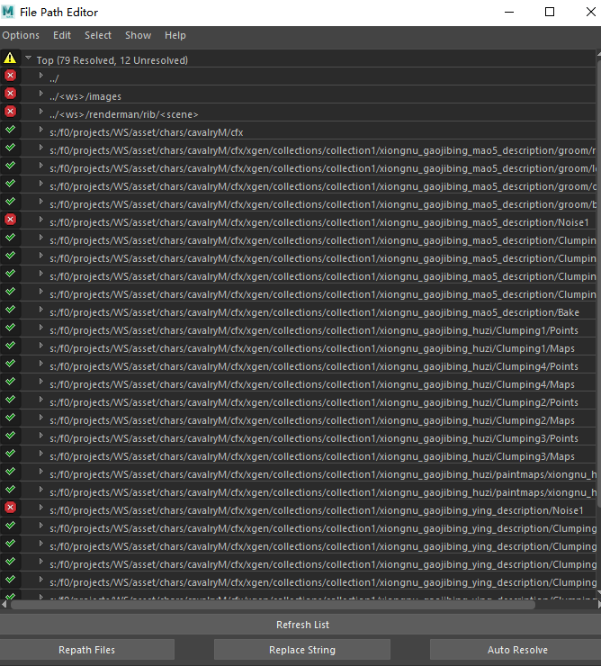

---

## 三、Cgtw 接口
&emsp;&emsp;由于是在 Cgtw 中进行工具的调用，那么在调用时肯定要通过 Cgtw 获取打包内容信息的，因此需要这些信息获取的接口。当在 Cgtw 中执行操作时（如选择制作阶段打开工具、打开文件等），Cgtw 会记录你上一个操作，可以通过接口获取对应信息。

### 获取基本数据

&emsp;&emsp;一般数据库、模块、模块类型等基本信息，都是通过 ```cgtw2.tw().client``` 获取。
```Python
import cgtw2
self.m_tw          = cgtw2.tw()
self.m_database    = self.m_tw.client.get_database()
self.m_module      = self.m_tw.client.get_module()
self.m_module_type = self.m_tw.client.get_module_type()
self.m_id_list     = self.m_tw.client.get_id()
```

&emsp;&emsp;其中：  
1. m_database 为数据库
2. m_module 为模块（asset/shot）
3. m_module_type 为模块类型
4. m_id_list 为当前选中的项id列表，如选中两项则该列表数有两个。  
    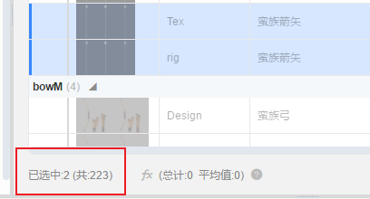

### 获取具体信息

&emsp;&emsp;通过基本数据，我们可以获取更多信息。
```Python
def get_proj_name(self):
    """获取项目名

    Returns:
        proj_name[str]: 项目名
    """
    proj_name = self.m_tw.task.get(self.m_database,self.m_module,self.m_id_list,['eps.project_code'])[0]['eps.project_code']
    return proj_name

def get_module_type_id(self, m_id):
    """获取task id

    Returns:
        task_id[str]: task id
    """
    task_id = self.m_tw.task.get(self.m_database,self.m_module,[m_id],[self.m_module_type+'.id'])[0][self.m_module_type+'.id']
    return task_id

def get_module_id(self, m_id):
    """获取module id

    Returns:
        module_id[str]: module id
    """
    module_id = self.m_tw.task.get(self.m_database,self.m_module,[m_id],[self.m_module+'.id'])[0][self.m_module+'.id']
    return module_id

def get_module_entity(self, m_id):
    """获取当前资产名/镜头号

    Returns:
        module_entity[str]: module_entity
    """
    module_entity = self.m_tw.task.get(self.m_database,self.m_module,[m_id],[self.m_module+'.entity'])[0][self.m_module+'.entity']
    return module_entity

def get_module_cn_name(self, m_id): 
    """获取资产中文名

    Returns:
        module_cn_name[str]: module_cn_name
    """
    if self.m_module == 'asset':
        module_cn_name = self.m_tw.task.get(self.m_database,self.m_module,[m_id],[self.m_module+'.cn_name'])[0][self.m_module+'.cn_name']
    else:
        module_cn_name = ''
    return module_cn_name

def get_module_link_eps(self, m_id):
    """获取镜头的关联集数

    Returns:
        module_link_eps[str]: module_link_eps
    """
    if self.m_module == 'shot':
        module_link_eps = self.m_tw.task.get(self.m_database,self.m_module,[m_id],[self.m_module+'.link_eps'])[0][self.m_module+'.link_eps']
    else:
        module_link_eps = ''
    return module_link_eps

def get_module_beizhu(self, m_id):
    """获取镜头的备注

    Returns:
        module_beizhu[str]: module_beizhu
    """
    if self.m_module == 'shot':
        module_beizhu = self.m_tw.task.get(self.m_database,self.m_module,[m_id],[self.m_module+'.beizhu'])[0][self.m_module+'.beizhu']
    else:
        module_beizhu = ''
    return module_beizhu

def get_module_image(self, m_id):
    """获取资产/镜头的缩略图

    Returns:
        img_path[str]: img_path
    """
    module_image = self.m_tw.task.get(self.m_database,self.m_module,[m_id],[self.m_module+'.image'])[0][self.m_module+'.image']
    img_path = ""
    if module_image:
        img_path = eval(module_image)[0]['min']
        img_path = os.path.join(CGTW_DISK, img_path.lstrip('/')).replace('\\','/')
    return img_path
```


&emsp;&emsp;通过 m_tw.task 获取 asset task id。选择的项中含有多少个资产则 asset_task_ids 列表就有多少个。  
```python
asset_task_ids = self.m_tw.task.get_id(self.m_database, self.m_module, [[self.m_module+'.id','=',asset_id]])
```

&emsp;&emsp;通过 asset task id 获取 pipeline 信息。  
```python
pipeline_id_info = self.m_tw.task.get(self.m_database,self.m_module,[asset_task_id],['pipeline.id',self.m_module_type+'.pipeline'])
```

&emsp;&emsp;通过 pipeline 信息获取该阶段创建的文件框信息。  
```python
pipeline_id = info['pipeline.id']
filebox_info = self.m_tw.filebox.get(db=self.m_database, module=self.m_module, module_type=self.m_module_type, field_list=['sign','#id'], pipeline_id_list=[pipeline_id])
```

&emsp;&emsp;通过 filebox 获取文件夹的名称、路径、显示类型、显示规则等信息。
```python
filebox_id = info['#id']
self.m_tw.info.get_filebox(self.m_database,self.m_module,id=module_id,filebox_id=filebox_id)
```

---

## 二、数据结构

&emsp;&emsp;当我们获取了 cgtw 的信息之后，需要将其储存起来，在需要时进行获取。在该工具中，使用了类和对象来存储数据。

&emsp;&emsp;首先，我们要清楚要实现什么样的功能：我们先在 cgtw 的某个项目中的 资产任务/镜头任务 中，选择需要打包的 资产阶段/镜头号 。工具根据选中的任务进行分析，在设定的规则上让用户选择需要打包的文件夹，最后对用户选择的内容进行打包。

&emsp;&emsp;我们梳理了工具工作流程后，可以开始分析哪些信息是需要的、关联的。当模块为资产时，关联数据为“资产 - 阶段 - 文件夹 - 文件夹内容”；当模块为镜头时，关联数据为“镜头 - 阶段 - 文件夹 - 文件夹内容”。由于关联的信息是层层递进的关系，因此利用了类的继承来保存这些信息。

### 资产/镜头节点  
&emsp;&emsp;这个节点基本定义了大部分的信息，比如节点名称、子节点、父节点、文件夹节点、勾选状态、节点中文名、节点缩略图、节点备注的信息。
```python
class Node(object):
    """资产节点/镜头节点

    Args:
        object (class): 继承object类
    """
    def __init__(self, m_data, parent=None):
        """初始化节点

        Args:
            m_data (str): 节点名称
            parent : Defaults to None.
        """
        self.__name = m_data
        self.__children = []
        self.__parent = parent
        self.__folder_node_list = []
        self.__checkState = False
        self.__cn_name = ""
        self.__image = ""
        self.__beizhu = ""
```

### 阶段节点  
&emsp;&emsp;这个节点比基础节点多了一个属性：展开折叠。该属性记录阶段是否展开。
```python
class PipeNode(Node):
    """阶段节点

    Args:
        Node (class): 继承 Node 节点
    """
    def __init__(self, m_data, parent=None):
        """初始化节点

        Args:
            m_data (str): 节点名称
            parent : Defaults to None.
        """
        super(PipeNode, self).__init__(m_data, parent)
        self.__expand = True
```

### 文件夹节点  
&emsp;&emsp;文件夹节点继承阶段节点，同时新增了一些属性：文件夹标识、路径、符合显示规则的文件列表、文件夹所属资产名、是否编辑打包文件以及编辑的文件列表。

```python
class FolderNode(PipeNode):
    """文件夹节点

    Args:
        PipeNode (class): 继承阶段节点
    """
    def __init__(self, m_data, m_info, asset, parent=None):
        """初始化节点

        Args:
            m_data (str): 节点名称
            m_info (dict): 节点路径、标识、符合显示规则的文件
            asset (asset): 节点关联的资产
            parent : Defaults to None.
        """
        super(FolderNode, self).__init__(m_data, parent)
        self.__sign = m_info['sign']
        self.__path = m_info['path']
        self.__rule_paths = m_info['rule_paths']
        self.__asset = asset
        self.__edit_children = 0
        self.__files_children = []
```

## 四、Maya 打包流程
&emsp;&emsp;当处理 Maya 文件打包时，我们会新开一个进程，用于启动 Maya 以及运行脚本。

### 创建进程
&emsp;&emsp;Qt 中的 QProcess 类可用于完成启动外部程序，并与之交互通信。
```python
process = QtCore.QProcess()
```

### 启动进程
&emsp;&emsp;启动 QProcess 进程有两种方式：
1. 传递程序以及命令行参数给 start()  
```python
process.start("programm.exe", "echo>test.txt")
```

<!--  -->


---

## 获取最大版本号的文件

&emsp;&emsp;由于制作文件的过程一般会更新很多个版本，因此需要一个方法来获取最大版本的文件。

```python
@staticmethod
def get_newset_files(fd_files):
    """获取最大版本文件 
    文件格式："v" + "版本数字" + "." + "后缀"

    Args:
        fd_files (list): 需要筛选的文件列表

    Returns:
        max_ver_files[list]: 最大版本文件列表
    """
    max_ver_files = []
    file_ver_dict = {}
    for fd_file in fd_files:
        split_info = re.split("v(?=\d)|\.", fd_file)
        if not len(split_info) == 3:
            continue
        file_start, file_ver, file_ext = split_info
        if not file_start in file_ver_dict.keys():
            file_ver_dict[file_start] = {'ver': file_ver, 'ext': file_ext}
        elif file_ver > file_ver_dict[file_start]['ver']:
            file_ver_dict[file_start]['ver'] = file_ver
    for start, info in file_ver_dict.items():
        file_path = start + 'v' + info['ver'] + '.' + info['ext']
        max_ver_files.append(file_path)
    return max_ver_files
```
