&emsp;&emsp;Deadline 是 AWS Thinkbox 旗下的产品。从接触TD这个工作以来，除了Maya外一直在和这个软件打交道，对于实现批量自动化来说是非常重要的工具。

&emsp;&emsp;记录一下我了解的方面。

## 📒仓库篇

---

### 一、连接仓库

&emsp;&emsp;像软件安装之类的就不详细阐述了，因为都是一搜一大把。

&emsp;&emsp;从仓库开始说，每个仓库相当于服务器，每台加入仓库的机器相当于客户端，需要有仓库（服务器）地址和证书才能访问仓库。

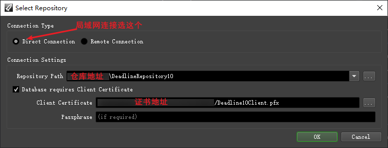

&emsp;&emsp;当然了，服务器和客户端可以在同一台机子上的。

&emsp;&emsp;❓️仓库连接失败？

&emsp;&emsp;首先检查仓库地址以及证书的访问权限，再者就是检查机器时间是不是实时，因为遇到过某些软件锁时间导致连不上 Deadline 仓库的问题。

&emsp;&emsp;📄帮助文档

&emsp;&emsp;非常建议去官方帮助文档找想实现或者修改的功能，比较详细能解决大部分的问题。虽然是全英文，但是开个翻译理解上基本是没问题的。

&emsp;&emsp;[AWS Thinkbox 综合指南](http://docs.thinkboxsoftware.com/)

&emsp;&emsp;[Deadline 指南](http://docs.thinkboxsoftware.com/)

---

### 二、仓库基本设置

&emsp;&emsp;作为一个仓库管理员，除了搭建仓库外，肯定少不了对仓库进行配置。

&emsp;&emsp;💡通过下图可以进入仓库设置页面。

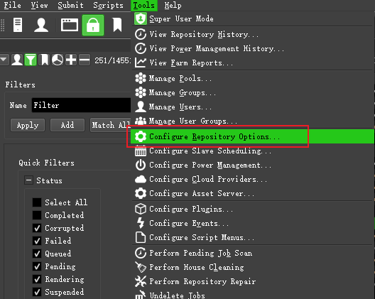

⭐️ **说下常用设置**

1. 开启远程设置  
    按如图设置就可以对机器发送远程命令啦。  
    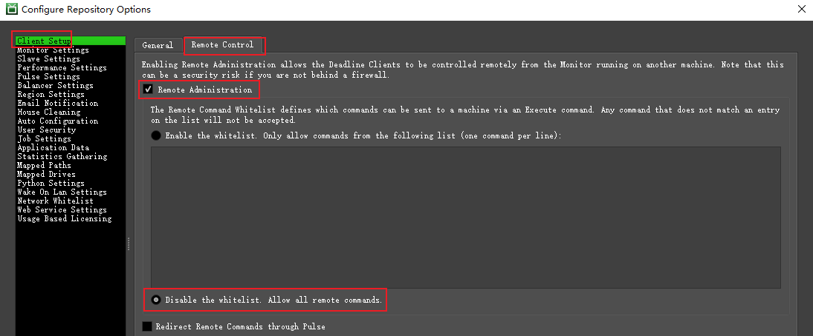  
    发送命令步骤：
    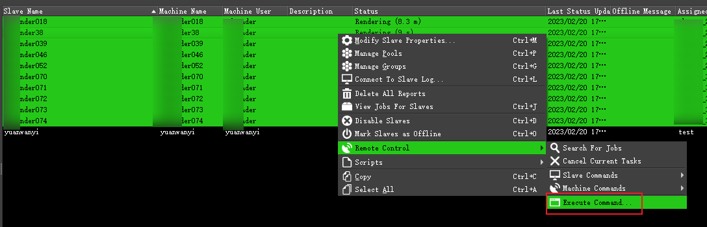  
    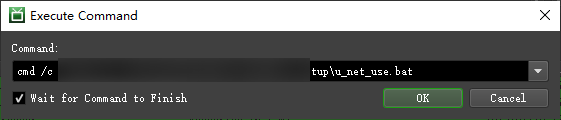
1. 管理员密码
    默认创建仓库后是没有管理员密码的，可以在这里设置  
    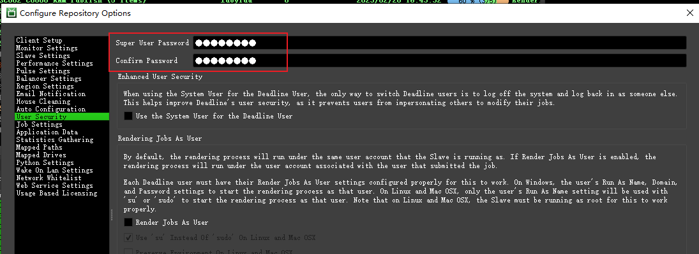
1. 任务优先度调配
    默认是 Pool（池） -> Priority（优先度） -> First-In First-Out（队列）  
    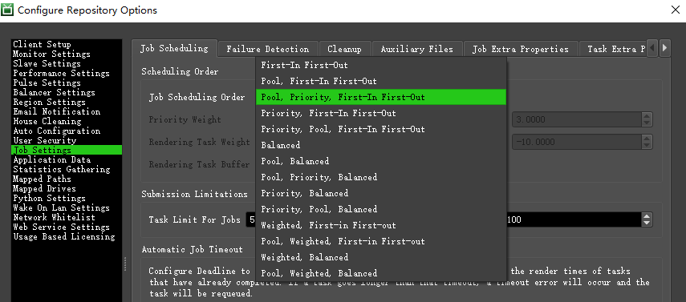
1. 任务Failed设置
    当任务运行失败次数超过指定次数，会爆红标记为“Failed”状态  
    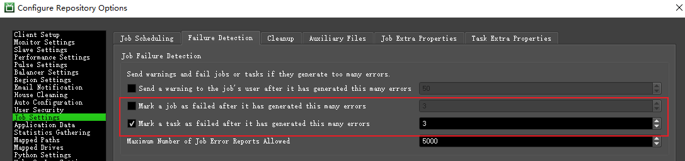
1. 自动清理任务
    一般过长时间的Complete任务可以通过设置该参数自动删除清理  
    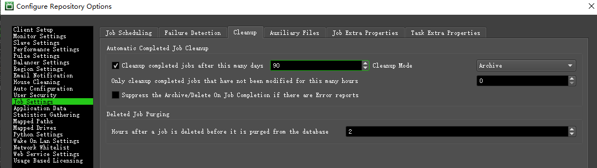

---

### 三、仓库插件配置

&emsp;&emsp;通过这里进入插件配置。

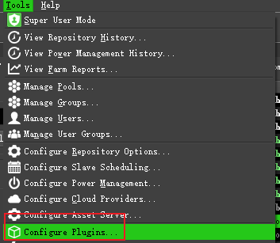

&emsp;&emsp;😂但是呢，修改配置还是要到仓库的配置文件中修改的。

#### MayaBatch新增版本

&emsp;&emsp;以新增MAYA2018为例。括号内容需要删掉并把前面的内容按需修改。

1. 配置文件夹路径：```xxx\DeadlineRepository10\plugins\MayaBatch```
1. MayaBatch.param  
    添加以下代码：  

    ```txt
    [RenderExecutable2018_0]
    Type=multilinemultifilename
    Category=Render Executables
    CategoryOrder=0
    Index=15（这个根据文件实际数量修改）
    Label=Maya 2018 Render Executable
    Default=C:\Program Files\Autodesk\Maya2018\bin\MayaBatch.exe（MayaBatch路径）;/usr/autodesk/maya2018/bin/maya;/Applications/Autodesk/maya2018/Maya.app/Contents/bin/maya;/usr/autodesk/mayaIO2018/bin/maya
    Description=The path to the Maya 2018 executable file used for rendering. Enter alternative paths on separate lines.
    ```

1. MayaBatch.py  
    假如想调用，但是又不想传入Maya文件打开，只是单独执行一下mel的话，需要修改以下代码（总共有两处）。 因为默认的判断方式是，如果检测到文件名为空，就会直接让任务Failed掉。  
    * 源代码：

        ```python
        scriptBuilder.AppendLine( 'string $checkScene = `file -q -sn`;' )
        scriptBuilder.AppendLine( 'if ($checkScene=="" && $sceneName!="")' )
        ```

    * 修改后的代码：

        ```python
        scriptBuilder.AppendLine( 'string $checkScene = `file -q -loc`;' )
        scriptBuilder.AppendLine( 'if ($checkScene=="" && $sceneName!="")' )
        ```

#### Python新增版本

&emsp;&emsp;以新增Python3.7为例。括号内容需要按需修改。

1. 配置文件夹路径：```xxx\DeadlineRepository10\plugins\Python```
1. Python.param  
    添加以下代码：  

    ```txt
    [Python_Executable_3_7]
    Type=multilinemultifilename
    Label=Python 3.7 Executable
    Category=Python Executables
    CategoryOrder=0
    Index=12（这个根据文件实际数量修改）
    Default=xxx\SoftWare\Tools\Python37\python.exe（Python的路径）;/usr/bin/python
    Description=The path to the Python executable. Enter alternative paths on separate lines.
    ```

1. Python.options  
    找到这里的位置，添加3.7

    ```txt
    [Version]
    Type=enum
    Values=2.3;2.4;2.5;2.6;2.7;3.0;3.1;3.2;3.3;3.4;3.5;3.6;3.7（添加3.7）
    Label=Version
    Category=Python Options
    CategoryOrder=0
    Index=2
    Description=The version of Python to use.
    Required=false
    DisableIfBlank=true
    ```

1. 最后，请在Python插件页面勾选加载！  
    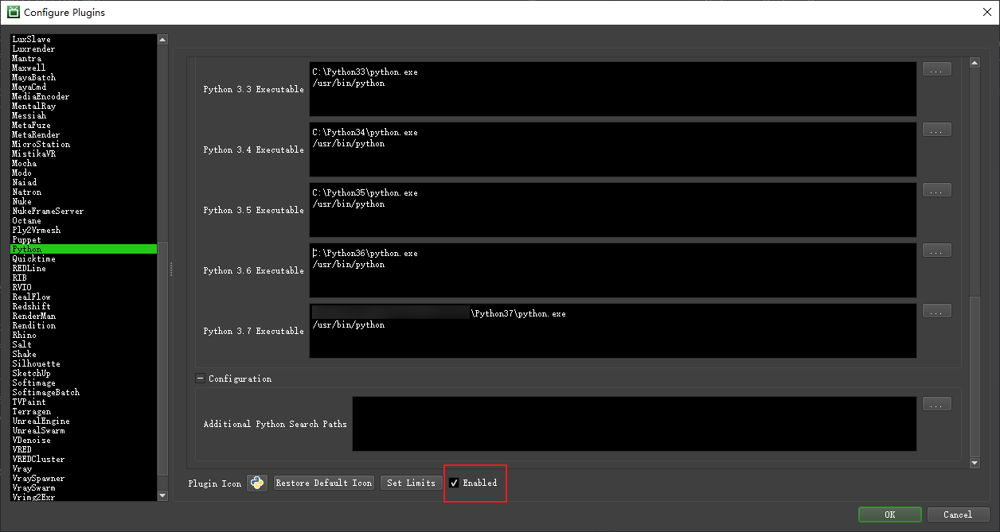

---

&emsp;&emsp;仓库篇就先讲这么多，后篇就开始讲任务提交相关的吧。
