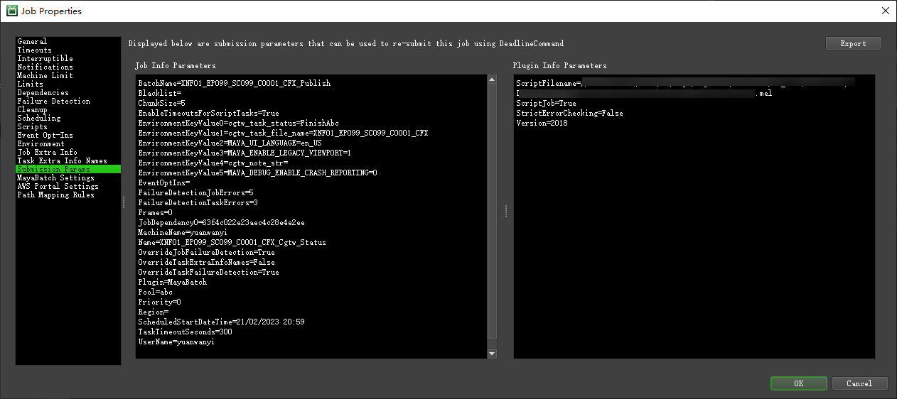
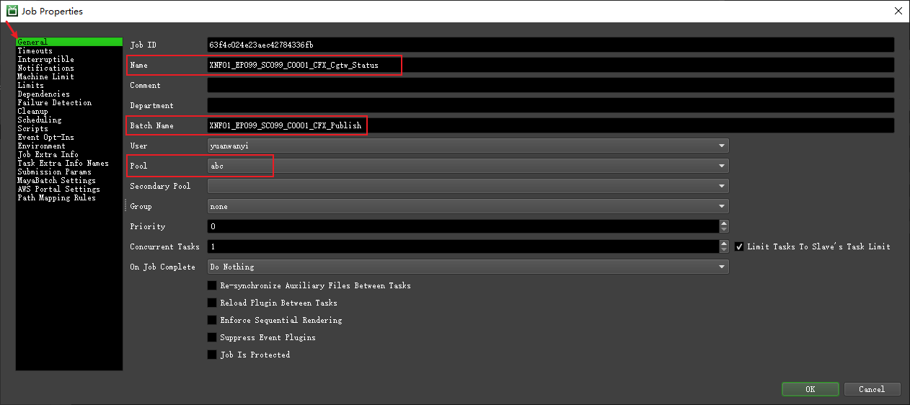
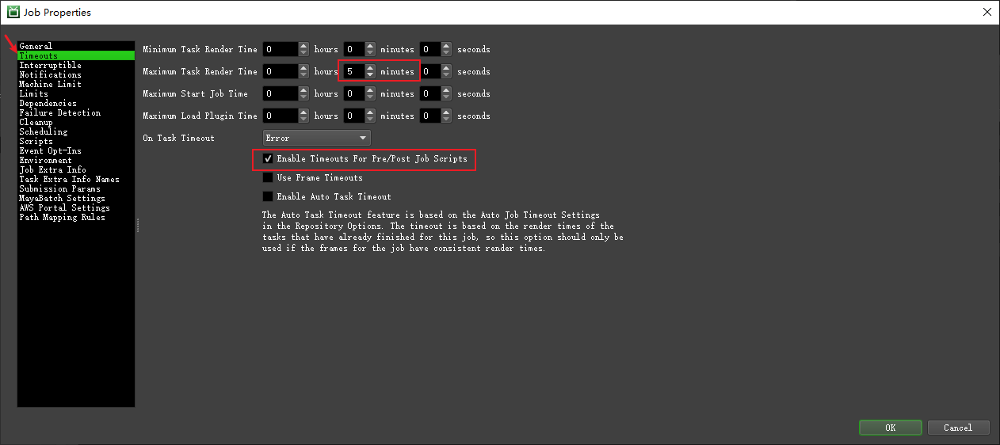
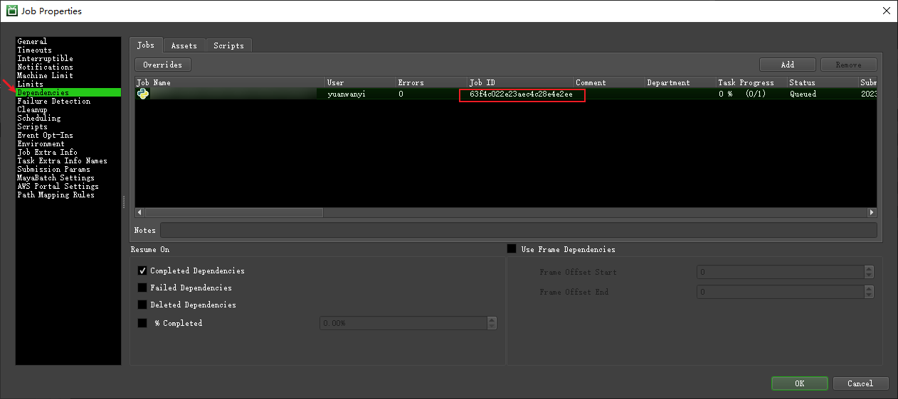
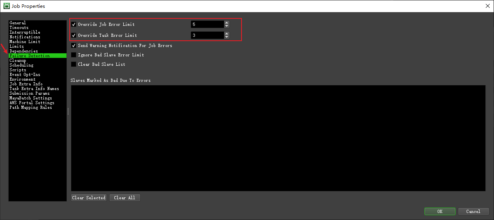
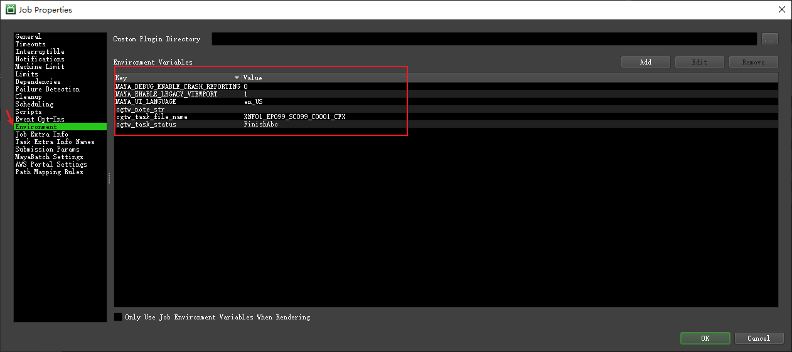
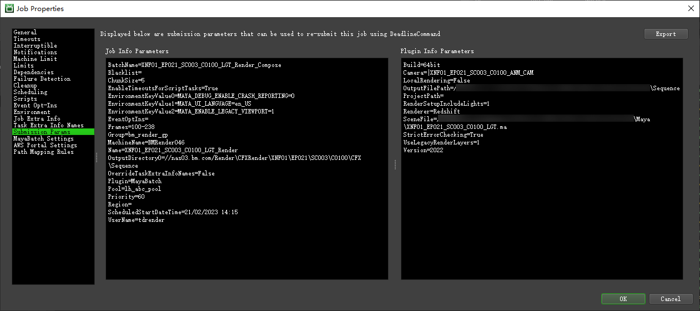

&emsp;&emsp;讲完仓库配置，要开始进行代码提交任务到 Deadline 去跑了！🚙🚙🚙

## 📒提交篇

---

### 一、JobInfo 和 PluginInfo 文件

&emsp;&emsp;Deadline的任务提交，简单总结就是提交一个“JobInfo.job”文件和一个“PluginInfo.job”文件。

&emsp;&emsp;JobInfo.job 文件，任务具体的配置。

&emsp;&emsp;PluginInfo.job 文件，插件（执行载体）具体的配置。

&emsp;&emsp;其实在每个 Deadline 任务的属性页面中，都可以看到有这一页，这些信息内容就来自JobInfo 和 PluginInfo 文件。  



&emsp;&emsp;以该任务为示例，这俩文件大概长这样 👀：

#### JobInfo.job

```txt
OverrideTaskExtraInfoNames=false
BatchName=XNF01_EP099_SC099_C0001_CFX_Publish
ChunkSize=5
Name=XNF01_EP099_SC099_C0001_CFX_Cgtw_Status
MachineName=yuanwanyi
Priority=0
Frames=0
Group=none
Plugin=MayaBatch
Pool=abc
JobDependencies=63f4c022e23aec4c28e4e2ee
EnableTimeoutsForScriptTasks=true
TaskTimeoutMinutes=5
FailureDetectionJobErrors=5
FailureDetectionTaskErrors=3
OverrideJobFailureDetection=true
OverrideTaskFailureDetection=true
EnvironmentKeyValue0=cgtw_task_file_name=XNF01_EP099_SC099_C0001_CFX
EnvironmentKeyValue1=cgtw_task_status=FinishAbc
EnvironmentKeyValue2=cgtw_note_str=
EnvironmentKeyValue3=MAYA_UI_LANGUAGE=en_US
EnvironmentKeyValue4=MAYA_DEBUG_ENABLE_CRASH_REPORTING=0
EnvironmentKeyValue5=MAYA_ENABLE_LEGACY_VIEWPORT=1
```

&emsp;&emsp;♪ 这个文件记录了任务提交到 Deadline 上的基本参数设置。挑几个常用参数来说：

- BatchName：任务打组的组名
- Name：任务名
- MachineName：提交任务的机器名
- Priority：任务优先度
- Frames：渲染帧范围
- Plugin：任务使用的插件
- Group：分配执行的组
- Pool：分配执行的池
- JobDependencies：任务依赖，通过传入 JobID ，等待指定任务完成后才开始执行
- EnableTimeoutsForScriptTasks：设置超时任务，默认为 false
- TaskTimeoutMinutes：设置超时时间，超过后任务自动 Failed，需要配合 EnableTimeoutsForScriptTasks 为 true 使用
- EnvironmentKeyValue0：环境变量名和值，后面的数字根据设置的变量数量递增

&emsp;&emsp;♩ 仔细对比你会发现，有一些参数在文件里有，但是在 Deadline 任务的 Submission Params 页面是找不到的，这是因为任务成功提交后，一些参数记录到别的页面中去了。  











- PluginInfo.job

```txt
Version=2018
StrictErrorChecking=False
ScriptFilename=***/***.mel
ScriptJob=True
```

&emsp;&emsp;♪ 这个文件就简单很多了。

- Version：插件的版本（这里指Maya2018）
- ScriptFilename：Mel脚本

#### 2. 提交任务

&emsp;&emsp;🔺这两个文件准备好之后，运行一下这段 Python 代码，啪的一下，提交！

```python
def submit_single_job(job_info_path, plugin_info_path):
    """通过jobInfo, pluginInfo两个文件，提交单个Deadline任务

    Args:
        job_info_path (str): JobInfo文件路径
        plugin_info_path (str): PluginInfo文件路径

    Returns:
        jobID: 返回提交的任务id
    """
    # 这里的deadline_path是 'deadlinecommand.exe' 位置完整路径
    deadline_path = os.path.join('【Deadline安装目录】', 'deadlinecommand.exe')
    submit_cmd = '"%s" %s %s' % (deadline_path, job_info_path, plugin_info_path)
    res = subprocess.Popen(submit_cmd, shell=True, stdout=subprocess.PIPE)
    for l in res.stdout.readlines():
        if str(l).startswith('JobID'):
            jobID = str(l).lstrip('JobID=').rstrip(r'\r\n').strip()
            return jobID
```

### 二、提交 MayaBatch MEL 脚本任务

&emsp;&emsp;MayaBatch 的提交原理很简单，就是传入一个 MEL 文件，让 MayaBatch 后台去执行这个 MEL文件就可以了。

&emsp;&emsp;上面的示例就是该任务类型。

---

### 三、提交 MayaBatch 渲染任务

&emsp;&emsp;与提交 MayaBatch MEL 脚本任务不同的是，两个 Job 文件的提交参数要丰富一点。比如 JobInfo 里的 ChunkSize、Frames ；PluginInfo 里的 SceneFile、ProjectPath、UseLegacyRenderLayers、RenderSetupIncludeLights、Build、Camera、Renderer、LocalRendering、OutputFilePath。



---

### 四、提交 Python 任务

&emsp;&emsp;Python 的话，自由度就很高了，只要你加载了 Python 插件，传进去一个 py 文件让它执行就好了。

&emsp;&emsp;讲述一种用 Python 前台打开 Maya 并执行脚本的提交方法。本质上和 MayaBatch 执行 Mel 脚本是一样的，只是在调用 Maya.exe 执行 Mel 脚本的时候，用了一层 Python 包装。

```python.exe run_maya.py```

```python
# run_maya.py
os.system('xxx/maya.exe xxx/xxx.mel')
```

&emsp;&emsp;值得一提的是，怎么把前台 Maya 的脚本编辑器信息输出到 Deadline 任务 log 里呢？在 Maya 中有一个环境变量叫 MAYA_CMD_FILE_OUTPUT，把该变量指定一个临时 log 文件，就会把日志信息内容记录在 log 文件中。

🎺 以下是详细的提交代码示例。

```python
# Maya.exe 路径
maya_exe_path = sys.argv[1]
# xxx.mel 路径
mel_path = sys.argv[2]

# 通过注册表查找 Maya.exe 路径
string = r'SOFTWARE\Autodesk\Maya\{}\Setup\InstallPath'.format(2018)
handle = winreg.OpenKey(winreg.HKEY_LOCAL_MACHINE, string)
location, __type = winreg.QueryValueEx(handle, 'MAYA_INSTALL_LOCATION')
maya_exe_path = location + r'bin\maya.exe'
if not maya_exe_path:
    raise RuntimeError('No Found Maya !')

# 用 QProcess 提交进程
process = QProcess()
# 创建一个收集 Maya 输出信息的临时文件
temp = tempfile.NamedTemporaryFile(mode='w+t',delete=False)
temp_file_name = temp.name

arg = ['-script', mel_path, '-noAutoloadPlugins']
_env = QProcessEnvironment.systemEnvironment()
# 指定 Maya 输出信息记录文件
_env.insert('MAYA_CMD_FILE_OUTPUT', temp_file_name)
# 设置 Maya 启动语言
_env.insert('MAYA_UI_LANGUAGE', 'en_US')
# 关闭 Maya 崩溃报错功能
_env.insert('MAYA_DEBUG_ENABLE_CRASH_REPORTING', '0')

# 设置进程环境变量
process.setProcessEnvironment(_env)
# 启动进程
process.start(maya_exe_path, arg)
# 等待进程结束
while not process.waitForFinished():
    if process.state() == QProcess.NotRunning:
        break
    pid = process.processId()
    if not psutil.pid_exists(pid):
        break

# 读取日志信息并打印
with open(temp_file_name, 'r+') as f:
    info = f.readlines()
for i in info:
    print(i)

temp.close()
os.remove(temp_file_name)
```
