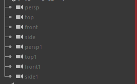
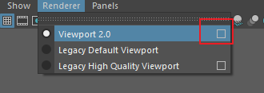
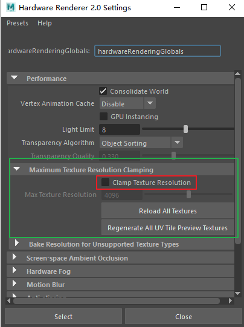
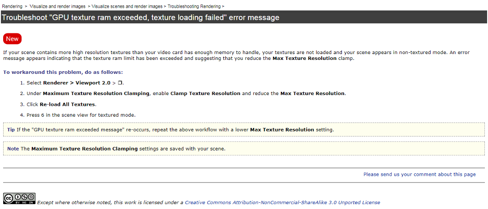

&emsp;&emsp;由于工作中经常遇到Maya中奇奇怪怪的问题上，所以总结一下一些遇到的小问题。

### 🎥 <font color=FireBrick>文件中多余的相机无法删除</font>


&emsp;&emsp;<font color=orange>原因：</font>相机重复出现可能是因为在导入或参考时出错了，需要把相机设置成非默认摄像机才可以删除。

&emsp;&emsp;<font color=orange>解决：</font>选中需要删除的相机执行。

```mel
// MEL
string $selection[] = `ls -selection -long`;
string $object;
for ( $object in $selection ) {
camera -e -startupCamera false $object;
lockNode -lock off $object;
delete $object;
}
```

```python
# python
cams = cmds.ls(sl=1)
for cam in cams:
cmds.camera(cam,startupCamera=0,edit=1)
cmds.lockNode(cam,lock=0)
cmds.delete(cam)
```

### 🌄 <font color=FireBrick>内存不足，纹理加载失败警告</font>

&emsp;&emsp;<font color=orange>原因：</font>场景中包含多个高分辨率纹理，以致您的显卡没有足够的内存来处理，则不会加载这些纹理并以非纹理模式显示该场景。


&emsp;&emsp;<font color=orange>解决：</font>
1. 选择渲染器 > Viewport 2.0 (Renderer > Viewport 2.0) > 。  

2. 在“最大纹理分辨率钳制”(Maximum Texture Resolution Clamping)下，启用“钳制纹理分辨率”(Clamp Texture Resolution)并减小“最大纹理分辨率”(Max Texture Resolution)。  

3. 单击“重新加载所有纹理”(Re-load All Textures)。
4. 在带纹理的模式的场景视图中按 6。

&emsp;&emsp;<font color=orange>官方解决方式参考：</font>


	


🖌 待续未完...
