## L0 初识帮助文档
- Maya脚本编辑器
- Maya帮助文档的查阅方法
- Mel与Python写法区别

### 练习
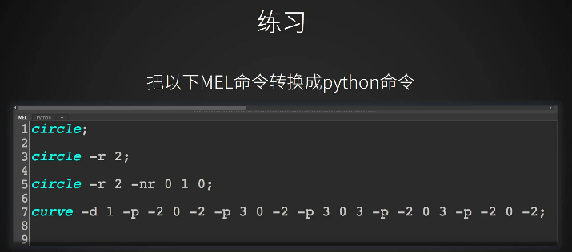

```python
import maya.cmds as cmds
cmds.circle()
cmds.circle(r=2)
cmds.circle(r=2,nr=(0,1,0))

cmds.curve(d=1,p=[(-2,0,-2),(3,0,-2),(-2,0,3),(-2,0,-2)])
```


## L1 获取场景内操作对象
1. 什么时候用到获取操作对象？
   1. 当我们需要对物体进行操作时
   2. 给物体分组、分类

2. 可以通过什么途径获取对象？
   1. 通过对象名字
   2. 按照类型找到一类物体
   3. 通过UUID找到固定对象（maya中名字可能重复又，但UUID是唯一的）

### ls 获取对象

| 命令                               | 说明                                                                                                        |
|------------------------------------|-----------------------------------------------------------------------------------------------------------|
| cmds.ls()                          | 列举场景内的所有节点                                                                                        |
| cmds.ls(sl=1)                      | 列举选择的节点                                                                                              |
| cmds.ls(typ='mesh')                | 列举所有类型为'mesh'的节点在python中，type是可以看一个实例或变量的类型，在maya中为了避免冲突，因此使用typ简称 |
| cmds.ls(typ=('mesh','nurbsCurve')) | 使用元组同时列举多重类型的物体                                                                              |
| cmds.ls(typ='mesh',long=1)         | 使用long参数列举出长名                                                                                      |
| cmds.ls(et='transform')            | 列举不含骨骼和其他从transform拓展而来的transform类型节点                                                    |
| cmds.ls(ext='transform')           | 列举除了transform节点以外的其他节点                                                                         |
| cmds.ls('\*_cn_\*')                | 列举名字中含有'_cn_'的所有节点，*代表无数个字符，?代表一个字符                                                |
| cmds.ls('具体uuid数值')            | 获取具体uuid的物体                                                                                          |

- ls命令详解
   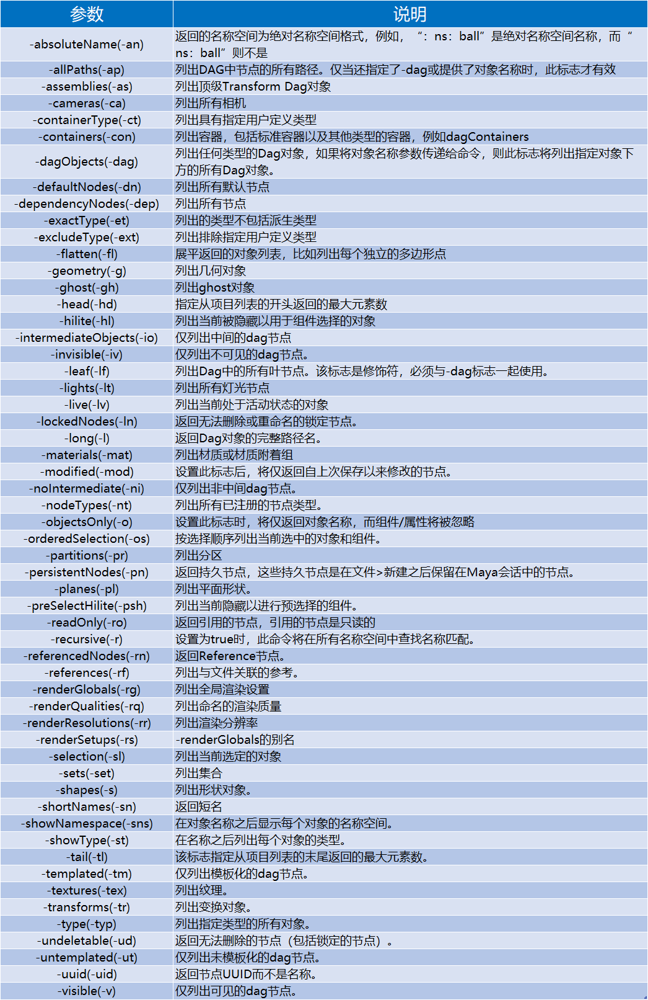

### rename 更改节点名字命令
使用方法：
```python
cmds.rename(oldName,newName)
```
返回类型：

&emsp;&emsp;节点新名称

### 练习
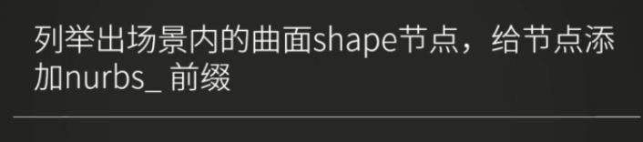
```python
cam_sh = cmds.ls(cameras=1)
f_sh = list(set(cmds.ls(shapes=1)).difference(set(cam_sh)))
for f in f_sh:
        new_name = 'nurbs_{}'.format(f)
        cmds.rename(f,new_name)
```
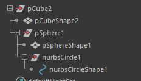 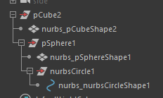


## L2 获取、改变场景内层级关系
1. 为什么要处理层级关系？
   1. 规范文件层级
   2. 便于工具识别
   3. 便于人工整理

### listRelatives命令示例

| 命令                                            | 说明                                         |
|-------------------------------------------------|--------------------------------------------|
| cmds.listRelatives('Mery_grp',p=1)              | 获取'Mery_grp'的父层级物体 p-parent          |
| cmds.listRelatives('Mery_grp',c=1)              | 获取'Mery_grp'的子层级物体 c-children        |
| cmds.listRelatives('Mery_grp',ad=1)             | 获取'Mery_grp'的所有子物体 ad-allDescendents |
| cmds.listRelatives('Mery_grp',ad=1,typ='joint') | 获取'Mery_grp'的所有类型为骨骼的子物体       |
| cmds.listRelatives('Mery_grp',ad=1,f=1)         | 获取'Mery_grp'的所有子物体的长名 f-fullPath  |
| cmds.parent('pSphere1','Mery_grp')              | 把'pSphere1'物体放到'Mery_grp'层级下         |
| cmds.parent('pSphere1',world=1)                 | 把'pSphere1'物体放到世界层级下               |
| cmds.group(cmd.ls(sl=1),name='ball_grp')        | 把选择的物体打组，组名为'ball_grp'            |

### listRelatives命令参数说明
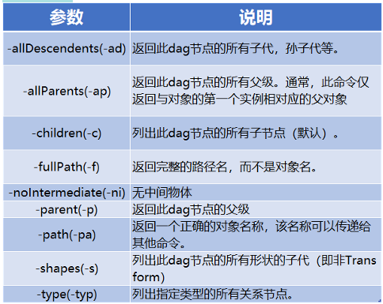

### parent命令参数说明
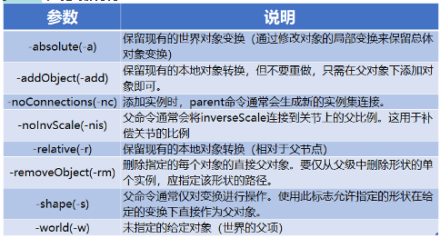

### group命令参数说明
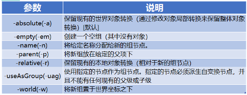

### 练习
根据物体类型，给物体分组。
```python
dag_objs = cmds.ls(dagObjects=1,shapes=1)
cam_objs = [u'frontShape', u'perspShape', u'sideShape', u'topShape']
sort_objs = list(set(dag_objs).difference(set(cam_objs)))

for obj in sort_objs:
        typ_name = cmds.nodeType(obj)
        if not cmds.objExists(typ_name):
                cmds.group(name=typ_name,empty=1,world=1)
        cmds.parent(cmds.listRelatives(obj,parent=1)[0],typ_name)
```
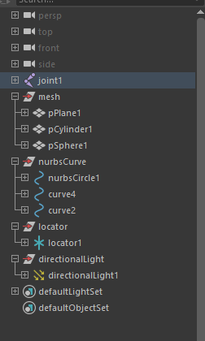


## L3 获取、更改物体位置
- 变换属性：移动、旋转、缩放
- 自身坐标与世界坐标

### 命令示例
| 命令                             | 示例                                               |
|----------------------------------|--------------------------------------------------|
| cmds.move(0,1,0,'pCube1',r=1)    | 'pCube1'物体向Y轴移动1单位 r-relative(自身坐标)    |
| cmds.move(0,1,0,'pCube1',a=1)    | 'pCube1'物体移动到(0,1,0)位置 a-absolute(世界坐标) |
| cmds.rotate(0,10,0,'pCube1',r=1) | 'pCube1'物体向Y轴旋转10度 r-relative(自身坐标)     |
| cmds.rotate(0,10,0,'pCube1',a=1) | 'pCube1'物体Y轴旋转到10度 a-absolute(世界坐标)     |
| cmds.scale(1,5,1,'pCube1',r=1)   | 'pCube1'物体Y轴方向放大5倍 r-relative(自身坐标)    |
| cmds.scale(1,1,1,'pCube1',a=1)   | 'pCube1'物体恢复默认缩放状态 a-absolute(世界坐标)  |

### 利用xform传递位移、旋转、缩放信息（自身坐标）
```python
loc_tx = cmds.xform('locator1',q=1,t=1)
cmds.xform('pSphere1',t=loc_tx)
```
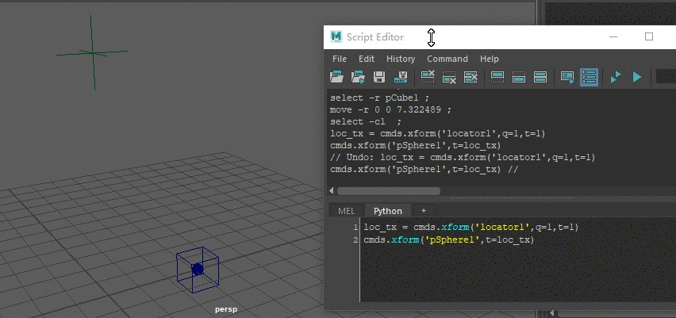

### 利用xform传递位移、旋转、缩放信息（世界坐标）
```python
loc_tx = cmds.xform('locator1',q=1,t=1)
cmds.xform('pSphere1',t=loc_tx,ws=1)
```
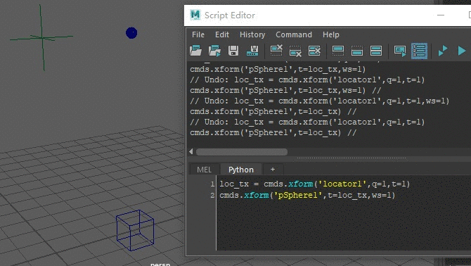

### xform命令参数说明
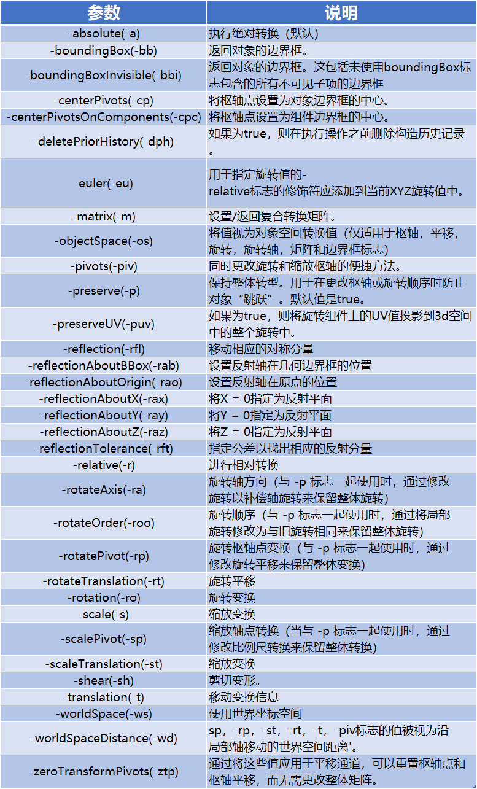

### 练习
使用 xform 匹配两个角色的pose信息

思路：同一个角色reference两次，给一个角色摆好pose之后，让另一个角色进行pose的匹配。

```python
sel1,sel2 = cmds.ls(sl=1)
import pymel.core as pm
sel1_ns = pm.PyNode(sel1).namespace()
sel2_ns = pm.PyNode(sel2).namespace()
for n_curve in cmds.listRelatives(sel1,allDescendents=1,typ='nurbsCurve',fullPath=1):
        n_curve = cmds.listRelatives(n_curve,parent=1)[0]
        n_tx = cmds.xform(n_curve,q=1,translation=1)
        n_ro = cmds.xform(n_curve,q=1,rotation=1)

        cmds.xform(n_curve.replace(sel1_ns,sel2_ns),translation=n_tx,rotation=n_ro)
```
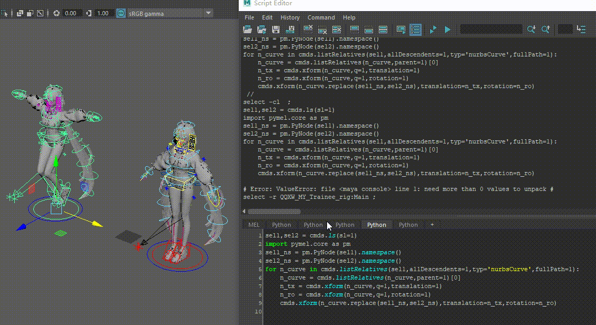


## L4 从无到有创建节点

### 创建一个球体
```python
improt maya.cmds as cmds
cmds.polySphere()
cmds.polySphere(r=2,sx=10,sy=5)
```

### 创建一个圆环
```python
cmds.circle()
cmds.circle(r=10,s=20,nr=(0,1,0))
```

### 创建一条曲线
```python
cmds.curve(d=1,p=[[0,0,0],[0,1,0],[0,1,1]]
```

### 创建骨骼
```python
cmds.joint(p=(0,1,0))
# ! 如果选择了物体，会在物体层级下创建骨骼
for i in range(10):
    cmds.joint(p=(0,0,i))
```
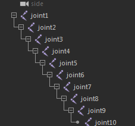
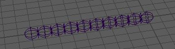

### 创建节点
```python
cmds.createNode('joint')
# ! 使用这种方式创建骨骼不会自动修正层级
for i in range(10):
    cmds.createNode('joint')
```
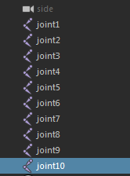

```python
# !当类型为mesh时，mesh为0个点，0个线，0个面，是一个空的节点
cmds.createNode('mesh')
# ! 创建颜色融合节点
cmds.createNode('blendColors')
# ! 创建乘除节点
cmds.createNode('mutiplyDivide')
```

### createNode命令参数说明
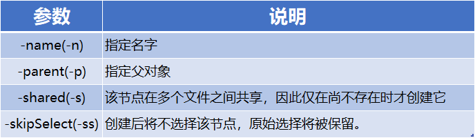

### 练习
自己用细分段数为1的曲线画一个图案，然后转换成代码实现。

mel生成的命令
```mel
curve -d 3 -p -0.839395 1.792949 0 -p -0.604013 1.974062 0 -p -0.133248 2.336288 0 -p 1.251516 2.03705 0 -p 1.21112 1.72368 0 -p 2.002488 1.503595 0 -p 1.456035 1.327409 0 -p 1.480586 0.560018 0 -p 1.928836 0.340742 0 -p 1.158852 0.0512701 0 -p 2.1789 -0.666696 0 -p 2.57546 -1.21213 0 -p 1.419647 -1.938615 0 -p 1.294912 -2.516338 0 -p 0.935117 -2.299332 0 -p 0.80681 -1.944977 0 -p 1.035179 -2.048344 0 -p -0.636392 -1.989231 0 -p -1.108525 -2.525225 0 -p -1.335772 -2.213165 0 -p -1.163381 -1.797263 0 -p -0.739298 -0.549653 0 -p -0.835217 -1.121078 0 -p -1.762025 -1.211135 0 -p -0.456917 0.20401 0 -p -0.560278 -0.28985 0 -p -1.613106 0.270444 0 -p -1.005203 0.537676 0 -p -1.175259 1.567658 0 -p -1.344683 1.048434 0 -p -1.463913 2.256511 0 -p -0.736987 1.650197 0 -p -0.823166 1.709551 0 -p -0.866256 1.739227 0 -k 0 -k 0 -k 0 -k 1 -k 2 -k 3 -k 4 -k 5 -k 6 -k 7 -k 8 -k 9 -k 10 -k 11 -k 12 -k 13 -k 14 -k 15 -k 16 -k 17 -k 18 -k 19 -k 20 -k 21 -k 22 -k 23 -k 24 -k 25 -k 26 -k 27 -k 28 -k 29 -k 30 -k 31 -k 31 -k 31 ;
```

转成代码实现
```python
point_script = ' -p -0.839395 1.792949 0 -p -0.604013 1.974062 0 -p -0.133248 2.336288 0 -p 1.251516 2.03705 0 -p 1.21112 1.72368 0 -p 2.002488 1.503595 0 -p 1.456035 1.327409 0 -p 1.480586 0.560018 0 -p 1.928836 0.340742 0 -p 1.158852 0.0512701 0 -p 2.1789 -0.666696 0 -p 2.57546 -1.21213 0 -p 1.419647 -1.938615 0 -p 1.294912 -2.516338 0 -p 0.935117 -2.299332 0 -p 0.80681 -1.944977 0 -p 1.035179 -2.048344 0 -p -0.636392 -1.989231 0 -p -1.108525 -2.525225 0 -p -1.335772 -2.213165 0 -p -1.163381 -1.797263 0 -p -0.739298 -0.549653 0 -p -0.835217 -1.121078 0 -p -1.762025 -1.211135 0 -p -0.456917 0.20401 0 -p -0.560278 -0.28985 0 -p -1.613106 0.270444 0 -p -1.005203 0.537676 0 -p -1.175259 1.567658 0 -p -1.344683 1.048434 0 -p -1.463913 2.256511 0 -p -0.736987 1.650197 0 -p -0.823166 1.709551 0 -p -0.866256 1.739227 0'
knot_script = ' -k 0 -k 0 -k 0 -k 1 -k 2 -k 3 -k 4 -k 5 -k 6 -k 7 -k 8 -k 9 -k 10 -k 11 -k 12 -k 13 -k 14 -k 15 -k 16 -k 17 -k 18 -k 19 -k 20 -k 21 -k 22 -k 23 -k 24 -k 25 -k 26 -k 27 -k 28 -k 29 -k 30 -k 31 -k 31 -k 31'
point_list = point_script.split(' -p ')
knot_list = knot_script.split(' -k ')
xyz_list = []
k_list = []
for point in point_list:
        if point == '':
                continue
        (x,y,z) = point.split(' ')
        xyz_list.append((x,y,z))
for k in knot_list:
        if k == '':
                continue
        k_list.append(int(k))
cmds.curve(d=3,p=xyz_list,k=k_list)
```

修改（k是不需要的）：
```python
point_script = ' -p -0.839395 1.792949 0 -p -0.604013 1.974062 0 -p -0.133248 2.336288 0 -p 1.251516 2.03705 0 -p 1.21112 1.72368 0 -p 2.002488 1.503595 0 -p 1.456035 1.327409 0 -p 1.480586 0.560018 0 -p 1.928836 0.340742 0 -p 1.158852 0.0512701 0 -p 2.1789 -0.666696 0 -p 2.57546 -1.21213 0 -p 1.419647 -1.938615 0 -p 1.294912 -2.516338 0 -p 0.935117 -2.299332 0 -p 0.80681 -1.944977 0 -p 1.035179 -2.048344 0 -p -0.636392 -1.989231 0 -p -1.108525 -2.525225 0 -p -1.335772 -2.213165 0 -p -1.163381 -1.797263 0 -p -0.739298 -0.549653 0 -p -0.835217 -1.121078 0 -p -1.762025 -1.211135 0 -p -0.456917 0.20401 0 -p -0.560278 -0.28985 0 -p -1.613106 0.270444 0 -p -1.005203 0.537676 0 -p -1.175259 1.567658 0 -p -1.344683 1.048434 0 -p -1.463913 2.256511 0 -p -0.736987 1.650197 0 -p -0.823166 1.709551 0 -p -0.866256 1.739227 0'
point_list = point_script.split(' -p ')
xyz_list = []
for point in point_list:
        if point == '':
                continue
        (x,y,z) = point.split(' ')
        xyz_list.append((x,y,z))
cmds.curve(d=3,p=xyz_list)
```

## L5 节点类型和属性的获取
### 获取选择物体的类型nodeType
```python
import maya.cmds as cmds
sel = cmds.ls(sl=True)[0]
print cmds.nodeType(sel)
```

### 获取物体所有属性listAttr
```python
cmds.listAttr('pCube1')
```

### 获取物体可k帧属性
```python
cmds.listAttr('pCube1',k=True)
```

### 获取物体自定义属性
```python
for attr in cmds.listAttr(box, k=True):
   _at = '{0}.{1}'.format(box, attr)
```
        
### 查询属性getAttr
```python
cmds.getAttr(_at)
```

### 修改属性setAttr
```python
# ! 当设置的属性值为字符串时，需要添加字符串类型
cmds.setAttr(_at, 1)
cmds.setAttr(_at, '1', typ='string')
cmds.setAttr(_at, '1', typ='string', l=1)
```

### 练习
获取选择物体的节点类型和属性信息，存储到文件里。

<font color=orange>把一个场景内需要的物体，导出成一个json文件，比如渲染设置、摄像机信息之类的，存储到文件里，然后从另一个文件里，导入这些属性进行状态的复制。</font>

输出属性
```python
import os
import json

node_name = 'rmanGlobals'
all_attrs = cmds.listAttr(node_name, hasData=1, output=1)

save_file = os.path.join(r'D:\td_tech\node_info', '{}.json'.format(node_name))
if not os.path.exists(os.path.dirname(save_file)):
        os.makedirs(os.path.dirname(save_file))

attr_dict = {}
for attr in all_attrs:
        attr_name = '{0}.{1}'.format(node_name, attr)
        attr_value = str(cmds.getAttr('{0}.{1}'.format(node_name, attr)))
        attr_dict[attr_name] = attr_value

with open(save_file, 'w+') as json_file:
        json_str = json.dumps(attr_dict, indent=4)
        json_file.write(json_str)
```

导入属性（属性类型问题未解决）
```python
import os
import json

node_name = 'rmanGlobals'

save_file = os.path.join(r'D:\td_tech\node_info', '{}.json'.format(node_name))
with open(save_file, 'r+') as json_file:
        json_dict = json.load(json_file)
        for attr_name, attr_value in json_dict.items():
                attr_type = cmds.getAttr(attr_name, type=True)
```

## L6 节点及其属性的断开和连接
<font color=orange>每一个场景资产，都是通过节点之间连接形成网络</font>

打开属性连接编辑器：Windows-General Editors-Connection Editor

左边为输出属性物体，右边为输入属性物体

### 获取物体的transform节点属性
查看transform节点的帮助文档，只要属性类型是一致的就可以连接

### 连接属性connectAttr
```python
cmds.connectAttr('pCube1.t','pSphere1.t')
cmds.connectAttr('pCube1.ry','pSphere1.ry')
# ! 当属性已经被连上，则需要断开再重新连，使用-force 可以强制连接
cmds.connectAttr('pCube2.t','pSphere1.t')

# ! 一个多边形的形状取决于它的outMesh和inMesh
cmds.connectAttr('pCube1.outMesh', 'pSphere1.inMesh', f=1)
```

### 断开属性disconnectAttr
```python
cmds.disconnectAttr('pCube1.outMesh', 'pSphere1.inMesh', f=1)
```

### 练习
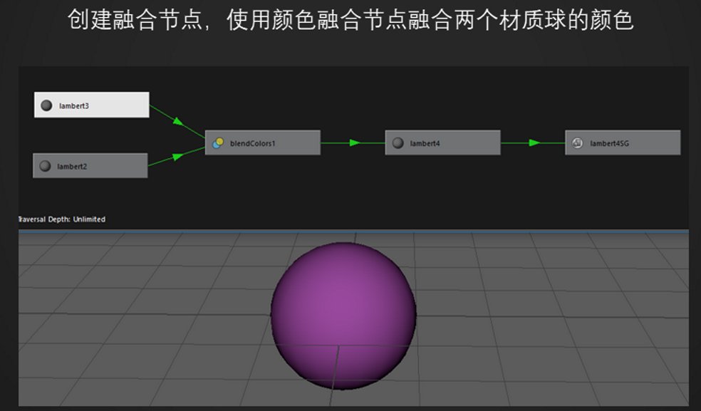

通过创建节点并连接网络，通过调节blendColors参数改变球体的颜色
```python
# create nodes
lamA = cmds.shadingNode('lambert',asShader=True)
lamB = cmds.shadingNode('lambert',asShader=True)
lamC = cmds.shadingNode('lambert',asShader=True)
bleColor = cmds.shadingNode('blendColors',asUtility=True)

# connect attr
cmds.connectAttr('{}.outColor'.format(lamA),'{}.color1'.format(bleColor))
cmds.connectAttr('{}.outColor'.format(lamB),'{}.color2'.format(bleColor))
cmds.connectAttr('{}.output'.format(bleColor),'{}.color'.format(lamC))
```
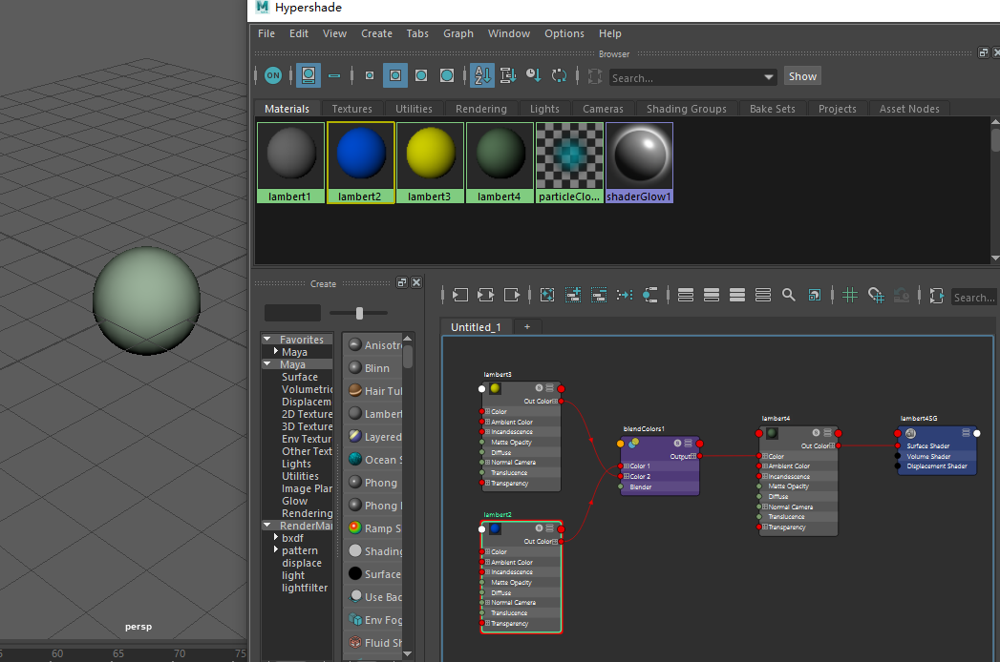


## L7 轻松获取节点连接关系
### listConnectins()
输入对象是一个节点
```python
lamA = cmds.shadingNode('lambert',asShader=True)
lamB = cmds.shadingNode('lambert',asShader=True)
lamC = cmds.shadingNode('lambert',asShader=True)
bleColor = cmds.shadingNode('blendColors',asUtility=True)
```
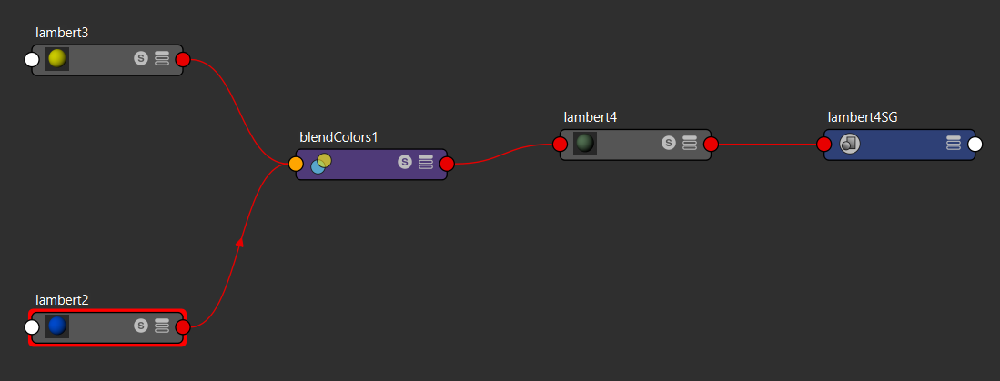

#### 获取所有连接节点
```python
cmds.listConnections(bleColor)
```
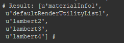

#### 只获取上游节点
```python
cmds.listConnections(bleColor,s=True,d=False)
```
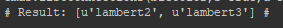

#### 获取连接节点属性以及属性名
```python
cmds.listConnections(bleColor,s=True,d=False,p=True)
```
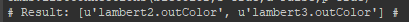

#### 以类型过滤连接节点
```python
cmds.listConnections(bleColor,type='lambert')
```
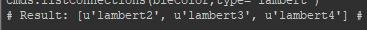


### connectionInfo()
输入对象是一个节点的属性
#### 获取输入属性
```python
cmds.connectionInfo('{}.color1'.format(bleColor),sfd=True)
```
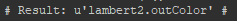

#### 获取输出属性
```python
cmds.connectionInfo('{}.output'.format(bleColor),dfs=True)
```
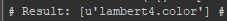

#### 判断是否为Sources输出的源
```python
cmds.connectionInfo('{}.output'.format(bleColor),isSource=True)
```
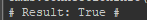

#### 判断是否为Destination被连接
```python
cmds.connectionInfo('{}.output'.format(bleColor),isDestination=True)
```
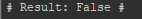


### 练习
获取一个动画角色控制器的关键帧连接信息，连接到另一个相同的角色。

## L8 几种物体的约束关系
用命令创建约束:

&emsp;&emsp;常见的约束有父子约束、点约束、旋转约束、缩放约束、目标约束以及极向量约束。

### 点约束
```python
cmds.pointConstraint('pSphere1','pSphere2')
# ! 保持相对位移：
cmds.pointConstraint('pSphere1','pSphere2',mo=True)
# ! 修改约束节点名称
cmds.pointConstraint('pSphere1','pSphere2',mo=True,name='ball')
# ! 查询约束节点名
cmds.pointConstraint('pSphere2',q=True,name=True)
# ! 查询约束权重
cmds.pointConstraint('pSphere2',q=True,wal=True)
```

### 旋转约束
```python
cmds.orientConstraint('pSphere1','pSphere2)
```

### 父子约束
```python
# ! 绑定时，需要先把控制器和骨骼的轴向一致，再进行约束
jnt = 'joint1'
ctl = 'ctl'
ctg = 'ctl_grp'
cmds.delete(cmds.parentConstraint(jnt,ctg))
cmds.parentConstraint(ctl,jnt)
```
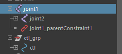

### 练习
创建一个脚本，根据选择的物体创建控制器并对其约束
```python
sel = cmds.ls(sl=1)
if len(sel) == 1:
        sel_obj = sel[0]
        obj_t = cmds.xform(sel_obj,q=1,t=1)
        obj_ro = cmds.xform(sel_obj,q=1,ro=1)
        ctl = cmds.circle(name='ctl',c=obj_t,nr=obj_ro)
        cmds.parentConstraint(ctl,sel_obj,mo=1)
else:
        print 'please select one obj'
```

## L9 创建和获取关键帧信息
设置关键帧快捷键：在时间轴上按s。

### 设置、创建关键帧setKeyframe()
```python
cmds.setKeyframe()
# ! 不选中物体
cmds.setKeyframe('pSphere1')
# ! 添加属性设置关键帧
cmds.setKeyframe('pSphere1',at='tx')
cmds.setKeyframe('pSphere1',at=['tx','ty','r'])
# !设置数值
cmds.setKeyframe('pSphere1',at=['tx','ty','r'],v=10)
```

### 案例：让球转圈
```python
import math
import maya.cmds as cmds

for i in range(0,360):
        x = math.sin(i * math.pi/180) * 10
        z = math.cos(i * math.pi/180) * 10
        
        cmds.setKeyframe('pSphere1', at='tx', t=i, v=x)
        cmds.setKeyframe('pSphere1', at='tz', t=i, v=z)
```

### 获取关键帧keyframe()
```python
# ! 查询帧
cmds.keyframe('pSphere1', q=True, tc=True)
# ! 查询属性
cmds.keyframe('pSphere1', q=True, vc=True)
# ! 属性过滤
cmds.keyframe('pSphere1', at='ty', q=True, tc=True)
cmds.keyframe('pSphere1', at='ty', q=True, vc=True)
# ! 编辑属性
frame_tc = cmds.keyframe('pSphere1', at='ty', q=True, tc=True)
cmds.keyframe('pSphere1',  # 编辑的物体
               at='ty',   # 编辑的属性
               e=True,    # 编辑模式
               time=(min(frame_tc), max(frame_tc)),     # 编辑的时间范围
               tc=5,     # 关键帧变化，正数往右，负数往左
               r=True    # 相对变化
```

### 练习
给一个物体从1到200逐渐创建关键帧，实现随机抖动效果。
```python
import random
sel = cmds.ls(sl=1)
if len(sel) == 1:
        sel_obj = sel[0]
        for i in range(1,201):
                rand_x = random.uniform(-20,20)
                rand_y = random.uniform(-20,20)
                rand_z = random.uniform(-20,20)
                cmds.setKeyframe(sel_obj, at='tx', t=i, v=rand_x)
                cmds.setKeyframe(sel_obj, at='ty', t=i, v=rand_y)
                cmds.setKeyframe(sel_obj, at='tz', t=i, v=rand_z)
else:
        print 'please select one obj'
```

## L10 文件输入输出以及reference处理
### file()
```python
# ! 新建场景
cmds.file(new=True,f=True)

# ! 保存场景
cmds.file(rename="D:/td_tech/test.ma")
cmds.file(save=True,typ="mayaAscii")

# ! 打开文件
cmds.file("D:/td_tech/test.ma",o=True,force=True)

# ! 获取场景名称
cmds.file(q=True,sn=True)
cmds.file(q=True,sn=True,shn=True)

# ! 导出物体
cmds.file("D:/td_tech/export.ma",exportAll=True,typ="mayaAscii")
cmds.file("D:/td_tech/export.ma",exportSelected=True,typ="mayaAscii")

# ! 导入物体
cmds.file("D:/td_tech/export.ma",i=True,ns='ball')

# ! 参考文件
cmds.file("D:/td_tech/export.ma",r=True,ns='ball')

# ! 查询参考文件
cmds.file(q=True,r=True)
cmds.file("D:/td_tech/export.ma",q=True,r=True)
```

### referenceQuery()
```python
# ! 参考文件节点查询
cmds.referenceQuery("D:/td_tech/export.ma",n=True)

# ! 参考节点文件查询
cmds.referenceQuery('ball1:pSphere1',f=True)

# ! 查询参考是否加载
cmds.referenceQuery("D:/td_tech/export.ma",isLoaded=True)
```

### 练习
利用循环实现批量reference功能。
```python
ref_file = "D:/td_tech/export.ma"
for i in range(0,5):
        cmds.file(ref_file,r=True,ns='ball{}'.format(i))
```


## L11 Maya 窗口与控件编程
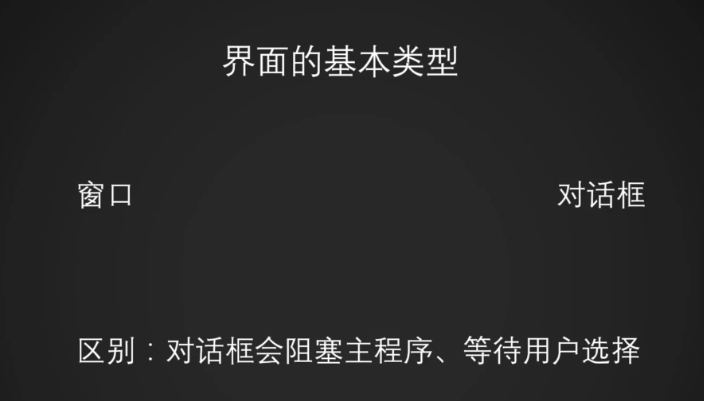

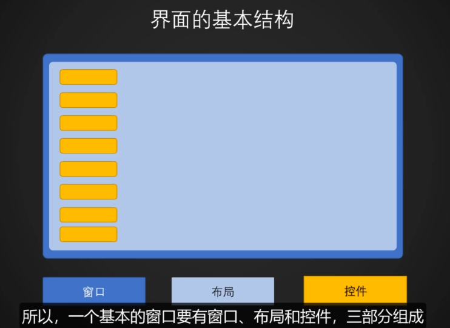

### 创建窗口
```python
wnd = cmds.window()
```

### 显示窗口
```python
cmds.showWindow(wnd)
```

### 添加窗口属性
```python
wnd = cmds.window(w=600,h=800,t='main_window')
```

### 定义变量避免窗口重复创建，并恢复默认窗口设置
```python
wnd_name = 'my_win'
if cmds.window(wnd_name,q=True,exists=True):
        cmds.deleteUI(wnd_name,wnd=True)
if cmds.windowPref(wnd_name,q=True,exists=True):
        cmds.windowPref(wnd_name,r=True)
wnd = cmds.window(wnd_name,w=600,h=800,t='main_window')
cmds.showWindow(wnd)
```

### 创建layout和按钮
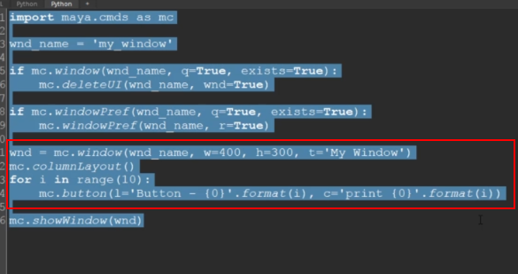

### 练习


```python
def create_ball(*args):
        num = cmds.textField(num_text,q=1,tx=1)
        ra = cmds.textField(ra_text,q=1,tx=1)
        for i in range(0,int(num)):
                cmds.polySphere(r=ra)

if __name__ == '__main__':
        wnd_name = 'my_win'
        if cmds.window(wnd_name,q=True,exists=True):
                cmds.deleteUI(wnd_name,wnd=True)
        if cmds.windowPref(wnd_name,q=True,exists=True):
                cmds.windowPref(wnd_name,r=True)
                
        wnd = cmds.window(wnd_name,w=300,h=50,t='main_window')
        cmds.gridLayout(numberOfColumns=2,numberOfRows=2,cellWidthHeight=(150, 30))
        cmds.text(label='num')
        num_text = cmds.textField()
        cmds.text(label='ra')
        ra_text = cmds.textField()

        cmds.button(l='create',c=create_ball)
        cmds.showWindow(wnd)
```


## L12 Maya中的视图与相机操作

### getPanel()
#### 获取所有视图
```python
cmds.getPanel(all=True)
```

#### 只获取显示的视图
```python
cmds.getPanel(vis=True)
```

#### 通过视图类型返回视图
```python
cmds.getPanel(typ='outlinerPanel')
```

#### 返回当前激活视图
```python
cmds.getPanel(withFocus=True)
```

### modelPanel()
#### 查询当前视图摄像机
```python
cmds.modelPanel('modelPanel4',q=True,cam=True)
cmds.modelEditor('modelPanel4',q=True,cam=True)
```

#### 编辑当前视图摄像机
```python
cmds.modelPanel('modelPanel4',e=True,cam='front')
```

#### 裁剪视图
```python
cmds.modelPanel('modelPanel4',e=True,tearOff=True)
```

#### 编辑视图显示的内容
```python
cmds.modelEditor('modelPanel2',e=True,joints=True)
```

### 练习


```python
def playblast_polygon():
        my_cam = cmds.camera(p=['8','36','33'],rot=['-42','10','0'])
        my_ball = cmds.polySphere()
        cmds.circle(center=(1,1,1))
        cmds.setKeyframe(my_ball,at='translateX',v=10,t=10)
        cmds.setKeyframe(my_ball,at='translateX',v=5,t=20)
        cmds.modelPanel(my_panel,e=True,cam=my_cam[0])
        cmds.modelEditor(my_panel,e=True,alo=False,polymeshes=True)
        cmds.refresh()
        cmds.playblast(st=1,et=30)
        

playblast_polygon()
```

## L13 Maya 中的事件触发
### 时间轴变化触发事件
```python
job_id = cmds.scriptJob(tc='print "change"')
cmds.scriptJob(kill=job_id)
```

### 属性变化触发事件
```python
job_id = cmds.scriptJob(attributeChange=('pSphere1.tx','print "123"'))
```

### 删除所有任务
```python
cmds.scriptJob(killAll=True)
```

### 其他属性更改
```python
cmds.scriptJob(nodeDeleted=('pSphere1', 'print "ball delete"'))
cmds.scriptJob(nodeNameChanged=('pSphere1', 'print "ball rename"'))
```

### 防止killAll全部删除
只有在maya关闭才会删除

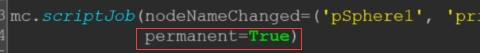

### 跟踪条件
自动k帧是否打开
```python
cmds.scriptJob(conditionTure=('autoKeyFrameState', 'print "auto key enable"'))
cmds.scriptJob(conditionFalse=('autoKeyFrameState', 'print "auto key disable"'))
```

是否有物体被选择
```python
cmds.scriptJob(conditionTrue=('Something Selected', 'print "selected"'))
```

传入方法
```python
def func():
    print cmds.ls(sl=True)

cmds.scriptJob(conditionTrue=('Something Selected', func))
```

### 练习
利用 scriptJob 创建一个属性变化影响另一个属性变化。
```python
def ball_tx_change():
        new_tx = cmds.getAttr('pCube1.tx')
        cmds.setAttr('pSphere1.tx',new_tx)
        
job_id = cmds.scriptJob(attributeChange=('pCube1.tx',ball_tx_change))
cmds.scriptJob(kill=job_id)
```

## L14 基础部分总结
Maya帮助文档

Maya命令反馈

mel whatIs

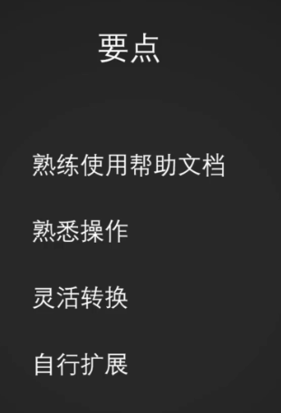

