## L15 走进 PyMEL 编程
### 什么是PyMel


### 了解PyNode


### pynode转化
```python
node = pm.PyNode('pSphere1')

# ! 查询方法
dir(node)

# ! 查询属性
dir(node.attr())
```

### 连接属性
```python
import maya.cmds as cmds
import pymel.core as pm
ball = pm.PyNode('ball')
ball_tx = ball.attr('tx')

box = pm.PyNode('pCube1')
box_tx = box.attr('tx')

ball_tx >> box.tx
```

### 断开连接
```python
ball_tx //  box_tx
```

### 使用API方法
```python 
ball = pm.PyNode('ball)
baii.__apiobject__()
```

### 练习
使用PyMEl实现原来融合节点的连接。

```pyrhon

import pymel.core as pm

lam_A = pm.createNode('lambert')
lam_B = pm.createNode('lambert')
lam_C = pm.createNode('lambert')
bc = pm.createNode('blendColors')

lam_A.outColor >> bc.color1
lam_B.outColor >> bc.color2
bc.output.connect(lam_C.color)
```

## L16 为 Maya 安装第三方 Python 包

1. 拷贝安装
2. pip安装
3. 编译安装

### 练习
给Maya安装yaml模块和numpy模块。

**Numpy**

官方文档

https://numpy.org/install/#python-numpy-install-guide

简介

https://www.runoob.com/numpy/numpy-tutorial.html

python安装

python -m pip install numpy

maya安装

1. 下载wheel  
   https://pypi.tuna.tsinghua.edu.cn/simple/numpy/

2. 安装  
   mayapy -m pip install C:\Users\Administrator\Desktop\numpy-1.14.0rc1-cp27-none-win_amd64.whl

**yaml**

python安装

python -m pip install pyyaml

maya安装

1. 下载wheel  
   https://pypi.tuna.tsinghua.edu.cn/simple/pyyml/

2. 安装  
   mayapy -m pip install C:\Users\Administrator\Desktop\pyyml-0.0.2-py2.py3-none-any.whl

## L17 自定义 Maya 环境变量
### 为什么自定义软件环境
1. 统一管理
2. 快速部署
3. 方便切换

&emsp;&emsp;环境变量的用户变量会覆盖系统变量。

### cmd设置环境变量
```cmd
set MAYA_DISABLE_CLIC_IPM=1
```

### python设置环境变量
1. 查询
```python
os.environ
```
2. 设置
```python
_env = os.environ.copy()
_env['XXX_ENV'] = 'hello'
import subprocess
subprocess.Popen("C:/Program Files/Autodesk/Maya2017/bin/maya.exe",env=_env)
```

### 常用环境变量
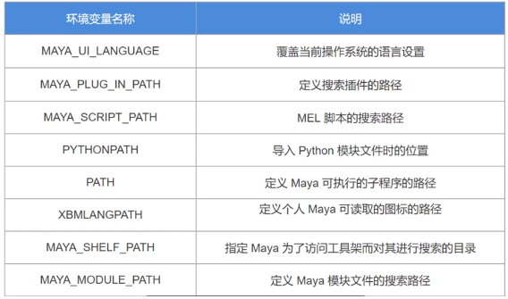

### 练习
使用Yaml编写一个环境配置文件，读取里面内容使用subprocess启动软件。

写入yaml
```python
import os
import yaml

yaml_str = """
name: yaml_env
date: 20200716
version: ['maya2018','maya2019']
"""

yaml_data = yaml.load(yaml_str, Loader=yaml.SafeLoader)

with open('D:/td_tech/yaml_test/yaml_write.yaml', 'w') as f:
        yaml.dump(yaml_data, f)
```

启动软件
```python
import os
import yaml
import subprocess

with open('D:/td_tech/yaml_test/yaml_write.yaml', 'r+') as f:
        data = yaml.load(f, Loader=yaml.Loader)

_env = os.environ.copy()

for (key,value) in data.items():
        _env[key] = str(value)


subprocess.Popen("C:/Program Files/Autodesk/Maya2018/bin/maya.exe",env=_env)
```
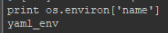


## L18 Maya API 基本类型介绍
### Maya API基本结构
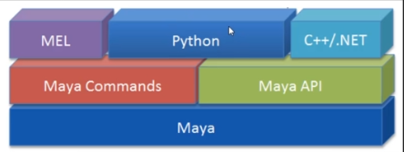

### API语言支持
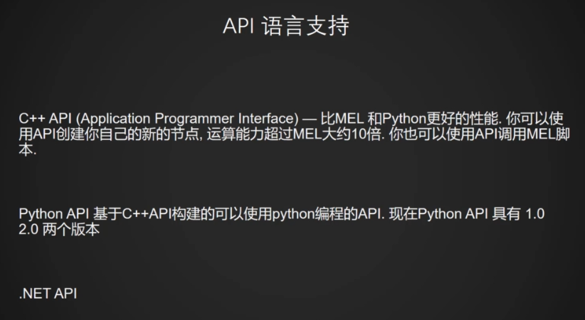

1. API编译的插件后缀：

    Linux：.so

    Windows: .mll

    Mac OS X：.bundle

    通用性插件：.py

2. API内置库：
   
    OpenMaya 基本的操作工具类

    OpenMayaUI 界面工具类

    OpenMayaAnim 动画工具类

    OpenMayaFX 特效工具类

    OpenMayaRender 渲染工具类

3. API命名规则

M classes - 基本的数据类型

MFn - Function 函数工具类型

MIt - Iterator 迭代器类型

MPx - 代理类型，拓展Maya功能需要继承的类

### DependencyNode、 DagNode
DependencyNode：Maya最基本的节点类型

DagNode：Maya带有层级的节点类型

DagNode由DependencyNode继承而来，DagNode有层级关系继承。

### MObject
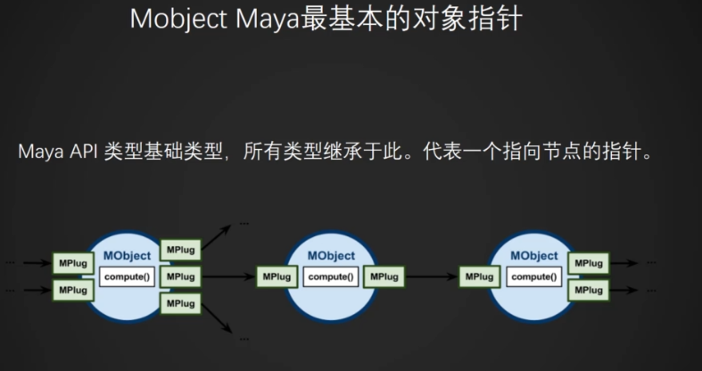

### 查询API帮助文档 API1.0
MObject() 相当于python的__init__()，可以用于实例化对象

静态方法static Mobject：在没有实例化节点之前就能使用

析构函数~Mobject()：变量在销毁的时候执行的操作

### 通过Pymel创建Mobject
```python
import maya.OpenMaya as OpenMaya
import pymel.core as pm

ball_node = pm.PyNode('pSphere1')
ball_api_node = ball_node.__apimobject__()

# 通过pymel转化的MObject已经有了对象
print ball_api_node.isNull() # True
# 通过OpenMaya直接创建的MObject是空的
print OpenMaya.MObject().isNull() # False

# 查询api类型
print ball_api_node.apiType() # 110
print ball_api_node.apiTypeStr() # kTransform
ballshape_api_node = pm.PyNode('pSphereShape1').__apimobject__()
print ballshape_api_node.apiType() # 296
print ballshape_api_node.apiTypeStr() # kMesh

# 使用 == != 判断两个物体是否相等
print ball_api_node == ballshape_api_node # False
# 使用 = 直接赋值
ballshape_api_node = ball_api_node
print ballshape_api_node.apiTypeStr() 
```

### DagPath

```python
# 创建一个空的MDagPath
ball_dag_path = OpenMaya.MDagPath()
# 建立DagPath联系
OpenMaya.MDagPath.getAPathTo(ball_api_node,ball_dag_path)
# 获取DagPath名字
print ball_dag_path.fullPathName() # |pSphere1
print ball_dag_path.partialPathName() # pSphere1
# 判断是否显示
print ball_dag_path.isVisible() # True
# 通过MDagPath获取API类型
print ball_dag_path.apiType() # 110
# 通过MDagPath返回MObject
print ball_dag_path.node() # <maya.OpenMaya.MObject; proxy of <Swig Object of type 'MObject *' at 0x0000014894705F90>
```

### 思考
既然Maya已经提供了cmds这个编程的接口，为什么还要提供OpenMaya的呢？


## L19 Maya API的三种基本类型
### MFn
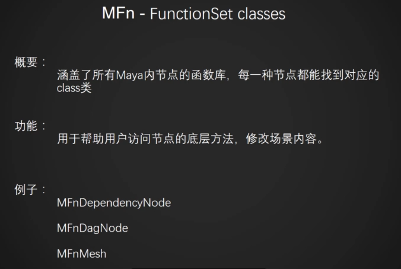

MFnDependencyNode：处理任何节点的普通方法

MFnDagNode：处理大纲物体的常用方法
MFnMesh：处理多边形操作

普通MFn记录Maya内所有节点的类型，MObject中的apiType返回的就是MFn列表的索引值

其他的有MFnSet、MFnMesh等等。

### MIt
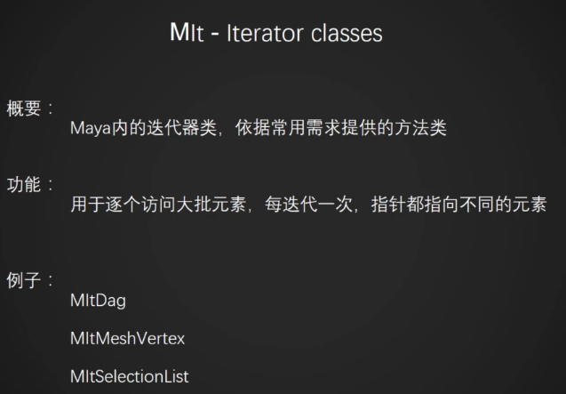

MitDag：处理大纲层级所有物体

MitCurveCV：处理曲线的点

MitMeshEdge：多边形的线的循环

MitMeshFaceVertex：处理多边形面点

MitMeshPolygon：处理多边形面

MitMeshVertex：处理多边形点

MitSelectionList：处理列表中的任何物体

MitDependencyGraph：通过一个节点寻找上下游所有节点

MitDependencyNodes：过滤场景内的任何节点

### MPx
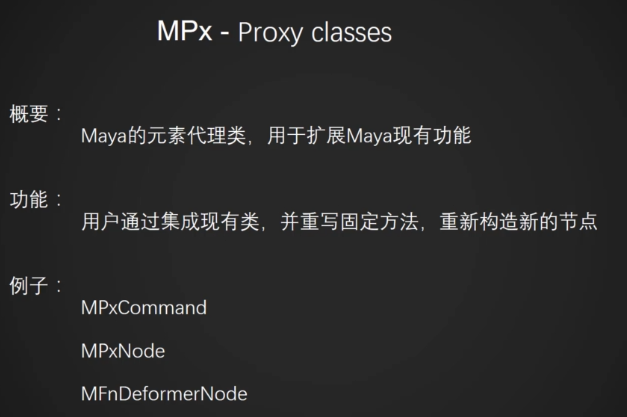

用于编写maya没有的物体

MpxCommand：编写一个命令

MPxNode：编写一个节点

### 总结
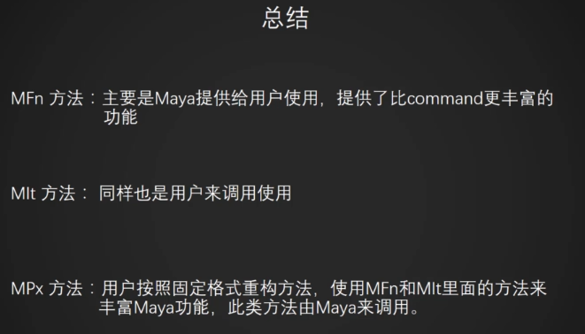


## L20 Maya API中基本容器的使用
### MSelectionList
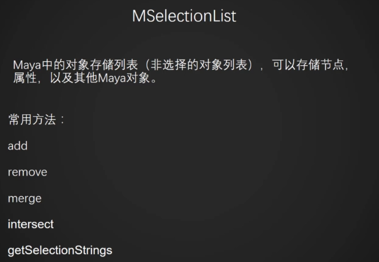

```python
import maya.OpenMaya as OpenMaya
import pymel.core as pm

# 创建一个空的MSelectionList
# <maya.OpenMaya.MSelectionList; proxy of <Swig Object of type 'MSelectionList *' at 0x0000014894705780> > 
lst = OpenMaya.MSelectionList()
print lst.isEmpty() # True

# 添加物体
lst.add('pSphere1')
# 查询个数
lst.length() # 1
# 添加所有的球体
lst.add('pSphere*')
lst.length() # 2

# 合并两个列表
b_lst = OpenMaya.MSelectionList()
b_lst.add('pCube?')
lst.merge(b_lst)

print lst.length() # 3
```

### MItSelectionList
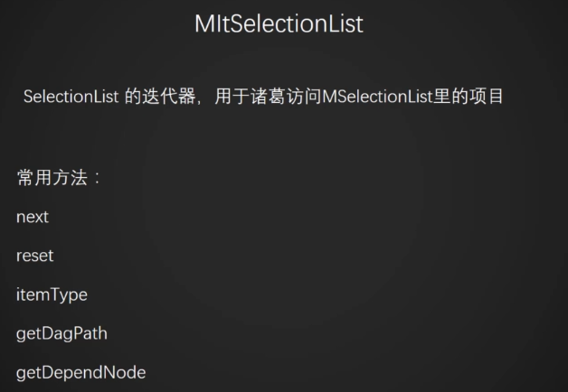

```python
import maya.OpenMaya as OpenMaya
import pymel.core as pm

sel_lst = OpenMaya.MSelectionList()
sel_lst.add('pSphere?')

# 返回列表每一个物体的长名
dag_path = OpenMaya.MDagPath()
lst_iter = OpenMaya.MItSelectionList(sel_lst)
while not lst_iter.isDone():
        lst_iter.getDagPath(dag_path)
        print dag_path.fullPathName()
        
        lst_iter.next()
```

### 练习
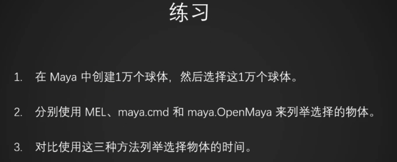

通配符

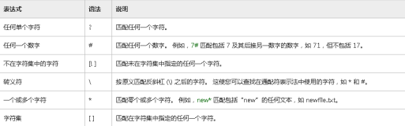

```python
import maya.cmds as cmds
import maya.OpenMaya as OpenMaya
import pymel.core as pm
from datetime import datetime

# create 10,000 balls
for i in range(1, 10000):
        cmds.polySphere()

# cmds
start_time = datetime.now()
sel_lst = cmds.ls(sl=True)
for sel in sel_lst:
        pass
end_time = datetime.now()
# 36000
cmds_time = (end_time - start_time)

# OpenMaya
sel_lst = OpenMaya.MSelectionList()
for i in range(1, 10000):
        sel_lst.add('pSphere{}'.format(i))
iter_lst = OpenMaya.MItSelectionList(sel_lst)
dag_path = OpenMaya.MDagPath()

start_time = datetime.now()
while not iter_lst.isDone():
        iter_lst.getDagPath(dag_path)
        iter_lst.next()
end_time = datetime.now()
# 28000
OpenMaya_time = (end_time - start_time)

# Mel
```


## L21 Maya API 的全局操作方法 - MGlobal
### MGlobal
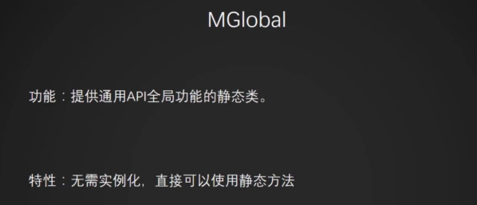

```python
import maya.OpenMaya
from maya.OpenMaya import MGlobal

print MGlobal.mayaVersion()
# 2018
print MGlobal.apiVersion()
# 20180500

# 把选择的物体传入sel列表
sel = OpenMaya.MSelectionList()
OpenMaya.MGlobal.getActiveSelectionList(sel)
print sel.length()

# 选择sel列表的物体
OpenMaya.MGlobal.setActiveSelectionList(sel)

# 执行python或mel命令
MGlobal.executeCommand('ls -sl')
MGlobal.executeCommand('createNode "joint"')
# MGlobal.executePythonCommand('cmds.createNode("joint")')

MGlobal.isYAxisUp()
# True

MGlobal.displayInfo('info ..')
MGlobal.displayWarning('warning ..')
MGlobal.displayError('error ..')

# 设置当前帧
MGlobal.viewFrame(30)
```

### MGlobal常用方法
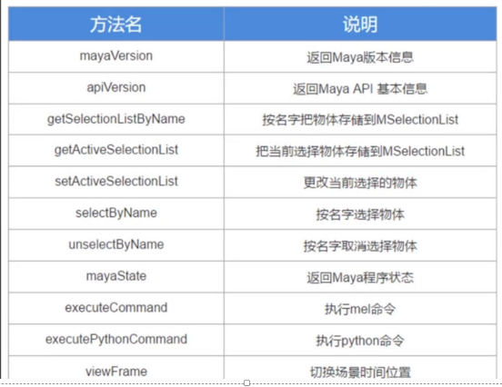

### 练习
尝试使用MGlobal选择屏幕某一块区域的物体。
```python
import maya.OpenMaya as OpenMaya
from maya.OpenMaya import MGlobal
import pymel.core as pm

MGlobal.selectFromScreen(0,0,1920,1080,MGlobal.kAddToList,MGlobal.kSurfaceSelectMethod)
```

## L22 Maya API 的文件操作 MFileIO

```python
import maya.OpenMaya
from maya.OpenMaya import MFileIO

print MFileIO.currentFile()
# D:/test/test/test.ma

MFileIO.setCurrentFile('D:/test/test_1.ma')
print MFileIO.currentFile()
# D:/test/test_1.ma

print MFileIO.fileType()
# u'mayaAscii'

lst = list()
MFileIO.getFileTypes(lst)
print lst
# [u'mayaAscii', u'mayaBinary', u'mel', u'OBJ', u'directory', u'plug-in', u'audio', u'move', u'EPS', u'Adobe(R) Illustrator(R)', u'image', u'fluidCache', u'editMA', u'editMB', u'Alembic', u'RIB']

# 新建场景
MFileIO.newFile(True)

# 保存场景
MFileIO.saveAs('D:/test/test/ball.ma', 'mayaAscii')
MFileIO.save()

```

### MFileIO 常用方法
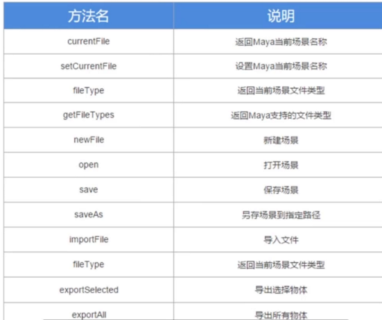
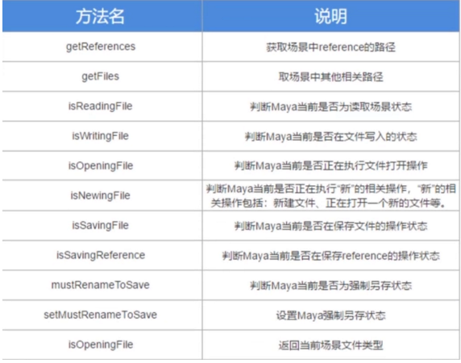

### 练习
列出场景内所有的材质shadingGroup节点，并使用API导出为文件。

```python
import maya.OpenMaya as OpenMaya
import pymel.core as pm

sg_lst = pm.ls(type='shadingEngine')
lst = OpenMaya.MSelectionList()

# 列出所有sg节点
for sg in sg_lst:
        sg_mobj = sg.__apimobject__()
        lst.add(sg_mobj)

# 选择所有sg节点
OpenMaya.MGlobal.setActiveSelectionList(lst)

# 导出选择的节点
OpenMaya.MFileIO.exportSelected('D:/test/sg_test.ma')
```

## L23 Maya API 中的节点迭代器和函数类
### MFnDependencyNode
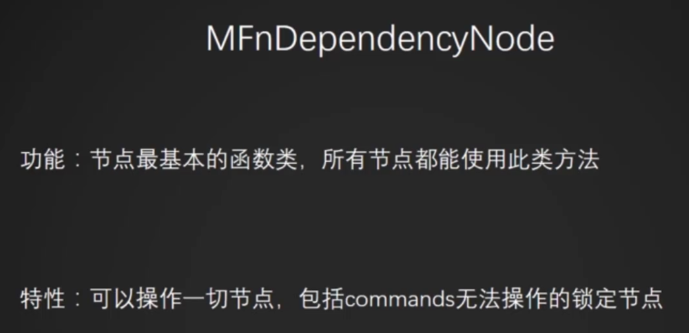

```python
import maya.OpenMaya as OpenMaya
import pymel.core as pm

mfn = OpenMaya.MFnDependencyNode(pm.ls(sl=True)[0].__apimobject__())
print mfn.typeName()
# transform
print mfn.name()
# pCylinder1
mfn.setName('new_pCylinder')
print mfn.name()
# new_pCylinder
mfn.attributeCount()
# 249

iterator = OpenMaya.MItDependencyNodes(OpenMaya.MFn.kMesh)
while not iterator.isDone():
        print OpenMaya.MFnDependencyNode(iterator.thisNode()).name()
        print OpenMaya.MFnDependencyNode(iterator.item()).name()
        iterator.next()

```

### 练习
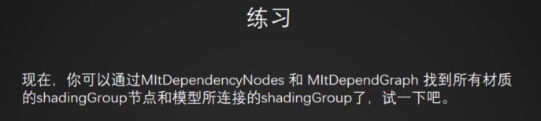
```python
import maya.OpenMaya as OpenMaya
import pymel.core as pm

mit = OpenMaya.MItDependencyNodes(OpenMaya.MFn.kMesh)
sh_sg_connects = {}
while not mit.isDone():
        mfn = OpenMaya.MFnDependencyNode(mit.item())
        plug_array = OpenMaya.MPlugArray()
        mfn.getConnections(plug_array)
        for i in range(plug_array.length()):
                des_array = OpenMaya.MPlugArray()
                plug_array[i].destinations(des_array)
                if des_array.length():
                        if des_array[0].node().apiTypeStr() == 'kShadingEngine':
                                sh_sg_connects[mfn.name()] = des_array[0].name().split('.')[0]
        mit.next()

for (key,value) in sh_sg_connects.items():
        print '{} connected to {}'.format(key,value)
```

## L24 Maya API 层级迭代器与物体函数类
### MFnDagNode
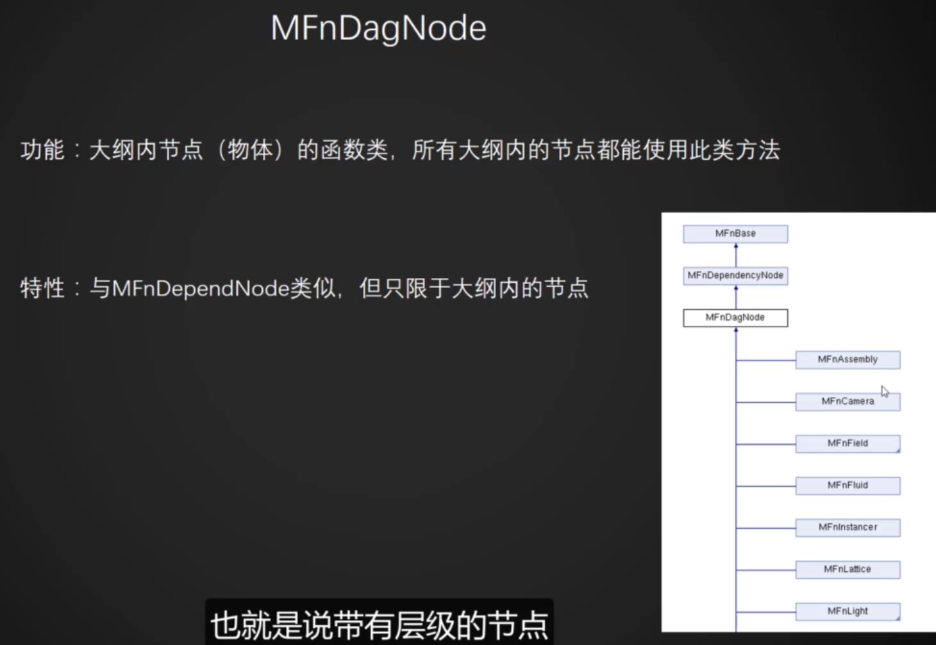

```python

import maya.OpenMaya as OpenMaya
import pymel.core as pm

mfn = OpenMaya.MFnDagNode(pm.PyNode('pSphere1').__apimobject__())
print mfn.partialPathName()
# pSphere1
print mfn.fullPathName()
# |pSphere1
print mfn.childCount()
# 1

iterator = OpenMaya.MItDag()
while not iterator.isDone():
        print iterator.partialPathName()

        iterator.next()
```

### 练习
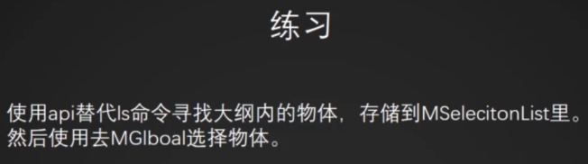
```python
import maya.OpenMaya as OpenMaya
import pymel.core as pm

# 选择所有mesh
mit = OpenMaya.MItDag(OpenMaya.MItDag.kDepthFirst,OpenMaya.MFn.kMesh)
sel_lst = OpenMaya.MSelectionList()
while not mit.isDone():
        m_dag = OpenMaya.MFnDagNode(mit.item())
        sel_lst.add(m_dag.fullPathName())
        mit.next()


OpenMaya.MGlobal.setActiveSelectionList(sel_lst)
```

## L25 Maya API 中的多边形处理MFnMesh MItMesh
### MFnMesh
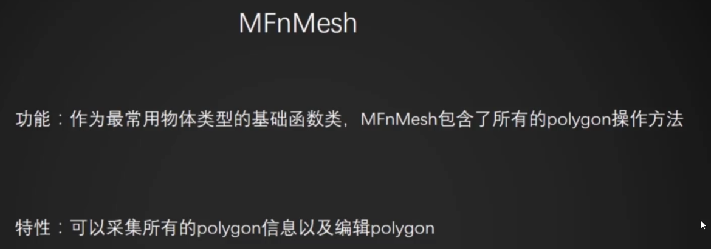

```python
import maya.OpenMaya as OpenMaya
import pymel.core as pm

mfn = OpenMaya.MFnMesh(pm.PyNode('pSphere1').__apiobject__())
print mfn.numPolygons()
# 400
print mfn.numVertices()
# 382

point = OpenMaya.MPoint()
mfn.getPoint(0, point)
print point.x,point.y,point.z
# 0.148778125644 -0.987688362598 -0.0483409427106
mfn.getPoint(381, point)
print point.x,point.y,point.z
# 0.0 1.0 0.0

# 设置点位置
point = OpenMaya.MPoint(0,2,0)
mfn.setPoint(381, point)

iterator = OpenMaya.MItMeshVertex(pm.PyNode('pSphereShape1').__apiobject__())
while not iterator.isDone():
        # 查询点位置
        point = iterator.position()
        print iterator.index(), point.x, point.y, point.z
        
        # 设置点位置
        point = OpenMaya.MPoint(0,0,0)
        iterator.setPosition(point)
        iterator.next()
```

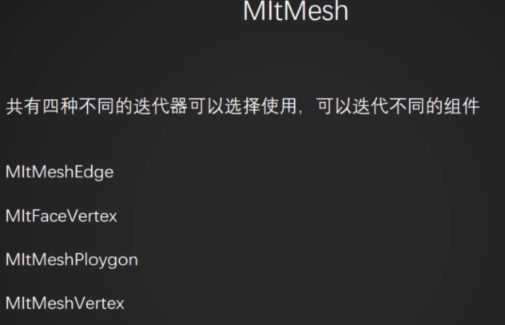

### 练习
使用MFnMesh和MItMesh里的迭代器，寻找两个物体穿插的部分。

## L26 Maya API 中的指针 - MScriptUtil
### MScriptUtil
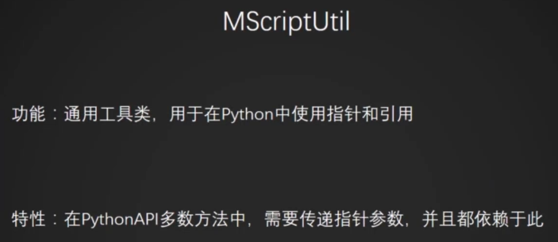
```python
import maya.OpenMaya as OpenMaya
import pymel.core as pm

iterator = OpenMaya.MItMeshVertex(pm.PyNode('pSphereShape1').__apimobject__())
# 定义float2类型指针
s_util = OpenMaya.MScriptUtil()
uv_ptr = s_util.asFloat2Ptr()

while not iterator.isDone():
        # 打印出每个点的uv值
        print iterator.index(),
        iterator.getUV(uv_ptr)
        print s_util.getFloat2ArrayItem(uv_ptr, 0, 0),
        print s_util.getFloat2ArrayItem(uv_ptr, 0, 1)
        iterator.next()
```

### 练习
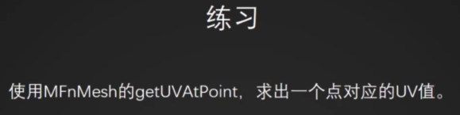


## L27 Maya API 中的事件捕获 - MMessage
### Message
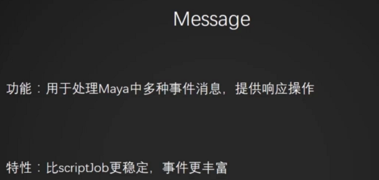

```python
import maya.OpenMaya as OpenMaya
import pymel.core as pm

def func(*args):
        print 1

# 添加时间触发事件    
callback_id = OpenMaya.MTimerMessage.addTimerCallback(2, func)

# 移除时间触发事件
OpenMaya.MTimerMessage.removeCallback(callback_id)

# 获取可以调用的事件种类
event_names = list()
OpenMaya.MEventMessage.getEventNames(event_names)
print event_names()

# 创建时间轴变化事件
callback_id = OpenMaya.MEventMessage.addEventCallback('timeChanged',func)
# 移除时间轴变化事件
OpenMaya.MTimerMessage.removeCallback()
```

### Message使用方法
1. 定义函数
2. addCallback
3. removeCallback

### 练习
使用MSceneMessage创建一个事件，当文件reference创建完成之后，修改它的namespace。