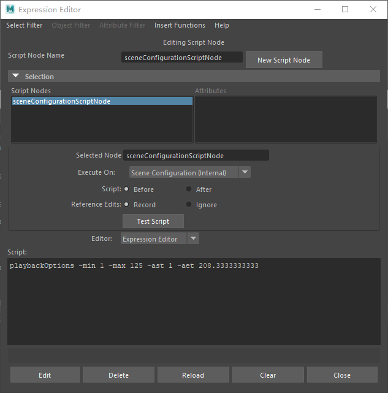
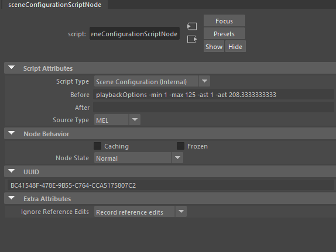
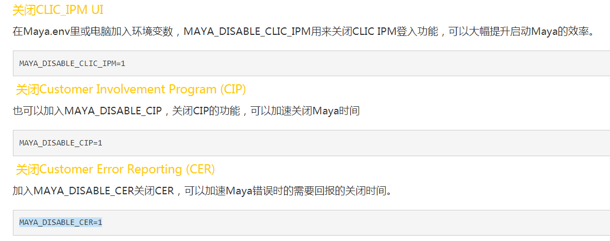
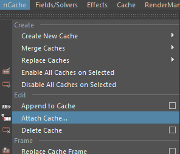
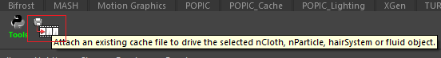
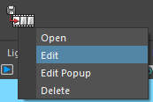
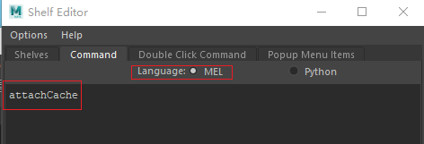

&emsp;&emsp;由于我的工作需要在Maya上进行开发，所以想总结一下自己常用的功能，以免下次自己使用的时候忘记。

### ❌ <font color=FireBrick>Traceback 显示详细的报错信息</font>

&emsp;&emsp;使用traceback类可以捕捉异常并打印信息。由于在编写代码时，经常需要import多个类，但是如果在maya的脚本编辑器中直接运行错误的代码，不一定能返回详细的报错信息，无法得知是哪一个文件哪一行的错误。下面是一个小例子。
- **创建两个文件：test.py 和 errorfile.py**
```python
import os
import errorfile
def test_func():
    errorfile.error_func()
```
    errorfile.py
```python
import os
def error_func():
    os.makedirs(r"C:\test_folder")
```


- **在maya中的运行代码：**
    - 不使用traceback的代码
```python
import sys
sys.path.insert(0,r'D:\git_script')
import test
reload(test)
test.test_func()
```
        报错：
        <font color='red'>\# Error: WindowsError: file C:\Program Files\Autodesk\Maya2018\bin\python27.zip\os.py line 157: 183 # </font>
    - 使用traceback的代码
```python
try:
    import test
    reload(test)
    test.test_func()
except:
    import traceback
    traceback.print_exc()
```
        报错：
        <font color='red'>\# Traceback (most recent call last):
        \#   File "<maya console>", line 7, in <module>
        \#   File "D:\git_script\test.py", line 5, in test_func
        \#     faa.error_func()
        \#   File "D:\git_script\errorfile.py", line 4, in error_func
        \#     os.makedirs(r"C:\test_folder")
        \#   File "C:\Program Files\Autodesk\Maya2018\bin\python27.zip\os.py", line 157, in makedirs
        \#     mkdir(name, mode)
        \# WindowsError: [Error 183] : 'C:\\test_folder'
        </font>

&emsp;&emsp;从上面例子可以看到，使用traceback后显示的错误信息十分完整，对于找bug十分有用。👍

### 💡 <font color=FireBrick>修改参考文件的路径</font>
&emsp;&emsp;开发某些工具的过程中需要修改maya场景参考资产的路径，以下是cmds和pm获取reference节点以及修改路径的方法：
- **使用pm**
```python
pm.FileReference(rn_node).unresolvedPath()
pm.FileReference(rn_node).replaceWith(new_path) 
```
- **使用cmds**：
```python
cmds.referenceQuery(rn_node, filename=1)
cmds.file(new_path, loadReference=rn_node)
```

### ⏰ <font color=FireBrick>场景时间轴节点 sceneConfigurationScriptNode</font>
&emsp;&emsp;Maya在保存文件时会记录一个记录场景时间轴信息的节点“sceneConfigurationScriptNode”，该节点可以在表达式编辑器“Expression Editor”中找到。  


&emsp;&emsp;在属性编辑器“Attribute Editor”中，可以看到该节点的详细信息。  


&emsp;&emsp;可以通过cmds.objExists()查询节点是否存在。在对选择导出时，可以把该节点一同选择导出，使场景保留时间轴信息。
```python
cmds.objExists('sceneConfigurationScriptNode')
cmds.objectType('sceneConfigurationScriptNode')
```

### 💎 <font color=FireBrick>使用PySide2创建Maya置顶的窗口</font>
&emsp;&emsp;Maya2016版本以上会自带PySide2，我们可以使用PySide2在Maya中创建窗口。

&emsp;&emsp;M该内容参考来源 [智伤帝 - Python Qt 开发教程 扩展说明](https://blog.l0v0.com/%2Fposts%2F2e0af969.html)。
```python
import maya.OpenMayaUI as omui
try:
    from shiboken2 import wrapInstance
except ImportError:
    from shiboken import wrapInstance

# ! 这个函数可以实现将 Maya 的 UI 转换为 Qt 的 QWidget 组件
def mayaToQT(name):
    ptr = omui.MQtUtil.findControl(name)
    if ptr is None:
        ptr = omui.MQtUtil.findLayout(name)
    if ptr is None:
        ptr = omui.MQtUtil.findMenuItem(name)
    if ptr is not None:
        return wrapInstance(long(ptr), QWidget)

# ! 检查窗口多开
global XG_WIN
if 'XG_WIN' in globals():
    if cmds.window(XG_WIN, q=1, ex=1):
        cmds.evalDeferred("cmds.deleteUI(\"" + XG_WIN + "\")")

# ! 获取 Qt 窗口控件
tool_ui = p_xgmArchiveExportBatchUI(False)
# ! 创建 Maya 窗口
XG_WIN = cmds.window(title=tool_ui.windowTitle())
# ! 显示 Maya 窗口
cmds.showWindow(XG_WIN)
# ! Maya 窗口转换为 Qt 对象
ptr = mayaToQT(XG_WIN)
# ! Maya 窗口添加 Qt 布局
ptr.setLayout(QVBoxLayout())
ptr.layout().setContentsMargins(0, 0, 0, 0)
# ! 把 Qt 窗口控件添加到 Maya 窗口布局中
ptr.layout().addWidget(tool_ui)
ptr.setFixedSize(QSize(tool_ui.width(), tool_ui.height()))
```

### 🔎 <font color=FireBrick>加快Maya启动速度</font>
&emsp;&emsp;Maya在启动时会获取服务器登陆信息，在断网的工作状态下，会由于无法联网而不断重新获取，因此会卡住一段时间，对于需要频繁打开关闭maya测试会十分影响效率。

&emsp;&emsp;在“文档\maya\2018（视下载版本而定）”文件夹的“Maya.env”文件中，添加```MAYA_DISABLE_CLIC_IPM=1```即可关闭在线登入功能，提高maya打开的速度。



&emsp;&emsp;运行以下文件可以对该电脑内所有maya版本的“Maya.env”文件添加“MAYA_DISABLE_CLIC_IPM=1”。
```python
# -*- coding: utf-8 -*-
import os
import re
import ctypes
from ctypes.wintypes import MAX_PATH
import win32api,win32con

def setting():
    # ! 获取文档路径
    dll = ctypes.windll.shell32
    buf = ctypes.create_unicode_buffer(MAX_PATH + 1)
    if dll.SHGetSpecialFolderPathW(None, buf, 0x0005, False):
        doc_path = buf.value
    else:
        return False
    maya_path = doc_path + '/' + 'maya'
    maya_path = maya_path.replace('\\', '/')

    if not os.path.exists(maya_path):
        win32api.MessageBox(0,u'文档下没有maya文件夹!', u'MayaEnv配置失败',win32con.MB_OK)
        return

    # ! 获取mayaenv路径
    maya_env_list = []
    file_list = os.listdir(maya_path)
    for _file in file_list:
        match = re.match('^(20\d\d)',_file)
        maya_dir = maya_path + '/' + _file
        if match and os.path.isdir(maya_dir):
            maya_env_list.append(maya_path + '/' + _file + '/maya.env')

    if not maya_env_list:
        win32api.MessageBox(0, u'maya文件夹下没有对应版本的maya!', u'MayaEnv配置失败',win32con.MB_OK)
        return

    setting_content = 'MAYA_DISABLE_CLIC_IPM=1'
    lines = []
    for path in maya_env_list:
        # ! 添加配置
        with open(path,'a+') as fp:
            content = fp.read()
            if not setting_content in content:
                fp.seek(0)
                fp.write('\n' + setting_content)

    win32api.MessageBox(0, u'配置成功!', u'MayaEnv配置',win32con.MB_OK)

if __name__ == '__main__':
    setting()
```

### 🍒 <font color=FireBrick>获取Maya的runTimeCommand所在路径</font>
&emsp;&emsp;在Maya开发经常会在一些Maya自带的功能上进行改进，假设需要对工具栏上的某个功能进行改进，如何找到这些命令的代码呢？

&emsp;&emsp;以Maya的Attach Cache为例来说明，这个命令可以通过选择需要替换的节点，指定缓存路径来替换缓存，但是只能对选择的节点进行替换。假如我们需要对场景中所有的毛发节点根据节点名称替换不同缓存，该如何实现呢？



1. 首先，找到这个功能的名称。通过组合键“Ctrl+Shift+左键”点击“Attach Cache”，可以把它添加到工具栏上。  
   
2. 在工具栏中右击该工具，选择“Edit”，打开工具编辑器。  
   
1. 在“Shelf Editor”中，可以通过Command面板查看到该工具使用的语言以及调用的命令。可以看到，“Attach Cache”工具用的是Mel语言，调用的命令为“attachCache”。在脚本编辑器“MEL”中运行“attachCache”，效果与直接点击该工具相同。  
   
1. 通过whatIs命令查询mel文件所在位置。  
   ```MEL
   // 直接运行
    attachCache

    // 查询attachCache类型
    whatIs attachCache
    // Result: Run Time Command // 

    // 查询runTimeCommand调用的方法
    runTimeCommand -q -command attachCache
    // Result: doAttachCacheArgList(0,{}) // 

    // 查询doAttachCacheArgList
    whatIs doAttachCacheArgList
    // Result: Mel procedure found in: C:/Program Files/Autodesk/Maya2018/scripts/others/doAttachCacheArgList.mel //
    ```
1. 找到所在mel文件后，我们就可以查看里面的代码内容自己进行修改了~。

🖌 待续未完...