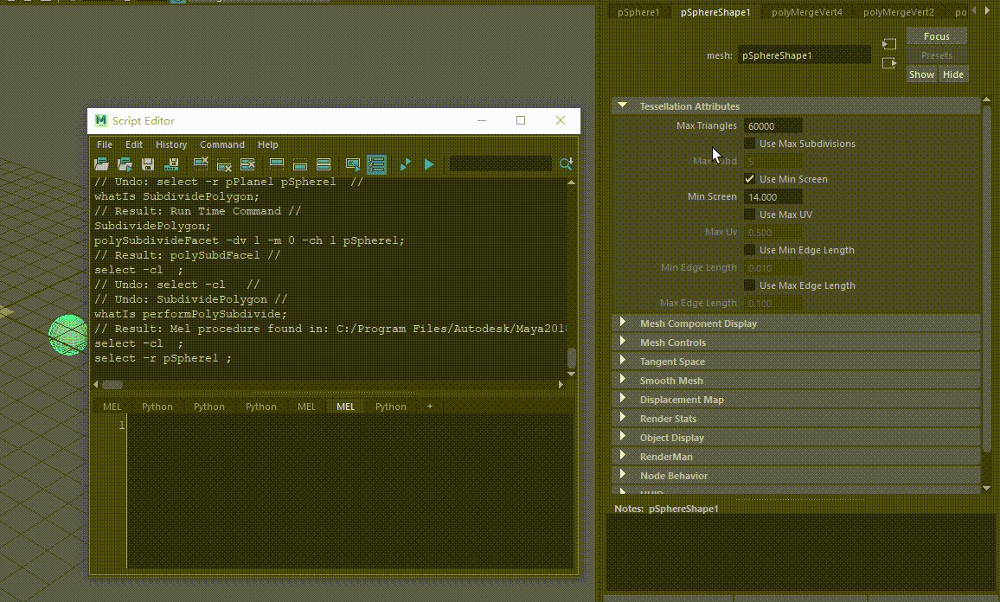
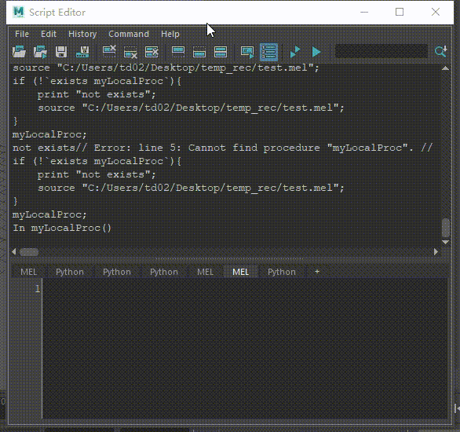

&emsp;&emsp;虽然接触 Maya 开发已经快接近两年了，但是发现自己其实并不会 Mel 语言！很多 Maya 中的命令也不知道怎么查询，有时候需要优化 Maya 自带功能时，不管是阅读还是修改都带来了极大的障碍。因此还是抽个时间把 Maya 文档中的 Mel 模块看一遍才行。

&emsp;&emsp;下面记录一些知识重点！

---

### 查询命令 whatIs
&emsp;&emsp;有时候我们不知道 Maya 做了什么具体操作，通常会打开脚本编辑器中的“Echo All Commands”，来查看执行过程中调用的命令。

&emsp;&emsp;我们可以用 ```whatIs``` 查询命令。whatIs 命令将返回一个字符串，表示该参数是一个命令、程序、脚本或未知。如果给它一个脚本名称，它将返回脚本路径。

&emsp;&emsp;以 Maya 的添加分段功能为例，键入命令：
```whatIs SubdividePolygon;``` ，运行后返回结果： ```// Result: Run Time Command // ``` 。我们可以找到<font color=red> Maya 安装目录的 scripts\startup 文件夹中的 defaultRunTimeCommands.mel </font>文件，此文件中列出了所有的运行时命令，以及与每个运行时命令关联的菜单项和 MEL 程序/Maya MEL 命令。

SubdividePolygon 命令在文件中的部分如下所示：
```Mel
runTimeCommand -default true
-annotation (uiRes("m_defaultRunTimeCommands.kSubdividePolygonAnnot"))
-category   ("Menu items.Modeling.Edit Mesh")
-command    ("performPolySubdivide \"\" 0")
SubdividePolygon;
```

再次键入命令查询 ```whatIs performPolySubdivide;``` ，运行后返回结果 ```// Result: Mel procedure found in: C:/Program Files/Autodesk/Maya2018/scripts/others/performPolySubdivide.mel // ``` ，在这里我们就找到具体的执行文件了。

---

### 拖拽属性到脚本编辑器
&emsp;&emsp;Maya 可以使用<font color=red>鼠标中键</font>将属性从“属性编辑器”(Attribute Editor)拖放到“脚本编辑器”(Script Editor)。node.attributeName 会直接添加到“脚本编辑器”(Script Editor)中。


---

### Source Script
&emsp;&emsp;执行文本文件的内容。

&emsp;&emsp;在调用自定义的 mel 的方法前，需要先定义，也就是先把方法运行声明一次。使用任意文件名保存脚本，然后使用 source 命令将其源化。脚本源化后，可以按任意顺序调用其任何全局程序。

&emsp;&emsp;可以点击脚本编辑器中的  按钮源化脚本。如果在源化脚本之后更改了脚本，那么 Maya 不会自动拾取该更改。您需要使用“文件 > 源化脚本”(File > Source Script)重新运行脚本。

&emsp;&emsp;如果不确定是否需要源化脚本，则可在调用之前测试函数在 MEL 中是否可用：
```Mel
if (!`exists myLocalProc`){
    source "xxx.mel";
}
myLocalProc;
```

注意： MEL 脚本和 mayaAscii 文件是不同的。如果将 .ma 文件重命名为 .mel 文件并源化该文件，则可能会出错。或者，如果将 .mel 脚本重命名为 .ma 文件并打开该文件，则可能会出错，或者甚至会使 Maya 崩溃。Maya 在读取文件时会执行一些特殊操作以提高性能，并非所有命令都与此兼容。

---

### 脚本编辑器自动补全
&emsp;&emsp;开启 Command -> Command Completion ，键入时自动完成命令名称。如果启用“显示工具提示帮助”(Show Tooltip Help)，则命令名称将在您键入时自动显示。如果禁用“显示工具提示帮助”(Show Tooltip Help)，则必须按住 Ctrl+空格键才能显示它们。



&emsp;&emsp;开启 Command -> Object Path Completion ，键入时自动完成对象路径名称。如果启用“显示工具提示帮助”(Show Tooltip Help)，则命令名称将在您键入时自动显示。如果禁用“显示工具提示帮助”(Show Tooltip Help)，则必须按住 Ctrl+空格键才能显示它们。

---

### 判断存在性
- 命令和脚本: exists  
如果参数为有效的命令、子程序或脚本，exists 命令将返回 true。
    ```Mel
    if (exists("sphere")) {
        sphere; // make a sphere
    }
    ```

- 对象: objExists  
如果对象存在且包含某个明确的名称，objExists 函数将返回 true。
    ```Mel
    sphere -name "george";
    // Result: george makeNurbSphere1 //
    print(objExists("george"));
    1
    print(objExists("martha"));
    0
    ```

- 节点上的属性: attributeExists  
使用 attributeExists 检查节点上是否存在给定属性。命令的形式为```attributeExists("attributeName","nodeName")```

    ```MEL
    if (attributeExists("visibility","mySphere")) {
        setAttr mySphere.visibility on;
    }
    ```


