&emsp;&emsp;最近有一个任务是开发工具架，主要功能为工具的显示和编辑。由于这次开发涉及未接触过的知识点比较多，而且对美观设计方面也有所欠缺，因此开发周期比较长，但收获良多。

&emsp;&emsp;Qt是跨平台的，虽然该工具主要是在 Maya 中使用，但是同样可以拓展到其他平台上。在开发这个工具的过程中更加深入学习了 Qt 的 MVC 框架以及对接数据库的 QSql 相关的知识，下面详细讲一下这个工具过程和演示。

---
# 🐙 工具展示

## 界面展示

- 用户界面  
用户模式主要进行工具的调用。  
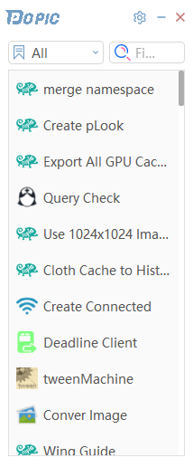
- 管理员界面  
管理员模式主要进行工具的编辑，功能包括工具的增加、删除、修改、移动、改变分组。 
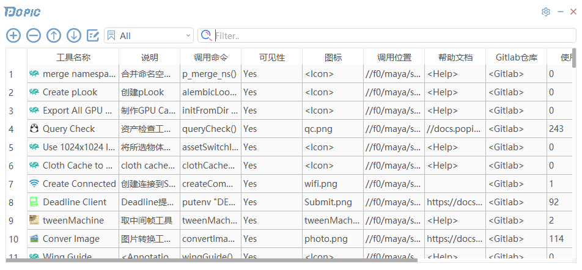

---

## 通用功能

1. 切换组分类  
通过点击组选项框，选择需要切换的组名，即可更改视图中显示的工具为所选组内的工具。  
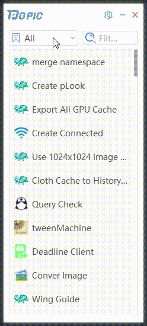
1. 搜索工具  
通过在搜索框中输入需要搜索的工具名称或备注信息，即可从视图中筛选符合搜索条件的工具并显示。  
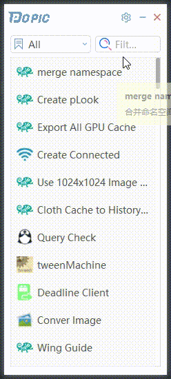
1. 切换用户模式与管理员模式  
可以通过点击设置菜单中的“进入用户/管理员模式”进行工具模式切换。  
当工具首次进入管理员模式时会要求输入密码，只有在密码输入正确后才能进入管理员模式，在下次初始化工具前不需要重新输入密码进入管理员模式。  
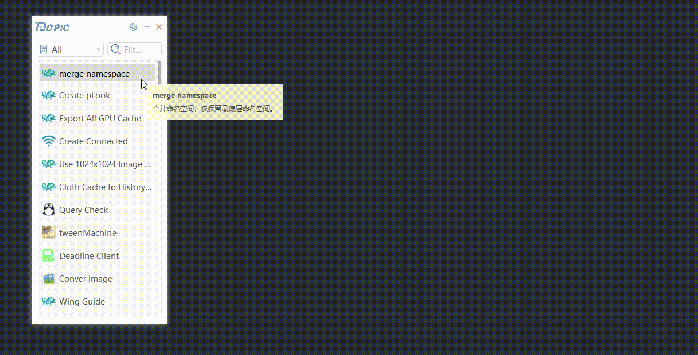
1. 折叠界面  
可以通过点击工具右上角的 “-” 按钮，把界面进行折叠或者展开。折叠后的标题栏可以点击进行拖拽。  
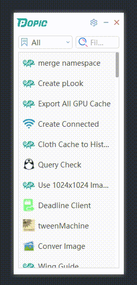
1. 窗口拖拽  
可以在界面空白处按住鼠标左键并移动鼠标，实现界面拖拽功能。  
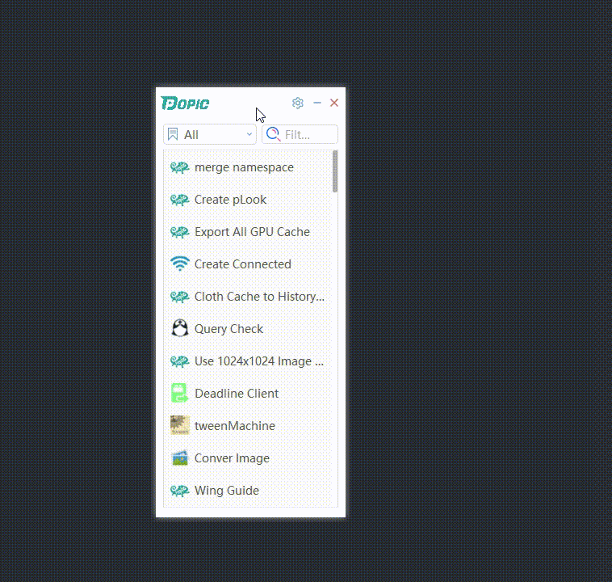
1. 窗口缩放  
可以把鼠标移动到窗口边缘，当鼠标出现缩放样式时，可以按住鼠标左键并移动鼠标，实现界面缩放功能。  
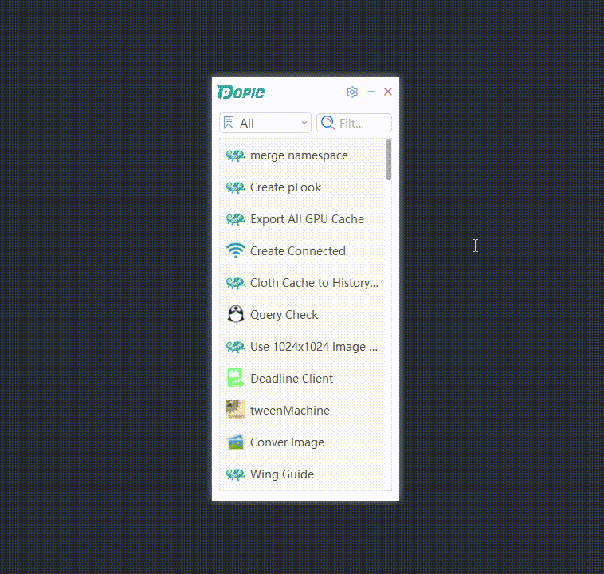

---

## 用户功能展示

1. 切换视图显示模式  
在用户模式下，工具视图显示模式有列表显示和图标显示两种，可以通过点击设置菜单上的“切换显示模式”，对视图的显示模式进行交替更换。  
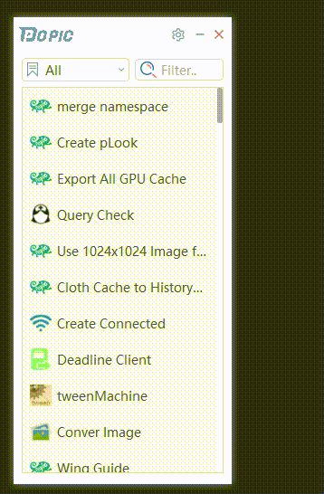
2. 调节视图显示比例  
在用户模式下，可以通过滑动设置菜单上的“调节显示比例”的滑动条，对视图的显示比例进行缩放。  
不同显示模式视图的缩放值完全独立，调节比例时仅对当前显示模式视图生效，不影响其他显示模式比例。  
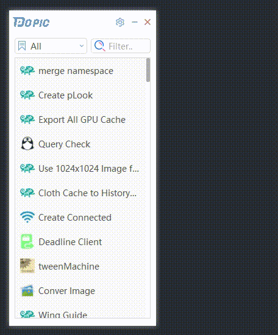
3. 查看备注  
在用户模式下，当鼠标悬停在工具上，会弹出该工具的备注。  
对于设置了说明文档链接的工具，还可以点击“Help”打开说明链接。  
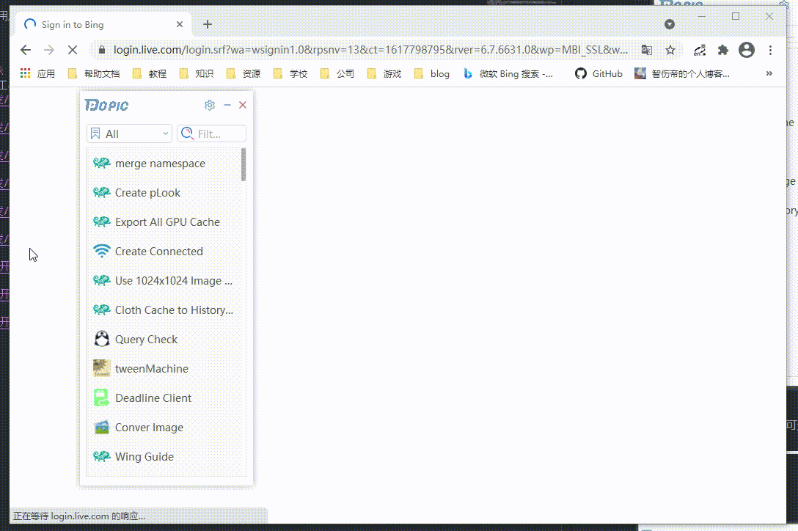
4. 运行工具  
&emsp;&emsp;单击用户界面中的工具即可运行选中工具。

---

## 管理员功能展示

### 编辑工具

1. 在当前行前插入工具  
在管理员模式下，选中其中一行工具，点击图示“添加”按钮，可以在选中行前插入一行新工具。  
如果当前组不是 All 组，创建的工具会自动加入到 All 组中。  
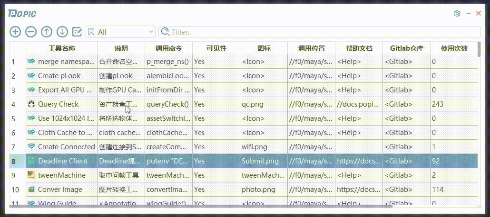
1. 删除当前行的工具  
在管理员模式下，选中需要移除的工具，点击图示“删除”按钮，可以删除选中行的工具。  
删除工具会把工具从所有组中移除。  
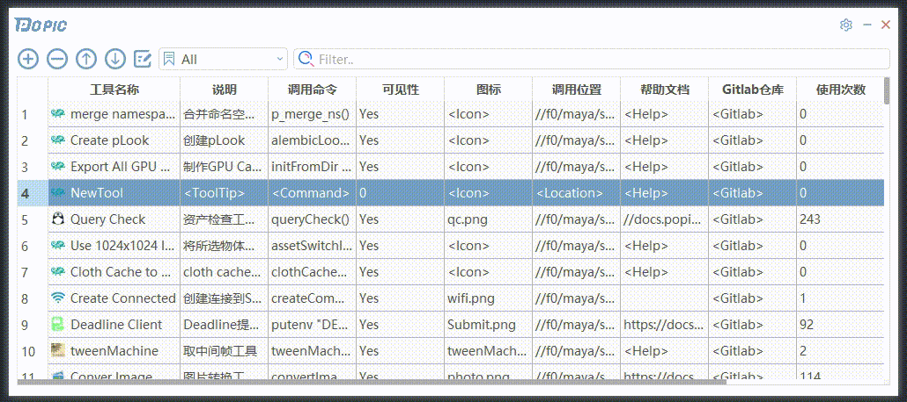
3. 上移当前行  
在管理员模式下，选择需要上移的工具行，点击图示“上移”按钮，可以把选中工具上移一位。  
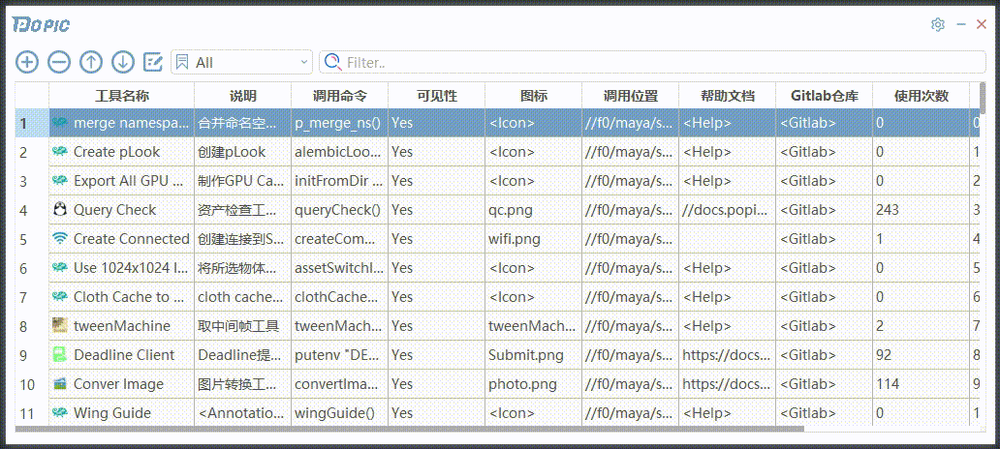
4. 下移当前行  
在管理员模式下，选择需要下移的工具行，点击图示“下移”按钮，可以把选中工具下移一位。  
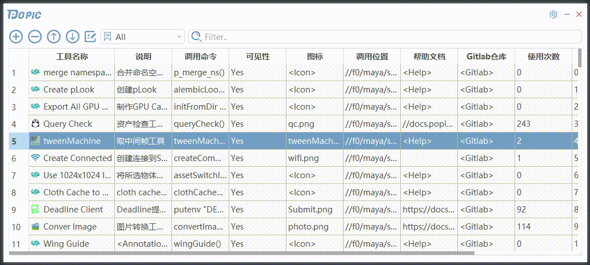
5. 拖拽移动行  
在管理员模式下，鼠标左键按住需要拖拽移动的工具行，按住拖动鼠标到需要插入的行位置后松开鼠标左键，可以把工具移动到指定行位置。  
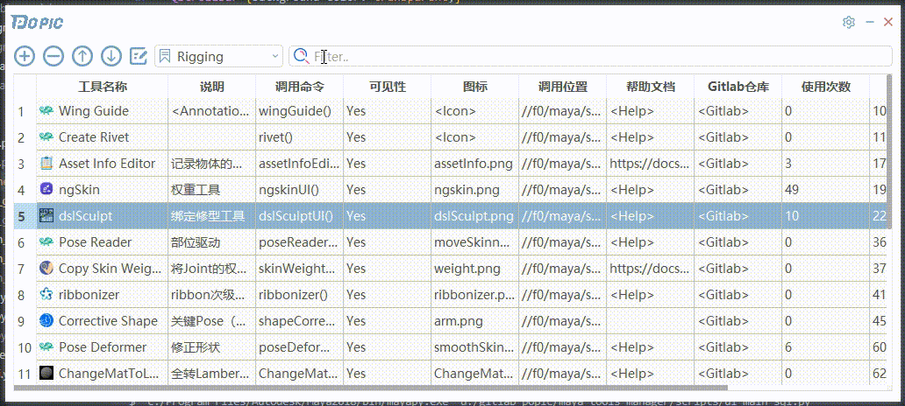
6. 编辑工具内容  
在管理员模式下，鼠标左键双击选中需要编辑的内容，可以编辑当前工具。其中 使用次数、 tid 和 tdatetime 为不可编辑列。  
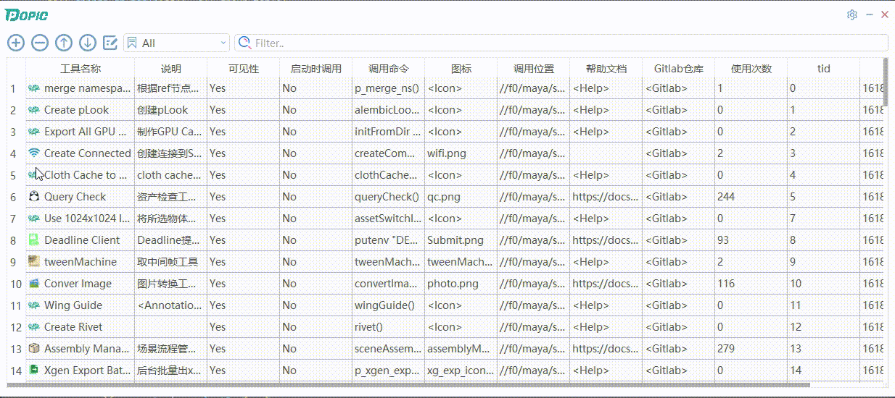


### 运行工具和打开工具帮助  

1. 运行工具  
在管理员模式下，右键点击选中工具，在弹出菜单中选择“运行工具”，即可运行选中工具。  
2. 打开帮助  
在管理员模式下，右键点击选中工具，在弹出菜单中选择“打开帮助”，即可打开选中工具的帮助文档。  

### 修改工具的分组

1. 添加到组  
在管理员模式下，右键点击选中工具，在弹出菜单中选择“添加到组”，弹出列表会显示除了当前组、 All 组以及 Unsorted 组外的其他组，选择需要添加的组，可以把选中工具添加到选择的组内。  
“添加到组”功能不会把工具从原来的组中移除，而是直接在需要添加的组中添加该工具。  
假如选中工具已经存在于需要添加的组，则会跳过添加操作。  
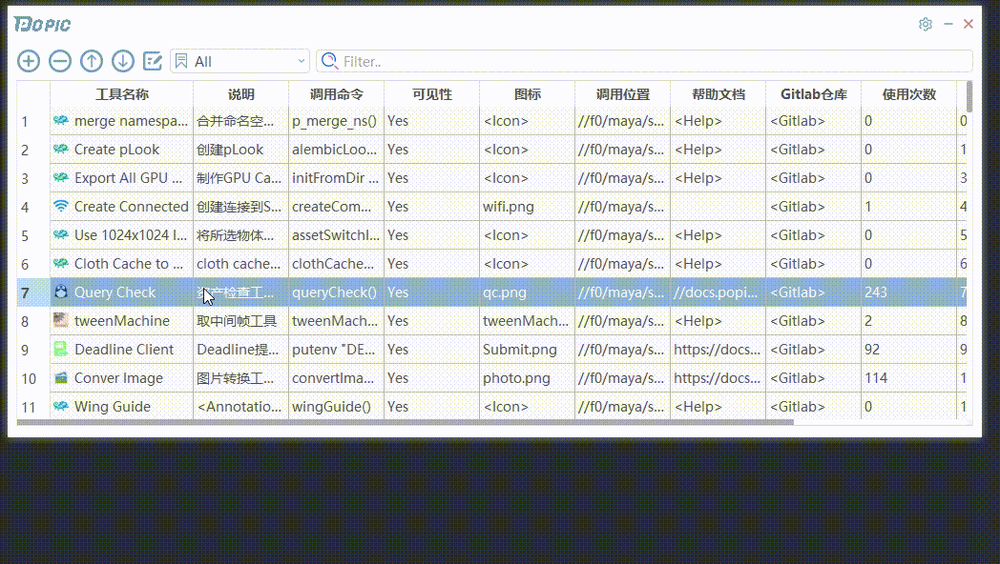
2. 移动到组  
在管理员模式下，右键点击选中工具，在弹出菜单中选择“移动到组”，弹出列表会显示除了当前组、 All 组以及 Unsorted 组外的其他组，选择需要移动的组，可以把选中工具移动到选择的组内。  
“移动到组”功能会把工具从原来组中移除，并在需要移动的组中添加该工具。  
假如选中工具已经存在于需要移动的组，则会跳过添加操作，但仍会从原来组中移除。  
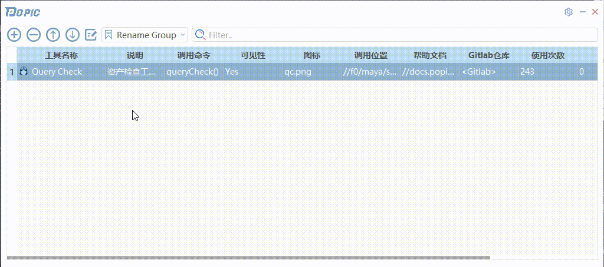
3. 移出该组
在管理员模式下，右键点击选中工具，在弹出菜单中选择“移出该组”，可以把工具从当前组中移除。  
与“删除工具”不同的是，“删除工具”会把工具从所有组中删除，而“移出该组”只会把工具从该组中移除，而不会影响工具在其他组的存在情况。  
假如工具在该组中移除后不存在于除了 All 组外的任何其他分组，则工具会自动添加到 Unsorted 分组中。
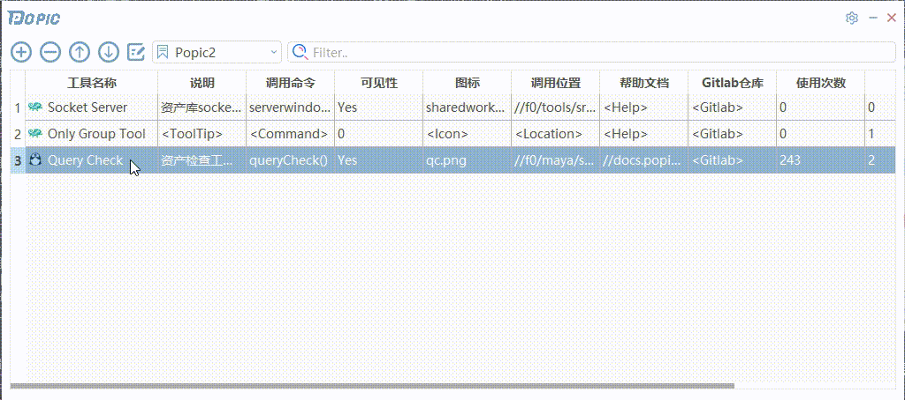

### 编辑组  

在管理员模式下，点击“编辑组”按钮，会弹出编辑组窗口界面。我们可以在界面中查看到已经创建的组名，以及进行添加新组、删除组和重命名组操作。编辑组中的组会同步到工具的分组中。  
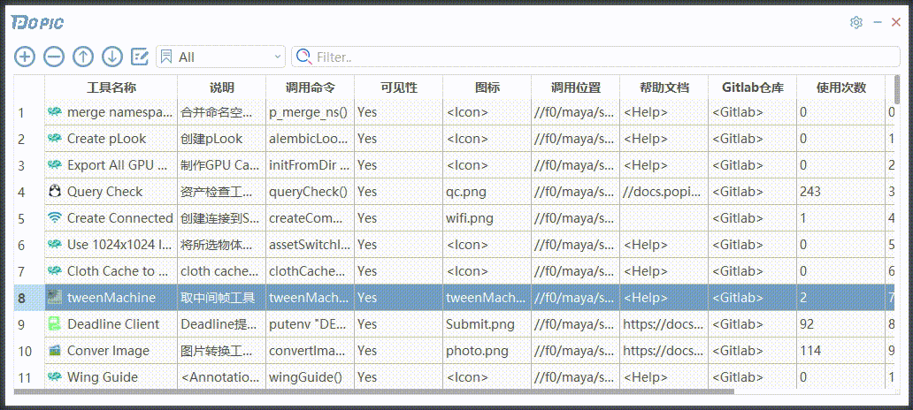   
   1. 添加新组  
   在打开的编辑组窗口中，点击“添加组”按钮，会弹出需要输入新组名的窗口，在窗口中输入需要创建的组名后，点击“OK”按钮，即可把在组列表最下方创建一个新组。  
   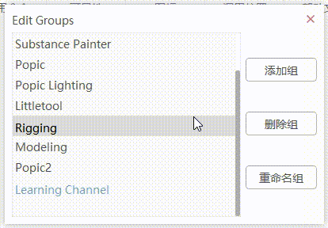
   2. 删除组  
   在打开的编辑组窗口中，选择需要删除的组，点击“删除组”按钮，会弹出提示框：“确定删除 xxx 组？删除后未分类工具会移动到 Unsorted 组”。点击提示框的“Ok”按钮，即可删除选中组。  
   假如选中组中存在多个工具，则会判断每个工具是否存在与别的组中，如果工具不存在于任何组（“All”组除外），则会把工具移动到 Unsorted 未分类组中。  
   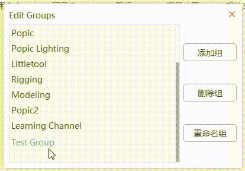
   3. 重命名组  
   在打开的编辑窗口中，选择需要重命名的组，点击“重命名组”，会弹出需要输入新组名的窗口，在窗口中输入新组名后，点击“Ok”按钮，即可把选中组重命名。  
   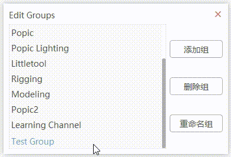

---

# 🐝 数据结构

## 数据库

&emsp;&emsp;本来一开始是计划用 PostgreSQL 来实现的，但是由于 Maya 的 PySide2 中没有 PSql 的驱动，本来使用 PSql 已经开发一半了，也无奈被迫中止，转用 sqlite 。

&emsp;&emsp;至于 Model ，一开始不清楚 Qt 有直接处理数据库的类，使用了传统的 QAbstractTableModel 结合自定义 Node 类型节点实现显示。虽然也可以正常显示数据，但是在得知可以使用 QSqlTableModel 直接操作数据库数据后，就舍弃了传统模型，改用 QSqlTableModel 了。


### PSQL

&emsp;&emsp;虽然最终并没有使用 Psql ，但是毕竟投入了一点时间进行研究，所以还是记录一下 Psql 中的开发使用吧。

#### 创建数据库

&emsp;&emsp;使用 pgAdmin 4 创建数据库。

#### 获取数据库连接

```Python
import psycopg2
conn = psycopg2.connect(
                database='database name',
                user='user name',
                password='database password',
                host='your host',
                port='your port')

TOOL_TABLE = 'public.tool_manager'
```

#### 插入数据

```Python
def insert_data(conn, table, tname, tcommand, tlocation, ttooltip='',  tenabled=True, ticon='', thelp='', tgitlab='', tused=0, tid=0, tdatetime=''):
    cursor = conn.cursor()
    cursor.execute("INSERT INTO {}(tname, ttooltip, tcommand, tenabled, ticon, tlocation, thelp, tgitlab, tused, tid, tdate) \
        VALUES('{}', '{}', '{}', '{}', '{}', '{}', '{}', '{}', {}, {}, '{}')".format(
            table, tname, ttooltip.encode('utf-8'), tcommand, tenabled, ticon, tlocation, thelp, tgitlab, tused, tid, tdatetime
        ))

insert_data(conn, 'public.group_{}'.format(tgroups.lower().replace(' ','_')), tname=tname, tcommand=tcommand, tlocation=tlocation, ttooltip=ttooltip, ticon=ticon, tenabled=tenabled, thelp=thelp, tused=tused, tid=tid, tdatetime=tdatetime)
```

#### 删除数据

```python
def delete_data(conn, table, condition_key, condition_value):
    cursor = conn.cursor()
    cursor.execute("DELETE FROM {} \
        WHERE {}='{}'".format(table, condition_key, condition_value))

delete_data(conn, TOOL_TABLE, 'tname', 'first_tool')
```

#### 清空表数据

&emsp;&emsp;truncate 方法在 sqlite 是没有的。
```Python
def truncate_table(conn, table):
    cursor = conn.cursor()
    cursor.execute("truncate {}".format(table))

truncate_table(TOOL_TABLE)
```

#### 查询数据

```Python
def query_data(conn, table, key, condition=''):
    cursor = conn.cursor()
    if condition:
        cursor.execute("SELECT {} from {} where {}".format(key, table, condition))
    else:
        cursor.execute("SELECT {} from {}".format(key, table))
    data = cursor.fetchall()
    return data

query_data(conn, TOOL_TABLE, 'tname')
```

#### 更新数据

```Python
def update_data(conn, table, key, value, condition):
    cursor = conn.cursor()
    try:
        cursor.execute("UPDATE {} SET {}='{}' WHERE {};".format(table, key, value.encode('utf-8'), condition))
    except:
        cursor.execute("UPDATE {} SET {}={} WHERE {};".format(table, key, value, condition))

update_data(conn, TOOL_TABLE, 'thelp', thelp, "tname='{}'".format(tname))
```

---

### SQlite

&emsp;&emsp;SQLite 是一个软件库，实现了自给自足的、无服务器的、零配置的、事务性的 SQL 数据库引擎。SQLite 是在世界上最广泛部署的 SQL 数据库引擎。SQLite 源代码不受版权限制。

#### 创建数据库

&emsp;&emsp;SQLite 可以指定数据库位置，假如位置不存在则会自动创建一个数据库。
```Python
TOOLS_DB = 'tools.db'
conn = sqlite3.connect(TOOLS_DB)
cursor = conn.cursor()
```

#### 创建表

&emsp;&emsp;SQLite 没有单独的 Boolean 存储类。相反，布尔值被存储为整数 0（false）和 1（true）。

&emsp;&emsp;SQLite 没有一个单独的用于存储日期和/或时间的存储类，但 SQLite 能够把日期和时间存储为 TEXT、REAL 或 INTEGER 值。

```Python
def create_table(table_name):
    cursor.execute('''select name from sqlite_master where type='table' order by name;''')
    table_tuples = cursor.fetchall()
    if tuple([table_name]) in table_tuples:
        return False
    cursor.execute('''create table {}(
        tname       text,
        ttooltip    text,
        tenabled    boolean,
        tsetup      boolean,
        tcommand    text,
        ticon       text,
        tlocation   text,
        thelp       text,
        tgitlab     text,
        tused       integer,
        tid         integer,
        tdate       text
        );'''.format(table_name))
    return True

create_table('group_all')
```

#### 删除表

&emsp;&emsp;SQLite 的 DROP TABLE 语句用来删除表定义及其所有相关数据、索引、触发器、约束和该表的权限规范。

&emsp;&emsp;使用此命令时要特别注意，因为一旦一个表被删除，表中所有信息也将永远丢失。

```Python
def drop_table(table_name):
    cursor.execute('''DROP TABLE {};'''.format(table_name))

drop_table('group_all')
```

#### 重命名表名

```Python
def rename_table(old_table, new_table):
    cursor.execute('''select name from sqlite_master where type='table' order by name;''')
    table_tuples = cursor.fetchall()
    if tuple([new_table]) in table_tuples:
        return False
    cursor.execute('''ALTER TABLE {} RENAME TO {};'''.format(old_table, new_table))
    return True

rename_table('old', 'new')
```

#### 清空表

&emsp;&emsp;在 SQLite 中，并没有 TRUNCATE TABLE 命令，但可以使用 SQLite 的 DELETE 命令从已有的表中删除全部的数据。

```Python
def truncate_table(table):
    cursor.execute('''delete from {};'''.format(table))

truncate_table('group_all')
```

#### 插入数据

```Python
def insert_record(table, tname='NewTool', tcommand='<Command>', tlocation='<Location>', ttooltip='<ToolTip>',  tenabled=True, ticon='<Icon>', thelp='<Help>', tgitlab='<Gitlab>', tused=0, tid=0, tdate='', tsetup=False):
    cursor.execute('''insert into {}(tname, ttooltip, tenabled, tsetup, tcommand, ticon, tlocation, thelp, tgitlab, tused, tid, tdate)
        VALUES(?, ?, ?, ?, ?, ?, ?, ?, ?, ?, ?, ?
        )'''.format(table), (tname, ttooltip, tenabled, tsetup, tcommand, ticon, tlocation, thelp, tgitlab, tused, tid, tdate))

insert_record('group_{}'.format(tgroups.lower().replace(' ','_')), tname=tname, tcommand=tcommand, tlocation=tlocation, ttooltip=ttooltip, ticon=ticon, tenabled=tenabled, thelp=thelp, tused=tused, tid=tid, tdate=tdatetime, tsetup=tsetup)
```

---

## QSqlTableModel

&emsp;&emsp;QSqlTableModel 可以作为 QTableView 的数据源。

### 连接数据库

```Python
TOOLS_DB = 'tools.db'
@staticmethod
def sql_db():
    if QSqlDatabase.contains("qt_sql_default_connection"):
        db = QSqlDatabase.database("qt_sql_default_connection")
    else:
        db = QSqlDatabase.addDatabase("QSQLITE")
        
    db.setDatabaseName(TOOLS_DB)

    if db.open():
        return db
    else:
        return QSqlDatabase()
```

### 设置编辑策略
QSqlTableModel.setEditStrategy(strategy)

参数为枚举类型：
- OnFieldChange 字段值变化时立即更新到数据库
- OnRowChange 当前行变化时更新到数据库
- OnManualSubmit  所有修改暂时缓存，手动调用submitAll保存

```Python
self.setEditStrategy(QSqlTableModel.OnManualSubmit)
```

---

# ⭐ 具体功能详解

## MVC 框架 显示工具数据

&emsp;&emsp;经典 MVC 模式中，M 是指业务模型，V 是指用户界面，C 则是控制器，使用 MVC 的目的是将 M 和 V 的实现代码分离，从而使同一个程序可以使用不同的表现形式。其中，View 的定义比较清晰，就是用户界面。

&emsp;&emsp;在 Qt 中的 MVC 并不叫MVC，而是叫“MVD”，Qt中没有 Controller 的说法，而是使用了另外一种抽象: Delegate (委托) ，其行为和传统的 MVC 是相同的。

&emsp;&emsp;在本工具中，View 使用了 QListView（用户界面）和 QTableView（管理员界面），Model 使用了 QSqlTableModel，Delegate 使用了 QStyledItemDelegate（combobox 显示 data）。

### 工具视图 ToolView

&emsp;&emsp;继承架构：

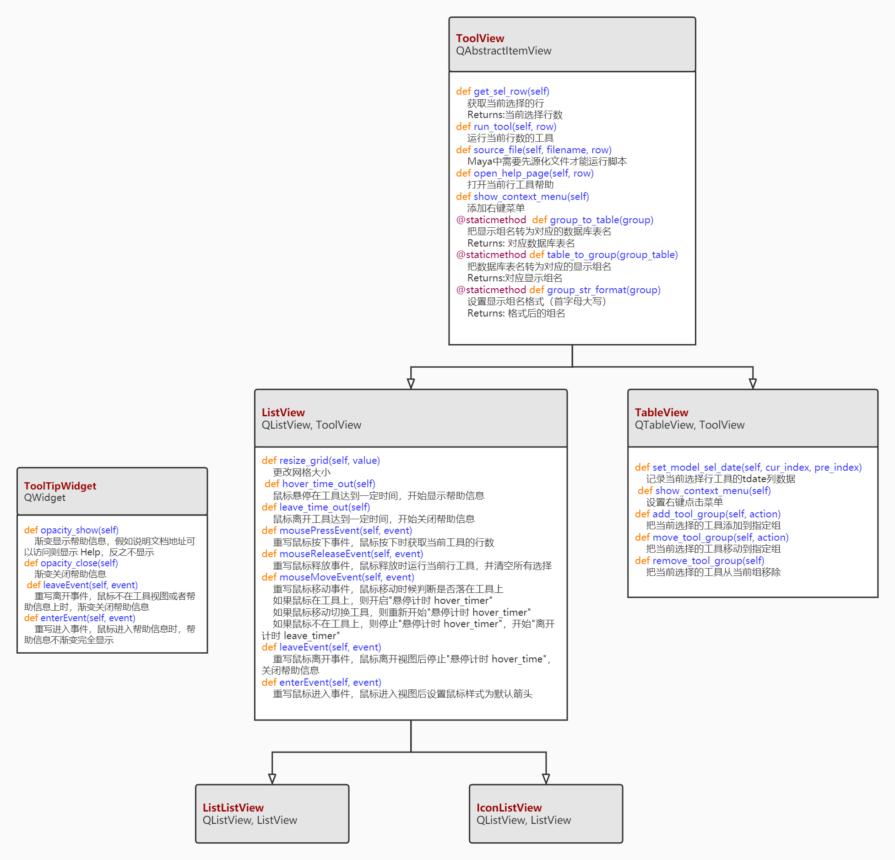

### 数据模型 sqlTableModel

&emsp;&emsp;模型方法：

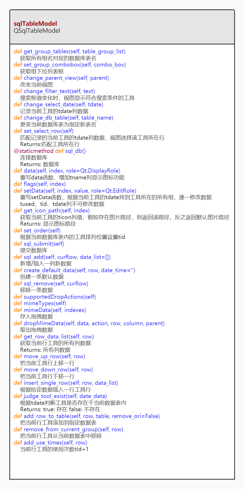

### 委托代理 ComboBoxDelegate

&emsp;&emsp;对 tenabled、tsetup 这类布尔值项设置代理，使得编辑时显示自定义下拉框以选择“Yes”或者“No”。

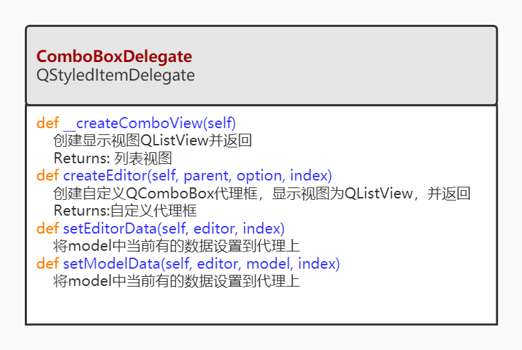

### 为视图设置模型和代理
ui_main_sql.py
```Python
# init list view
self.UserView = self.icon_list_view
self.tool_view = self.UserView
# init model
self.tool_model = _sql_table_model.sqlTableModel(self.tool_view)
# set list view model
self.icon_list_view.setModel(self.tool_model)
self.list_list_view.setModel(self.tool_model)

# --- change to AdminMode --- 
# init table view
self.AdminView = _table_view.TableView(self)
# init combobox delegate
combo_model = QStandardItemModel(2, 1, self.AdminView)
combo_model.setData(combo_model.index(0, 0, QModelIndex()), "Yes")
combo_model.setData(combo_model.index(1, 0, QModelIndex()), "No")
# set table view delegate
self.AdminView.setItemDelegateForColumn(self.tool_model._column_key['tenabled'], _combobox_delegate.ComboBoxDelegate(combo_model, self.AdminView))
self.AdminView.setItemDelegateForColumn(self.tool_model._column_key['tsetup'], _combobox_delegate.ComboBoxDelegate(combo_model, self.AdminView))
# set table view model
self.AdminView.setModel(self.tool_model)
```
---

## 切换组时更新工具视图

&emsp;&emsp;当切换组时，sqkTableModel重新设置数据表。

ui_main_sql.py
```Python
class ToolWin(QMainWindow):
    def __init__(self, parent=None):
        # init group combobox
        self.group_combobox = _combo_box.ComboBox(self.group_list)
        # parse group combobox to model
        self.tool_model.set_group_combobox(self.group_combobox)
        # set group combobox signal
        self.group_combobox.currentTextChanged.connect(self.change_group)

    def change_group(self, cur_group):
        group_table = _table_view.TableView.group_to_table(cur_group)
        self.tool_model.change_db_table(group_table)
```

sql_table_model.py
```Python
class sqlTableModel(QSqlTableModel):
    def change_db_table(self, table_name):
        """更变当前数据库表为指定新表名

        Args:
            table_name (str): 数据库表名
        """
        self.setTable(table_name)
        # 重新筛选符合搜索条件的工具
        self.setFilter("lower(tname) like '%{}%' or lower(ttooltip) like '%{}%'".format(self._filter_text.lower(), self._filter_text.lower()))
        self.setSort(self._sort_key, Qt.AscendingOrder)
        self.select()

        self.setHeaderData(self._column_key['tname'], Qt.Horizontal, u"工具名称")
        self.setHeaderData(self._column_key['ttooltip'], Qt.Horizontal, u"说明")
        self.setHeaderData(self._column_key['tcommand'], Qt.Horizontal, u"调用命令")
        self.setHeaderData(self._column_key['tenabled'], Qt.Horizontal, u"可见性")
        self.setHeaderData(self._column_key['tsetup'], Qt.Horizontal, u"启动时调用")
        self.setHeaderData(self._column_key['ticon'], Qt.Horizontal, u"图标")
        self.setHeaderData(self._column_key['tlocation'], Qt.Horizontal, u"调用位置")
        self.setHeaderData(self._column_key['thelp'], Qt.Horizontal, u"帮助文档")
        self.setHeaderData(self._column_key['tgitlab'], Qt.Horizontal, u"Gitlab仓库")
        self.setHeaderData(self._column_key['tused'], Qt.Horizontal, u"使用次数")

        # 设置组下拉框当前值为新表名对应的组名
        if self._group_combobox:
            cur_table_group = self._parent_view.table_to_group(table_name)
            if not cur_table_group == self._group_combobox.currentText():
                self._group_combobox.setCurrentText(cur_table_group)

        # 表格根据记录的tdate选择工具
        if self._parent_view.inherits('QTableView'):
            self._parent_view.setColumnWidth(self._column_key['tname'], 150)
            self.set_select_row()
```

---

## 无边框窗口添加阴影

&emsp;&emsp;把阴影窗口 ShadowWidget 设置为显示主窗口的父窗体。

ui_main_sql.py
```Python
class ShadowWidget(QWidget):
    def __init__(self, main_win, parent=None):
        super(ShadowWidget, self).__init__(parent)

        self.setWindowFlags(Qt.FramelessWindowHint | Qt.Windo
        self.setAttribute(Qt.WA_TranslucentBackground)

        self.main_widget = main_win
        self.main_widget.setParent(self)
        self.main_layout = QVBoxLayout(self)
        self.main_layout.addWidget(self.main_widget)
        self.main_layout.setContentsMargins(6,6,6,6)

        wndShadow = QGraphicsDropShadowEffect(self)
        wndShadow.setBlurRadius(20)
        wndShadow.setColor(Qt.gray)
        wndShadow.setOffset(0,0)
        self.main_widget.setGraphicsEffect(wndShadow)
```
---

## 无边框窗口拖拽功能

&emsp;&emsp;通过重写鼠标点击、释放和移动事件实现窗口拖拽功能。

&emsp;&emsp;用 ismoving 属性记录窗口移动状态。

ui_main_sql.py
```Python
class ShadowWidget(QWidget):
    def __init__(self, main_win, parent=None):
        self.ismoving = False
        self.main_widget.setMouseTracking(True)
        self.setMouseTracking(True)
    
    def mouseMoveEvent(self, event):
        super(ShadowWidget, self).mouseMoveEvent(event)
        if self.ismoving:
            relpos = event.globalPos() - self.start_point
            self.move(self.window_point + relpos)

    def mousePressEvent(self, event):
        super(ShadowWidget, self).mousePressEvent(event)
        if event.button() == Qt.LeftButton:
            self.ismoving = True
            self.setCursor(Qt.ClosedHandCursor)
            self.start_point = event.globalPos()
            self.window_point = self.frameGeometry().topLeft()

    def mouseReleaseEvent(self, event):
        super(ShadowWidget, self).mouseReleaseEvent(event)
        self.ismoving = False
        if event.button() == Qt.LeftButton:
            self.setCursor(Qt.ArrowCursor)
```

---

## 无边框窗口缩放功能

属性：
- Margins: 判定窗口边缘距离鼠标的值
- current_edit_rect: 鼠标所在界面的区域范围
- on_left_btn：是否按下左键

方法：
- judgeReigon(pos): 判断鼠标在窗口边缘的哪一部分区域
- resizeWin(mgPos): 鼠标在可以缩放的区域范围并左键点击和拖拽，则进行缩放

ui_main_sql.py
```Python
class ShadowWidget(QWidget):
    def __init__(self, main_win, parent=None):
        self.Margins = 10
        self.current_edit_rect = None
        self.on_left_btn = False
        self.main_widget.setMouseTracking(True)
        self.setMouseTracking(True)

    def mouseMoveEvent(self, event):
        super(ShadowWidget, self).mouseMoveEvent(event)
        if not self.on_left_btn:
            self.judgeReigon(self.mapToParent(event.pos()))
        elif self.cursor() != Qt.ArrowCursor:
            self.resizeWin(event.globalPos())

    def mousePressEvent(self, event):
        super(ShadowWidget, self).mousePressEvent(event)
        if event.button() == Qt.LeftButton:
            self.on_left_btn = True
    
    def mouseReleaseEvent(self, event):
        super(ShadowWidget, self).mouseReleaseEvent(event)
        if event.button() == Qt.LeftButton:
            self.setCursor(Qt.ArrowCursor)
            self.current_edit_rect = None
            self.on_left_btn = False

    def judgeReigon(self, pos):
        rect = self.frameGeometry()

        self.top_rect = QRect(rect.x()+self.Margins, rect.y(), rect.width()-self.Margins*2, self.Margins)
        self.top_left_rect = QRect(rect.x(), rect.y(), self.Margins, self.Margins)
        self.left_rect = QRect(rect.x(), rect.y()+self.Margins, self.Margins, rect.height()-self.Margins*2)
        self.bottom_left_rect = QRect(rect.x(), rect.y()+rect.height()-self.Margins, self.Margins, self.Margins)
        self.bottom_rect = QRect(rect.x()+self.Margins, rect.y()+rect.height()-self.Margins, rect.width()-self.Margins*2, self.Margins)
        self.botton_right_rect = QRect(rect.x()+self.width()-self.Margins, rect.y()+rect.height()-self.Margins, self.Margins, self.Margins)
        self.right_rect = QRect(rect.x()+self.width()-self.Margins, rect.y()+self.Margins, self.Margins, rect.height()-self.Margins*2)
        self.top_right_rect = QRect(rect.x()+self.width()-self.Margins, rect.y(), self.Margins, self.Margins)

        if self.top_rect.contains(pos):
            self.setCursor(Qt.SizeVerCursor)
            self.current_edit_rect = 'top_rect'
        elif self.top_left_rect.contains(pos):
            self.setCursor(Qt.SizeFDiagCursor)
            self.current_edit_rect = 'top_left_rect'
        elif self.left_rect.contains(pos):
            self.setCursor(Qt.SizeHorCursor)
            self.current_edit_rect = 'left_rect'
        elif self.bottom_left_rect.contains(pos):
            self.setCursor(Qt.SizeBDiagCursor)
            self.current_edit_rect = 'bottom_left_rect'
        elif self.bottom_rect.contains(pos):
            self.setCursor(Qt.SizeVerCursor)
            self.current_edit_rect = 'bottom_rect'
        elif self.botton_right_rect.contains(pos):
            self.setCursor(Qt.SizeFDiagCursor)
            self.current_edit_rect = 'botton_right_rect'
        elif self.right_rect.contains(pos):
            self.setCursor(Qt.SizeHorCursor)
            self.current_edit_rect = 'right_rect'
        elif self.top_right_rect.contains(pos):
            self.setCursor(Qt.SizeBDiagCursor)
            self.current_edit_rect = 'top_right_rect'
        else:
            self.setCursor(Qt.ArrowCursor)
            self.current_edit_rect = None

    def resizeWin(self, mgPos):
        if self.current_edit_rect == None:
            return
        winX = self.geometry().x()
        winY = self.geometry().y()
        winW = self.geometry().width()
        winH = self.geometry().height()
        downside = self.pos().y() + winH
        rightside = self.pos().x() + winW
        if self.current_edit_rect == 'top_rect':
            winY = mgPos.y()
            winH = downside - winY
        elif self.current_edit_rect == 'top_left_rect':
            winY = mgPos.y()
            winH = downside - winY
            winX = mgPos.x()
            winW = rightside - winX
        elif self.current_edit_rect == 'left_rect':
            winX = mgPos.x()
            winW = rightside - winX
        elif self.current_edit_rect == 'bottom_left_rect':
            winX = mgPos.x()
            winW = rightside - winX
            winH = mgPos.y() - self.pos().y()
        elif self.current_edit_rect == 'botton_right_rect':
            winW = mgPos.x() - self.pos().x()
            winH = mgPos.y() - self.pos().y()
        elif self.current_edit_rect == 'right_rect':
            winW = mgPos.x() - self.pos().x()
        elif self.current_edit_rect == 'bottom_rect':
            winH = mgPos.y() - self.pos().y()
        elif self.current_edit_rect == 'top_right_rect':
            winY = mgPos.y()
            winH = downside - winY
            winW = mgPos.x() - self.pos().x()
        if winW < self.win_min_width:
            return
        if winH < self.win_min_height:
            return
        self.setGeometry(winX, winY, winW, winH)
```
---

## 窗口应用用户配置

### 关闭时保存配置信息

&emsp;&emsp;当工具关闭或者退出时，会在电脑本地文档路径下生成一个“popic_tool_config.json”文件。该文件记录工具窗口的位置、大小、用户/管理员模式、当前列表视图显示模式、工具缩放滑块条数值和当前显示组的信息。

```Python
USER_CONFIG_PATH = os.path.expanduser('~/popic_tool_config.json')

class ShadowWidget(QWidget):
    def closeEvent(self, event):
        super(ShadowWidget, self).closeEvent(event)
        user_config = {
            'win_left' : self.pos().x(),
            'win_top' : self.pos().y(),
            'user_width' : self.main_widget.UserViewWidth,
            'user_height' : self.main_widget.UserViewHeight,
            'admin_width' : self.main_widget.AdminViewWidth,
            'admin_height' : self.main_widget.AdminViewHeight,
            'admin_mode' : self.main_widget.AdminMode,
            'current_view' : str(self.main_widget.UserView.viewMode()).split('.')[-1],
            'icon_slider_value' : self.main_widget.size_slider.icon_mode_value,
            'list_slider_value' : self.main_widget.size_slider.list_mode_value,
            'group_index' : self.main_widget.group_combobox.currentIndex()
        }

        with open(USER_CONFIG_PATH, 'w+') as f:
            json_str = json.dumps(user_config, indent=4)
            f.write(json_str)
```

### 打开时读取配置信息

&emsp;&emsp;当工具启动时，假如电脑本地文档路径下存在“popic_tool_config.json”文件，则读取该文件信息并更新工具显示，以恢复与关闭工具前相同的状态。

&emsp;&emsp;如果电脑本地文档路径下不存在“popic_tool_config.json”文件，则会以默认配置启动工具。

```Python
class ShadowWidget(QWidget):
    def showEvent(self, event):
        super(ShadowWidget, self).showEvent(event)
        if os.path.exists(USER_CONFIG_PATH):
            with open(USER_CONFIG_PATH, 'r+') as f:
                user_config = json.load(f)
            self.move(user_config['win_left'], user_config['win_top'])
            self.main_widget.UserViewWidth = user_config['user_width']
            self.main_widget.UserViewHeight = user_config['user_height']
            self.main_widget.AdminViewWidth = user_config['admin_width']
            self.main_widget.AdminViewHeight = user_config['admin_height']
            self.main_widget.group_combobox.setCurrentIndex(user_config['group_index'])
            self.main_widget.size_slider.icon_mode_value = user_config['icon_slider_value']
            self.main_widget.size_slider.list_mode_value = user_config['list_slider_value']
            admin_mode = user_config['admin_mode']
            if admin_mode and self.main_widget.AdminView:
                pass
            else:
                if user_config['current_view'] == 'IconMode':
                    self.main_widget.change_to_icon_mode()
                elif user_config['current_view'] == 'ListMode':
                    self.main_widget.change_to_list_mode()
        self.main_widget.resize_view()

    def resize(self):
        super(ShadowWidget, self).resize(self.main_widget.width()+self.Margins + 20, self.main_widget.height()+self.Margins + 20)

class ToolWin(QMainWindow):
    def resize_view(self):
        if self.tool_view == self.AdminView:
            self.resize(self.AdminViewWidth, self.AdminViewHeight)
        else:
            self.resize(self.UserViewWidth, self.UserViewHeight)
        self.parent().resize()
```

---

## 调用工具

### 在 Windows 下调用工具

```Python
if __name__ == '__main__':
    app = QApplication(sys.argv)
    main_win = ToolWin()
    win = ShadowWidget(main_win)
    win.show()
    sys.exit(app.exec_())
```

### 在 Maya 下调用工具

``` Python
def maya_main():
    ptr = OpenMayaUI.MQtUtil.mainWindow()
    mayaWindow = wrapInstance(long(ptr), QWidget)
    win_obj = mayaWindow.findChild(QWidget, 'popic_tool_window')
    if win_obj:
        win_obj.close()
    else:
        main_win = ToolWin()
        win_obj = ShadowWidget(main_win, mayaWindow)
        win_obj.setObjectName('popic_tool_window')
    win_obj.show()

maya_main()
```

---

## 获取 Maya 的 Icon 路径

&emsp;&emsp;很多 Maya 的工具显示使用的是 Maya 自带的图标，这些图标路径可以通过几个地方找到。

### XBMLANGPATH  
&emsp;&emsp;Icon 路径，在该变量下的路径中的图片文件可以直接用来当作界面控件的图标。  

1. 运行 mel 命令 ```xbmLangPathList;``` 可以查看 icon 路径。  
2. 也可以通过查询环境变量 ```os.environ['XBMLANGPATH']```  查看路径。


