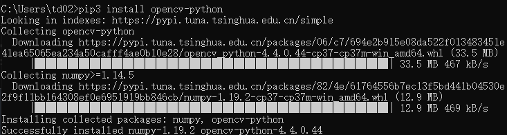
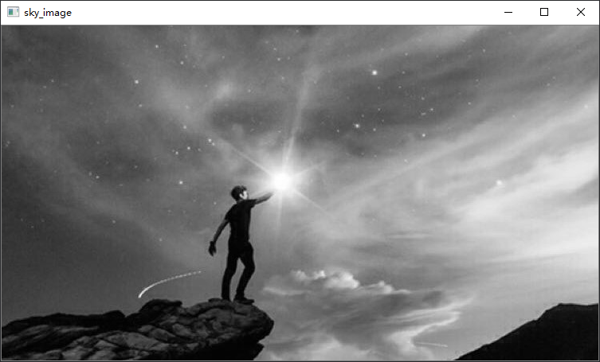
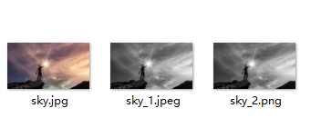

&emsp;&emsp;本节介绍cv2在python中的安装，及其读取、显示、保存图片功能用法。

&emsp;&emsp;参考：https://blog.csdn.net/fu6543210/article/details/80835280

### 🔻 安装cv2
&emsp;&emsp;利用pip3 install 安装
```
pip3 install opencv-python
```

&emsp;&emsp;安装成功：



😮 <font color=orange>题外话 Begin</font>

&emsp;&emsp;为什么我使用pip安装时候是使用国内镜像呢？其实只需要配置一个文件即可实现默认使用国内源。在Windows系统下的具体操作如下：

1. 在用户目录“C:/Users/<font color=pink>用户名</font>”中创建一个名为“pip”的文件夹
2. 在“pip”文件夹中新建文件“pip.ini”
3. 在“pip.ini”文件中写入一下内容并保存  
    ```ini
    [global]
    index-url=https://pypi.tuna.tsinghua.edu.cn/simple 
    [install]  
    trusted-host=pypi.tuna.tsinghua.edu.cn
    disable-pip-version-check = true  
    timeout = 6000
    ```
4. 之后使用pip安装的库都会默认下载清华国内源啦

😮 <font color=orange>题外话 Over</font>

&emsp;&emsp;现在，我们可以在python3中导入cv2这个库了。
```python
import cv2
```

### 👀 读取、显示、保存图像
#### <font color=pink>读取图像 cv2.imread(filepath,flags)</font>
- filepath：读入图像路径
- flags：参数
  - cv2.IMREAD_COLOR：读入一副彩色图像。图像的透明度会被忽略，这是默认参数
  - cv2.IMREAD_GRAYSCALE：以灰度模式读入图像

#### <font color=pink>显示图像 cv2.imshow(wname,img)</font>
- wname：显示窗口的名字
- img：需要显示的图像（使用imread读入）

#### <font color=pink>保存图像 cv2.imwrite(file，img，num)</font>
- file：要保存的文件名
- img：需要保存的图像（使用imread读入）

- num：可选参数，针对特定的格式：对于JPEG，其表示的是图像的质量，用0 - 100的整数表示，默认95；对于png 第三个参数表示的是压缩级别，默认为3。
  - cv2.IMWRITE_JPEG_QUALITY类型为 long ,必须转换成 int
  - cv2.IMWRITE_PNG_COMPRESSION, 从0到9 压缩级别越高图像越小

#### <font color=orange>实例</font>
&emsp;&emsp;以“sky.jpg”图片为例进行图像读取、显示及保存。
```python
import cv2

# ! 读入一张图像，读取方式为灰度模式
img = cv2.imread('sky.jpg',cv2.IMREAD_GRAYSCALE)

# ! 显示读入的图像，并设置窗口名为“sky_image”
cv2.imshow('sky_image',img)

# ! 等待键盘输入，单位为毫秒，即等待指定的毫秒数看是否有键盘输入
# ! 若在等待时间内按下任意键则返回按键的ASCII码，程序继续运行。若没有按下任何键，超时后返回-1。参数为0表示无限等待。
# ! 不调用waitKey的话，窗口会一闪而逝，看不到显示的图片。
cv2.waitKey(0)

# ! 销毁指定窗口
cv2.destroyWindow('sky_image')

# ! 销毁所有窗口
# cv2.destroyAllWindow()

# ! 保存图像
cv2.imwrite('sky_1.jpeg',img, [int( cv2.IMWRITE_JPEG_QUALITY), 95])
cv2.imwrite('sky_2.png',img, [int(cv2.IMWRITE_PNG_COMPRESSION), 9])
```

运行后显示图片：



运行结束后保存图片：



