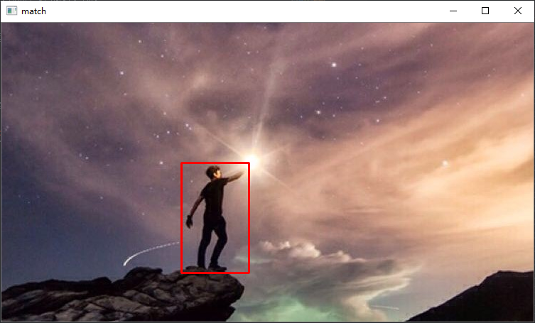

&emsp;&emsp;本节介绍cv2在python中的安装，及其读取、显示、保存图片功能用法。

### 🔻 安装cv2
&emsp;&emsp;利用pip3 install 安装
```
pip3 install opencv-python
```

&emsp;&emsp;安装成功：


😮 <font color=orange>题外话 Begin</font>

&emsp;&emsp;为什么我使用pip安装时候是使用国内镜像呢？其实只需要配置一个文件即可实现默认使用国内源。在Windows系统下的具体操作如下：

1. 在用户目录“C:/Users/<font color=pink>用户名</font>”中创建一个名为“pip”的文件夹
2. 在“pip”文件夹中新建文件“pip.ini”
3. 在“pip.ini”文件中写入一下内容并保存  
    ```ini
    [global]
    index-url=https://pypi.tuna.tsinghua.edu.cn/simple 
    [install]  
    trusted-host=pypi.tuna.tsinghua.edu.cn
    disable-pip-version-check = true  
    timeout = 6000
    ```
4. 之后使用pip安装的库都会默认下载清华国内源啦

😮 <font color=orange>题外话 Over</font>

&emsp;&emsp;现在，我们可以在python3中导入cv2这个库了。
```python
import cv2
```

### 👀 读取、显示、保存图像
参考：https://blog.csdn.net/qq_42079689/article/details/102535329
#### <font color=pink>读取图像 cv2.imread(filepath,flags)</font>
- filepath：读入图像路径（索引地址）
- flags：用于指定以什么样的格式来读取图像
  - flags = 1 / cv2.IMREAD_UNCHANGED：采用保持原始格式的方式读取图像。默认参数。
  - flags = 2 / cv2.IMREAD_GRAYSCALE：以灰度图像格式读取图像。无论原始图像原来是什么格式，读取后都的结果都转变为灰度图像。
  - flags = 3 / cv2.IMREAD_COLOR：以BGR格式读取图像。无论原始图像原来是什么格式，读取后都的结果都转变为BGR形式的三通道图像。

需要特别注意的是：cv2.imread()函数读取RGB图像时，返回的图像格式的通道并不是按R、G、B排列的，而是按B、G、R顺序排列的。

#### <font color=pink>显示图像 cv2.imshow(wname,img)</font>
- wname：显示窗口的名字
- img：需要显示的图像（使用imread读入）

#### <font color=pink>保存图像 cv2.imwrite(file，img，num)</font>
- file：要保存的文件名
- img：需要保存的图像（使用imread读入）

- num：可选参数，针对特定的格式：对于JPEG，其表示的是图像的质量，用0 - 100的整数表示，默认95；对于png 第三个参数表示的是压缩级别，默认为3。
  - cv2.IMWRITE_JPEG_QUALITY类型为 long ,必须转换成 int
  - cv2.IMWRITE_PNG_COMPRESSION, 从0到9 压缩级别越高图像越小

#### <font color=orange>实例</font>
&emsp;&emsp;以“sky.jpg”图片为例进行图像读取、显示及保存。
```python
# -*- coding:utf-8 -*-
import cv2

# ! 读入一张图像，读取方式为灰度模式
img = cv2.imread('sky.jpg',cv2.IMREAD_GRAYSCALE)

# ! 显示读入的图像，并设置窗口名为“sky_image”
cv2.imshow('sky_image',img)

# ! 等待键盘输入，单位为毫秒，即等待指定的毫秒数看是否有键盘输入
# ! 若在等待时间内按下任意键则返回按键的ASCII码，程序继续运行。若没有按下任何键，超时后返回-1。参数为0表示无限等待。
# ! 不调用waitKey的话，窗口会一闪而逝，看不到显示的图片。
cv2.waitKey(0)

# ! 销毁指定窗口
cv2.destroyWindow('sky_image')

# ! 销毁所有窗口
# cv2.destroyAllWindow()

# ! 保存图像
cv2.imwrite('sky_1.jpeg',img, [int( cv2.IMWRITE_JPEG_QUALITY), 95])
cv2.imwrite('sky_2.png',img, [int(cv2.IMWRITE_PNG_COMPRESSION), 9])
```

运行后显示图片：


运行结束后保存图片：


### 🎆 翻转、复制、颜色空间转换图像
参考：https://blog.csdn.net/djcxym/article/details/52097812
#### <font color=pink>翻转图像 cv2.flip(img,flipcode)</font>
- img：需要翻转的图像（使用imread读入）
- flipcode：控制翻转效果
  - flipcode = 0：沿x轴翻转
  - flipcode > 0：沿y轴翻转
  - flipcode < 0：x,y轴同时翻转

```python
# ! 翻转图像
img = cv2.flip(img,0)
```

#### <font color=pink>复制图像 cv2.flip(img,flipcode)</font>
```python
imgcopy = img.copy()
```

#### <font color=pink>颜色空间转化 cv2.flip(img,flipcode)</font>
```python
# 彩色图像转为灰度图像
img2 = cv2.cvtColor(img,cv2.COLOR_RGB2GRAY) 
# 灰度图像转为彩色图像
img3 = cv2.cvtColor(img,cv2.COLOR_GRAY2RGB)
# cv2.COLOR_X2Y，其中X,Y = RGB, BGR, GRAY, HSV, YCrCb, XYZ, Lab, Luv, HLS
```

### 🔍 图像匹配
参考：https://blog.csdn.net/zhusongziye/article/details/93393725
#### <font color=pink>模版匹配 cv2.matchTemplate()</font>
&emsp;&emsp;在模板和输入图像之间寻找匹配，获得匹配结果图像。

&emsp;&emsp;模板匹配具有自身的局限性，主要表现在它只能进行平行移动，若原图像中的匹配目标发生旋转或大小变化，该算法无效。


&emsp;&emsp;其中模板匹配的算法：
1. 利用平方差来进行匹配，最好匹配为0。匹配越差，匹配值越大。
   - 平方差匹配：CV_TM_SQDIFF
   - 标准平方差匹配：CV_TM_SQDIFF_NORMED
2. 采用模板和图像间的乘法操作，得出数值越大表示匹配程度较高，0为最坏匹配。
   - 相关匹配：CV_TM_CCORR
   - 标准相关匹配：CV_TM_CCORR_NORMED
3. 将模版对其均值的相对值与图像对其均值的相关值进行匹配，1表示完美匹配，-1表示糟糕的匹配，0表示没有任何相关性(随机序列)。
   - 相关系数匹配：CV_TM_CCOEFF
   - 标准相关系数匹配：CV_TM_CCOEFF_NORMED

&emsp;&emsp;标准化意味着将数值统一到0~1。除了平方差类型的是值越小越好，其他的都是值越大越好。

#### <font color=pink>找出矩阵最大值和最小值的位置 cv2.minMaxLoc()</font>
&emsp;&emsp;在给定的矩阵中寻找最大和最小值，并给出它们的位置。

#### <font color=orange>实例</font>
```python
# -*- coding:utf-8 -*-
import cv2

# ! 读取匹配图像
img = cv2.imread('sky.jpg',1)
# ! 读取模版图像
temple = cv2.imread('people.png',1)

# ! 获取匹配图像的宽高
ih, iw = img.shape[:2]
# ! 获取模版图像的宽高
th, tw = temple.shape[:2]

# ! 使用标准相关系数匹配，返回一个矩阵
result = cv2.matchTemplate(img, temple, cv2.TM_CCOEFF_NORMED)

# ! 获取矩阵的最大值和最小值，以及其位置
min_val, max_val, min_loc, max_loc = cv2.minMaxLoc(result)

# ! 此处选取最大值的位置,即匹配结果图像的左上角
tl = max_loc

# ! 根据模版大小，得出匹配结果图像的右下角
br = (tl[0]+tw, tl[1]+th)

# ! 绘制矩形框
cv2.rectangle(img, tl, br, (0, 0, 255), 2)

# ! 显示匹配结果窗口
cv2.namedWindow('match', 0)
cv2.resizeWindow('match', iw, ih)
cv2.imshow('match', img)

cv2.waitKey(0)
```

&emsp;&emsp;图像显示的匹配结果：

