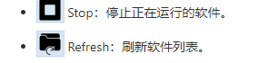
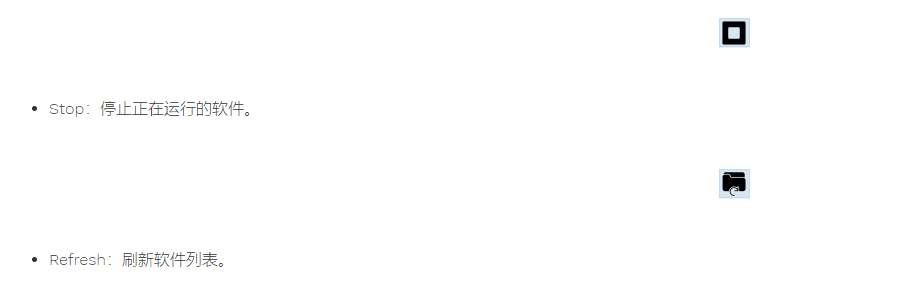
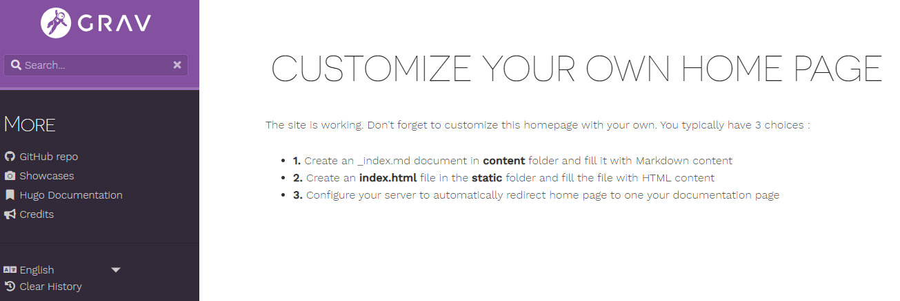
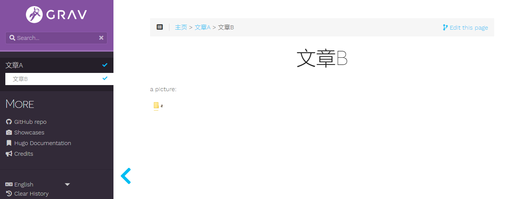

&emsp;&emsp;最近公司开发了gitlab上的文档功能，并配置了主题（hugo-learn-free）。

&emsp;&emsp;在使用过程中，我发现该主题的图片会自动换行追踪，不能修改图片显示的位置。这对于需要图片排版的文章十分不友好，因此我自己在本地配置了一个相同主题的网站做测试。

我在markdown中编辑的效果：



我在Hugo主题中显示的效果：



---

### 🦊 Hugo安装
&emsp;&emsp;Hugo是一个非常受欢迎的、开源的静态网站生成工具，和Hexo类似。 它速度快，扩展性强。

1. 从 hugo 的 [GitHub 仓库](https://github.com/gohugoio/hugo/releases) 下载对应安装包（我的win10系统下载的是“ hugo_0.76.5_Windows-64bit.zip ”）。
2. 解压安装包到自定义目录下。
3. 把目录添加到 Windows 的系统环境变量的 PATH 中。
4. 验证Hugo是否安装成功：`hugo version`

### 🐮 搭建站点
&emsp;&emsp;在想放置站点的文件夹，打开“Git Bash Here”，输入“ hugo new site + 站点名”。
```
hugo new site blog
```


### 🐰 配置主题
&emsp;&emsp;既然要测试，那么肯定要测试相同的主题了。

1. 把“ hugo-learn-free ”主题内容解压后放在 “blog/themes” 目录下（blog替换成创建的站点名）。
2. 在“ blog/hugo-theme-learn/exampleSite ”中有一个“config.toml”文件，这是一个主题的模版配置文件，把它复制到你的站点根目录下。
3. 这样就能加载到该主题了。

### 🐢 添加文章
&emsp;&emsp;创建 blog/content/posts/_index.md。
```
hugo new posts/_index.md
```
&emsp;&emsp;正常主题这样就可以显示文章了，但是“ hugo-learn-free ”主题不一样，它有文章命名规则：



&emsp;&emsp;第一点就是：在内容文件夹中创建一个_index.md文档，并用Markdown内容填充它。也就是说，我们的文章需要放在一个文件夹内，且文章命名要为_index.md。

&emsp;&emsp;文章的大致结构如下：
```markdown
content
├─ pages
│  ├─ first_page                //文件夹，可以自定义命名
│  │  ├─ index                  //文件夹，存放同层级的_index.md中的图片
│  │  │  └─ test_pic.png        
│  │  └─ _index.md              //文章A下的文章B
│  └─ _index.md                 //文章A
└─ _index.md                    //主页
```

&emsp;&emsp;_index.md文件中 title 属性为在页面中显示的文章标题。

&emsp;&emsp;创建成功的页面预览：




### 🐭 利用css修改图片位置

&emsp;&emsp;到这里，站点配置差不多了，可以开始进行图片设置了。这里使用的方法参考了这里：[自定义 HUGO Markdown 图文混排和图片位置](https://www.jianshu.com/p/5b13d1b3ca3a)。

1. 找到 blog\themes\hugo-theme-learn\static\css 文件夹下的 theme.css 。
2. 打开 theme.css ，找到设置图片的css样式代码。这里的实现效果是图片视频都默认居中且会上下换行。  
```css
#body img, #body .video-container {
    margin: 3rem auto;
    display: block;
    text-align: center;
}
```
3. 如果我们想保留这个样式，但又想有时使图片居中，添加以下css样式到 theme.css 文件夹中：
```css
#body img[alt$="<"] {
    float: left;
}
#body img[alt$="><"] {
    float: center;
}
#body img[alt$=">"] {
    float: right;
}
```

在markdown中写图片：
```
# 图片靠左


# 图片居中


# 图片靠右


```

显示效果：


也可以尝试下这种写法：
```css
#body img[src$="#left"] {
    float: left;
    margin: auto;
    display: -moz-inline-box;
}
```
对应markdown：
```

```

---
Over~