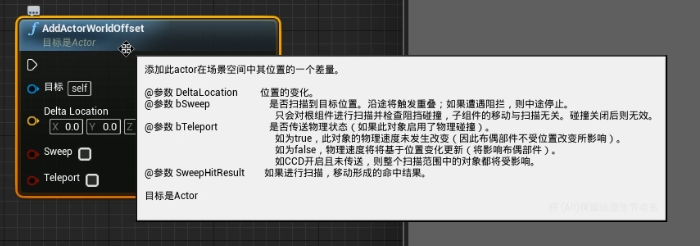
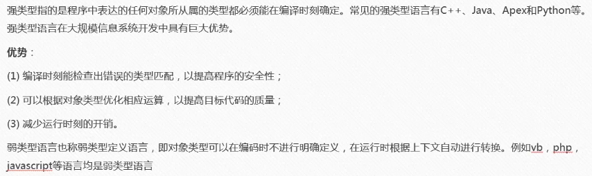

&emsp;&emsp;🧁 这是一套比较久远（2019年）的教程，基本都是直接截取知识点，主要是入门基础学习总结，方便自己之后翻阅复习_(:з」∠)_。

## L1 获取Epic Games引擎源码

1. 注册 Github 账号。（相信大家都有吧！）
2. 在 Unreal 引擎中选择 “管理账户”。  

3. 进入连接页面，连接 Github 账号，登陆后选择加入 Epic 组织。  

4. 在 Github 中的个人主页中可以看到 Epic Games 的图标，则成功加入！  

## L2 引擎中的坐标系

### 左手坐标系  

### 世界坐标系与自身坐标系

## L3 虚幻中的光照

### 虚幻中的光照分类

### 光源的移动特性

### 固定光源

### 光照模式

### 间接光照缓存

### 重要光照体积

## L4 蓝图认知

&emsp;&emsp;蓝图是虚幻中的一种可视化编程语言。

### 蓝图种类

### Actor

### 蓝图编辑器

&emsp;&emsp;可以在 “内容浏览器” 中右键添加蓝图。

&emsp;&emsp;选择父类，即创建的蓝图需要继承的类。

&emsp;&emsp;组件优先于继承，组件可以避免继承的臃肿，既可以完成继承拓展的功能特性，又可以保证继承队列的清晰和干净。

&emsp;&emsp;场景中可渲染物体只有静态网格和骨骼网格（mesh）在蓝图Actor编辑器中选择添加mesh组件，在组件属性中的“视口选项”选择“显示引擎内容”。

&emsp;&emsp;对于已经创建蓝图Actor对象，修改蓝图模板不会影响已创建对象，只能重新生成。

### 蓝图日志输出

&emsp;&emsp;Print String节点 - 日志输出节点

&emsp;&emsp;蓝图节点名词

&emsp;&emsp;Print 节点

### 蓝图连接

&emsp;&emsp;断开执行线：Alt + 左键 针脚

&emsp;&emsp;移动执行线：ctrl + 左键拖拽 针脚

### 蓝图添加注释

1. 框选需要注释的节点，按键C

1. 选中注释，按键 Delete 删除注释

1. 点选需要添加注释的节点，点击节点上方的“...”

### Actor 蓝图构建节点（构造函数）

&emsp;&emsp;Construction：在Actor构造完整后调用的第一函数（调整函数），在物体被拖动时也相当于重新构建。

&emsp;&emsp;可以取消勾选 “拖拽时运行” 取消拖动调用构造函数。

### 蓝图事件

1. 事件BeginPlay节点只调用一次。Actor构造完后先调用construction，再调用beginplay
1. 事件ActorBeginOverlap：与另一个Actor重叠时调用。一般禁用，通过添加组件可以实现该功能。
1. 事件Tick：定时调用函数。默认为每帧调用一次。BeginPlay先于Tick。

### 位移节点

1. 差量位移节点：AddActorWorldOffset ，基于原有位置再进行偏移

2. 直接位移节点：SetActorLocation ，根据世界坐标移动到指定位置

## L5 3D数学（向量）

- 向量
  - 有长度有方向
  - UE里用空间直角坐标系表示法
  - 三维空间向量由三分量构成，虚幻里用xyz表示
  - 坐标是一个特殊的向量

### 向量类型

### 位置向量运算

- 计算向量的模（长度）
  - 先计算两个坐标向量的差向量，再计算向量的长度。
  - 使用VectorLength节点求模
- 计算单位向量
  - 使用Normalize节点标量化
- 点乘
  - a·b = |a||b|cosθ
  - 单位向量的点乘可以求方向
  - 节点：dot
- 叉乘
  - 得到的是一个垂直于向量ab平面的向量
  - 节点：cross
- 获取正方向
  - 节点：Get Actor Forword Vector（返回的是单位向量）

## L6 蓝图数据类型

### 强类型与弱类型

### 基本数据类型

### 声明和初始化

### 命名法则

## L7 蓝图基本运算

### 赋值和获取

### 整形的自增和自减

### 取余运算

## L8 蓝图流程控制

### 分支

### 关系运算符

<!-- ## L9 掷色子案例演示 -->
