&emsp;&emsp;📢 继续教程的学习~

## L1 面向对象

### 面向对象编程

### 对象和模版

🎹 蓝图模版

### 成员属性

### 成员函数

&emsp;&emsp;多用成员属性（变量），数据可以灵活调整，获得更灵活的逻辑表现。

#### 加减速逻辑示例

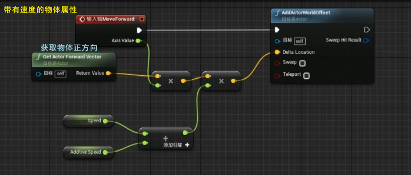

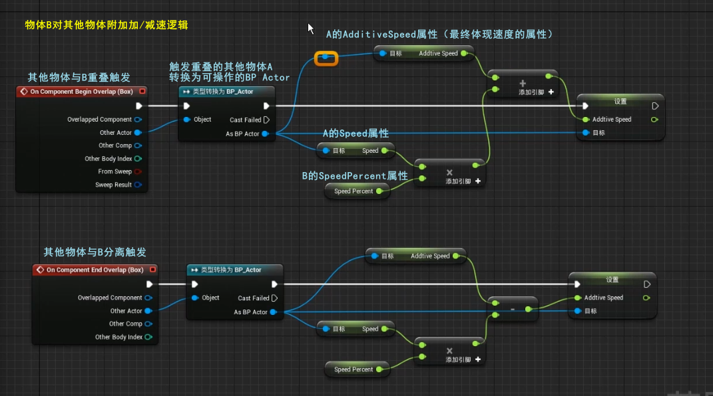

#### 函数封装 Change Speed

1. 构建函数  
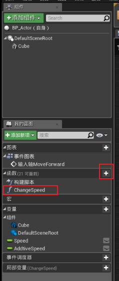

1. 输入值（函数的参数）  
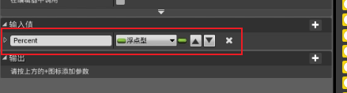

1. 函数示例  
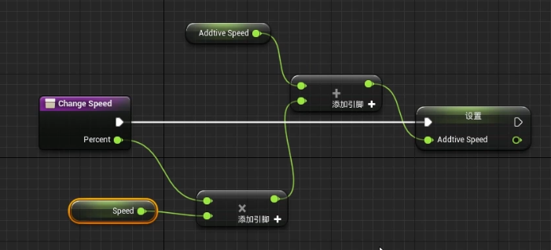

1. 函数调用  
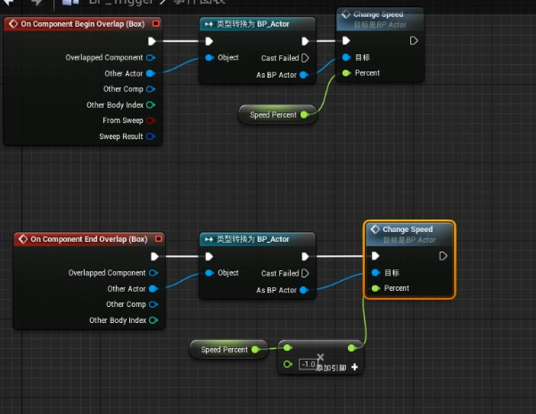

#### 函数输入值和输出

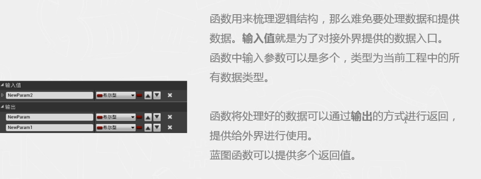

#### 纯函数

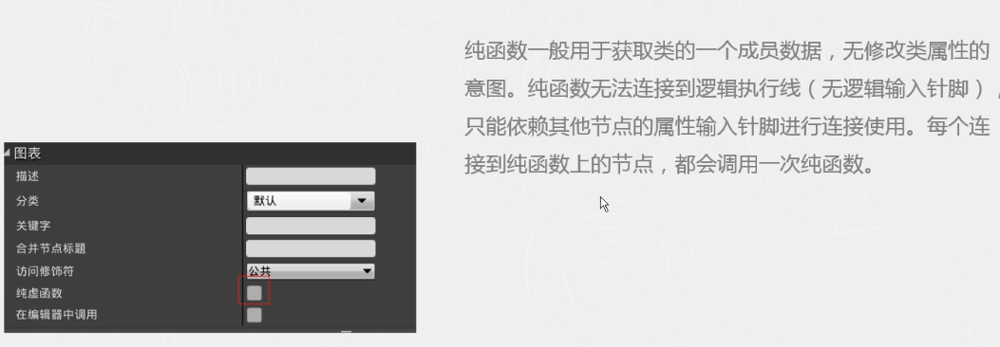

#### 局部变量

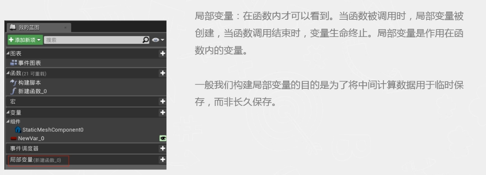

### 事件

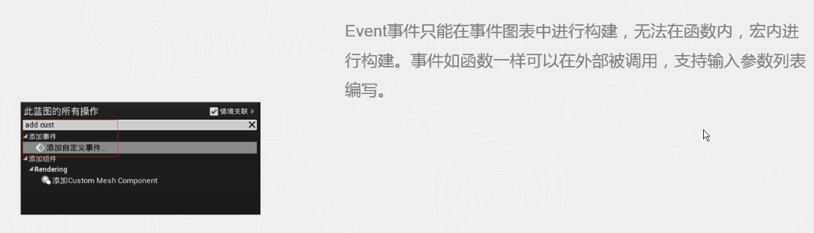

#### 添加自定义事件

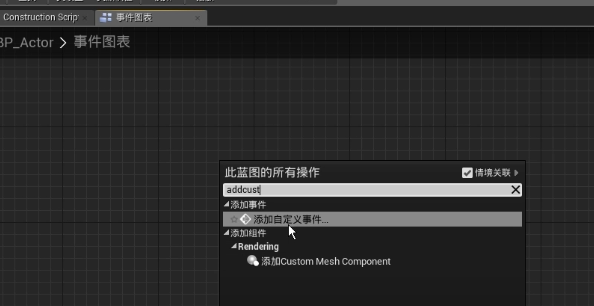

#### 事件的定义与调用

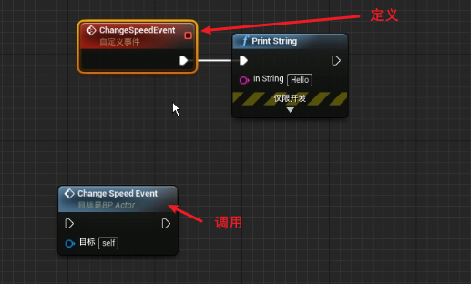  

#### 事件与函数

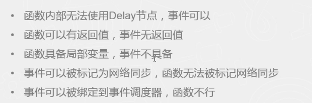

### 宏

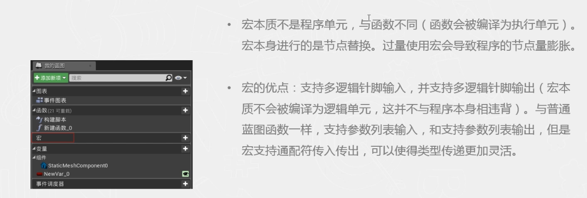

#### 本地数据类型

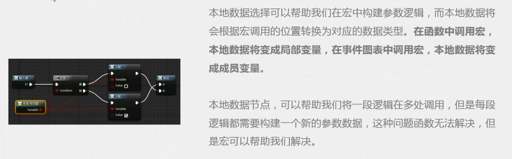

#### 宏与函数

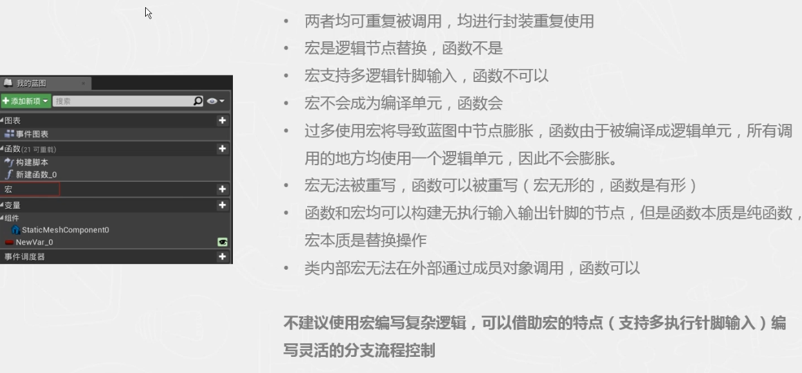

### 实例

#### 创建Actor

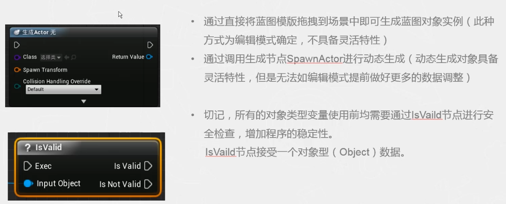

在原地生成 Actor 并判断：

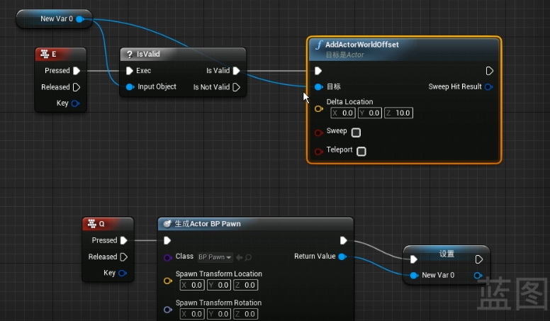
