&emsp;&emsp;🛎 在 UE4 中使用 Python 开发入门。

&emsp;&emsp;视频学习链接：[虚幻引擎使用Python开发](https://www.bilibili.com/video/BV1b4411r7kX?p=9)

## L1 在 UE4 中配置 Python
### 加载插件
&emsp;&emsp;从菜单 “Edit - Plugins” 进入插件管理，从左侧列表找到 “Scripting”。勾选 Python Editor Script Plugin 后重启引擎。


### 配置路径
&emsp;&emsp;从菜单 “Edit - Project Settings” 进入项目设置，从左侧列表找到 “Python”。


- Startup Scripts: 指定 UE4 打开时运行的脚本文件。
- Additional Paths: UE4 可以读取到 Python 脚本的路径。

### Unreal Python API
Unreal Python [API 文档](https://docs.unrealengine.com/en-US/PythonAPI/index.html)


## L2 使用 Python 导入资产
### Example1 导入贴图和音频 
AssetFunction_1.py
```python
# coding: utf-8
import os

import unreal

# import AssetFunction_1 as af
# reload(af)
# af.importMyAssets()

asset_folder = 'D:/ue4/test/asset'
texture_jpg = os.path.join(asset_folder, 'dear.jpg').replace('\\','/')
sound_mp3 = os.path.join(asset_folder, 'easy.mp3').replace('\\','/')

def importMyAssets():
    texture_task = bulidImportTask(texture_jpg, '/Game/MyAsset/Textures')
    sound_task = bulidImportTask(sound_mp3, '/Game/MyAsset/Sounds')
    executeImportTasks([texture_task, sound_task])

# ! 设置导入资产属性
def bulidImportTask(filename, destination_path):
    task = unreal.AssetImportTask()
    task.set_editor_property('automated', True)
    task.set_editor_property('destination_name', '')
    task.set_editor_property('destination_path', destination_path)
    task.set_editor_property('filename', filename)
    task.set_editor_property('replace_existing', True)
    task.set_editor_property('save', True)
    return task

def executeImportTasks(tasks):
    unreal.AssetToolsHelpers.get_asset_tools().import_asset_tasks(tasks)
    for task in tasks:
        for path in task.get_editor_property('imported_object_paths'):
            print 'Imported {}'.format(path)
```

### Example2 导入fbx
AssetFunction_2.py
```python
# coding: utf-8
import os

import unreal

# import AssetFunction_2 as af
# reload(af)
# af.importMyAssets()

asset_folder = 'D:/ue4/test/asset'
static_mesh_fbx = os.path.join(asset_folder, 'static_fbx.fbx').replace('\\','/')
skeletal_mesh_fbx = os.path.join(asset_folder, 'skeletal_fbx.fbx').replace('\\','/')

def importMyAssets():
    # ! 静态网格
    static_mesh_task = bulidImportTask(static_mesh_fbx, '/Game/MyAsset/StaticMeshes', buildStaticMeshImportOptions())
    # ! 带骨骼的网格
    skeletal_mesh_task = bulidImportTask(skeletal_mesh_fbx, '/Game/MyAsset/SkeletalMeshes', buildSkeletalMeshImportOptions())
    executeImportTasks([static_mesh_task, skeletal_mesh_task])

def bulidImportTask(filename, destination_path, options=None):
    task = unreal.AssetImportTask()
    task.set_editor_property('automated', True)
    task.set_editor_property('destination_name', '')
    task.set_editor_property('destination_path', destination_path)
    task.set_editor_property('filename', filename)
    task.set_editor_property('replace_existing', True)
    task.set_editor_property('save', True)
    task.set_editor_property('options', options)
    return task

def executeImportTasks(tasks):
    unreal.AssetToolsHelpers.get_asset_tools().import_asset_tasks(tasks)
    for task in tasks:
        for path in task.get_editor_property('imported_object_paths'):
            print 'Imported {}'.format(path)

def buildStaticMeshImportOptions():
    options = unreal.FbxImportUI()
    # unreal.FbxImportUI
    options.set_editor_property('import_mesh', True)
    options.set_editor_property('import_textures', False)
    options.set_editor_property('import_materials', True)
    options.set_editor_property('import_as_skeletal', False) # Static Mesh
    # unreal.FbxMeshImportData
    options.static_mesh_import_data.set_editor_property('import_translation', unreal.Vector(50.0, 0.0, 0.0))
    options.static_mesh_import_data.set_editor_property('import_rotation', unreal.Rotator(0.0, 110.0, 0.0))
    options.static_mesh_import_data.set_editor_property('import_uniform_scale', 1.0)
    # unreal.FbxStaticMeshImportData
    options.static_mesh_import_data.set_editor_property('combine_meshes', True)
    options.static_mesh_import_data.set_editor_property('generate_lightmap_u_vs', True)
    options.static_mesh_import_data.set_editor_property('auto_generate_collision', True)
    return options

def buildSkeletalMeshImportOptions():
    options = unreal.FbxImportUI()
    # unreal.FbxImportUI
    options.set_editor_property('import_mesh', True)
    options.set_editor_property('import_textures', True)
    options.set_editor_property('import_materials', True)
    options.set_editor_property('import_as_skeletal', True) # Skeletal Mesh
    # unreal.FbxMeshImportData
    options.skeletal_mesh_import_data.set_editor_property('import_translation', unreal.Vector(0.0, 0.0, 0.0))
    options.skeletal_mesh_import_data.set_editor_property('import_rotation', unreal.Rotator(0.0, 0.0, 0.0))
    options.skeletal_mesh_import_data.set_editor_property('import_uniform_scale', 1.0)
    # unreal.FbxSkeletalMeshImportData
    options.skeletal_mesh_import_data.set_editor_property('import_morph_targets', True)
    options.skeletal_mesh_import_data.set_editor_property('update_skeleton_reference_pose', False)
    return options
```

### Example3 创建、复制、删除、重命名资产和文件夹
AssetFunction_3.py
```python
# coding: utf-8
import os

import unreal

# import AssetFunction_3 as af
# reload(af)
# af.createDirectory()

# ! 创建文件夹 ~/MyNewDirectory
def createDirectory():
    unreal.EditorAssetLibrary.make_directory('/Game/MyAsset/MyNewDirectory')

# ! 复制文件夹 ~/MyNewDirectory -> ~/MyNewDirectory_Duplicated
def duplicateDirectory():
    return unreal.EditorAssetLibrary.duplicate_directory('/Game/MyAsset/MyNewDirectory', '/Game/MyAsset/MyNewDirectory_Duplicated')

# ! 删除文件夹 ~/MyNewDirectory
def deleteDirectory():
    unreal.EditorAssetLibrary.delete_directory('/Game/MyAsset/MyNewDirectory')

# ! 重命名文件夹 ~/MyNewDirectory_Duplicated -> ~/MyNewDirectory_Renamed
def renameDirectory():
    return unreal.EditorAssetLibrary.rename_directory('/Game/MyAsset/MyNewDirectory_Duplicated', '/Game/MyAsset/MyNewDirectory_Renamed')

# ! 复制资产 ~/dear -> ~/dear_Duplicated
def duplicateAsset():
    return unreal.EditorAssetLibrary.duplicate_asset('/Game/MyAsset/Textures/dear', '/Game/MyAsset/Textures/dear_Duplicated')

# ! 删除资产 ~/dear
def deleteAsset():
    unreal.EditorAssetLibrary.delete_asset('/Game/MyAsset/Textures/dear')

# ! 判断资产是否存在
def assetExist():
    print unreal.EditorAssetLibrary.does_asset_exist('/Game/MyAsset/Textures/dear')
    print unreal.EditorAssetLibrary.does_asset_exist('/Game/MyAsset/Textures/dear_Duplicated')

# ! 重命名资产 ~/dear_Duplicated -> ~/dear_Renamed
def renameAsset():
    unreal.EditorAssetLibrary.rename_asset('/Game/MyAsset/Textures/dear_Duplicated', '/Game/MyAsset/Textures/dear_Renamed')

# ! 显示复制资产提示框 ~/dear_Renamed -> ~/dear_Duplicated
def duplicateAssetDialog(show_dialog=True):
    if show_dialog:
        unreal.AssetToolsHelpers.get_asset_tools().duplicate_asset_with_dialog('dear_Duplicated', '/Game/MyAsset/Textures', unreal.load_asset('/Game/MyAsset/Textures/dear_Renamed'))
    else:
        unreal.AssetToolsHelpers.get_asset_tools().duplicate_asset('dear_Duplicated', '/Game/MyAsset/Textures', unreal.load_asset('/Game/MyAsset/Textures/dear_Renamed'))

# ! 显示重命名提示框 
# ! ~/dear_Renamed -> ~/dear_Renamed_2
# ! ~/dear_Duplicated -> ~/dear_Duplicated_Renamed
def renameAssetDialog(show_dialog=True):
    first_renmae_data = unreal.AssetRenameData(unreal.load_asset('/Game/MyAsset/Textures/dear_Renamed'), '/Game/MyAsset/Textures', 'dear_Renamed_2')
    second_rename_data = unreal.AssetRenameData(unreal.load_asset('/Game/MyAsset/Textures/dear_Duplicated'), '/Game/MyAsset/Textures', 'dear_Duplicated_Renamed')
    if show_dialog:
        unreal.AssetToolsHelpers.get_asset_tools().rename_assets_with_dialog([first_renmae_data, second_rename_data])
    else:
        unreal.AssetToolsHelpers.get_asset_tools().rename_assets([first_renmae_data, second_rename_data])
```

## L3 使用 Python 调用 C++ 函数
&emsp;&emsp;可以通过公开蓝图类的方式使 Python 可以访问 C++ 的函数。
### 创建蓝图C++类
1. 首先，创建一个继承蓝图函数库的C++类，命名为“ ZFunction ”，创建成功后会自动打开 Visual Studio。  

2. 修改 .h 文件  
    ```C++
    // Fill out your copyright notice in the Description page of Project Settings.

    #pragma once

    #include "CoreMinimal.h"
    #include "Kismet/BlueprintFunctionLibrary.h"
    #include "ZFunction.generated.h"

    /**
    * 
    */
    UCLASS()
    class SCRIPT_PROJ_API UZFunction : public UBlueprintFunctionLibrary
    {
        GENERATED_BODY()

    public:
        UFUNCTION(BlueprintCallable)
            static void CalledFromPython(FString InputString);
    };
    ```
3. 修改 .cpp 文件  
    ```C++
    // Fill out your copyright notice in the Description page of Project Settings.


    #include "ZFunction.h"

    void UZFunction::CalledFromPython(FString InputString) {
        UE_LOG(LogTemp, Error, TEXT("%s"), *InputString);
    }
    ```
### 遍历函数和类
&emsp;&emsp;查看 UE4 中所有函数和类：
```python
for x in sorted(dir(unreal)):
	print x
```
&emsp;&emsp;查看类中所含方法，可以看到我们创建的 'called_from_python' 方法在其中。
```python
for x in sorted(dir(unreal.ZFunction)):
	print x
```

### 调用 C++ 方法
```python
unreal.ZFunction.called_from_python('haha')
```


## L4 修改文件夹颜色
### 定义类和方法
1. 创建一个继承蓝图函数库的C++类，命名为“ CppLib ”  
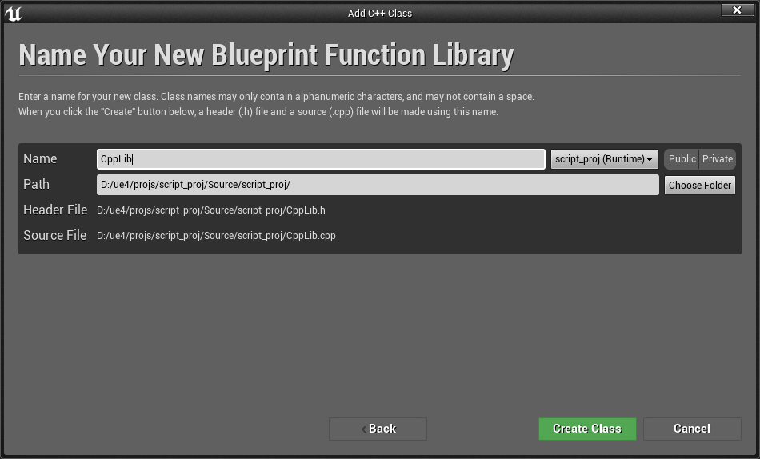
2. 修改 .h 文件  
    ```C++
    // Fill out your copyright notice in the Description page of Project Settings.

    #pragma once

    #include "CoreMinimal.h"
    #include "Kismet/BlueprintFunctionLibrary.h"
    #include "CppLib.generated.h"

    /**
    * 
    */
    UCLASS()
    class SCRIPT_PROJ_API UCppLib : public UBlueprintFunctionLibrary
    {
        GENERATED_BODY()
        
    public:
        UFUNCTION(BlueprintCallable, Category = "Unreal Python")
            static void setFolderColor(FString FolderPath, FLinearColor Color);
    };
    ```
3. 修改 .cpp 文件  
    ```C++
    // Fill out your copyright notice in the Description page of Project Settings.


    #include "CppLib.h"
    #include  "Runtime/Core/Public/Misc/ConfigCacheIni.h"

    void UCppLib::setFolderColor(FString FolderPath, FLinearColor Color) {
        GConfig->SetString(TEXT("PathColor"), *FolderPath, *Color.ToString(), GEditorPerProjectIni);
    }
    ```
4. 在 UE4 中点击重新编译。

### 在蓝图中设置文件夹颜色
1. 创建蓝图类“Folder”。  
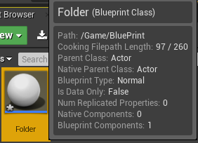
2. 编辑事件节点，编译。  
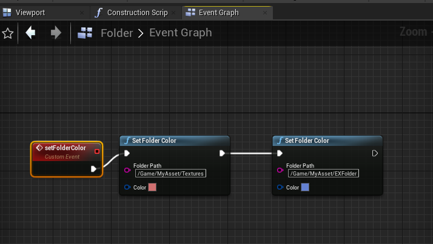  
其中，自定义事件节点勾选“Call In Editor”，该事件会显示在属性编辑器上。  
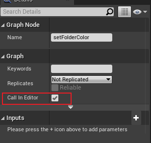
3. 在场景中创建“Folder”，点击其属性中的“Set Folder Color”  
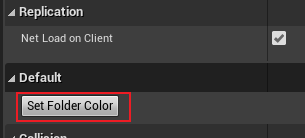
4. 创建 “/Game/MyAsset/EXFolder”，可以看到颜色为蓝色，而对已经存在的文件夹颜色修改需要重启后才能看到效果。  
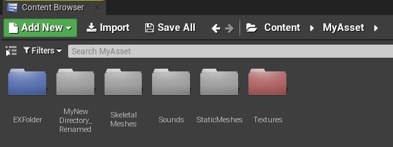

### 在Python中创建颜色文件夹
AssetFunction_4.py
```python
# coding: utf-8

import unreal

# import AssetFunction_4 as af
# reload(af)
# af.generateColoredDirectories()

def generateColoredDirectories():
    for x in range(40, 80):
        dir_path = '/Game/MyAsset/MyColorFolder/' + str(x)
        linear_color = getGradientColor(x)
        unreal.CppLib.set_folder_color(dir_path, linear_color)
        unreal.EditorAssetLibrary.make_directory(dir_path)

def getGradientColor(x):
    x = float(x) / 100
    return unreal.LinearColor(x, 1-x, 1-x, 1)
```

&emsp;&emsp;在 UE4 运行后，会创建颜色不同的文件夹。

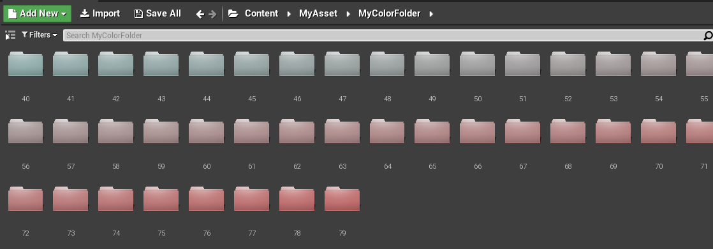


## L5 打开和关闭资产
&emsp;&emsp;Python只能打开资产，如果要实现关闭资产，需要添加 C++ 类增加功能来实现效果。

1. 添加 build.cs 依赖  
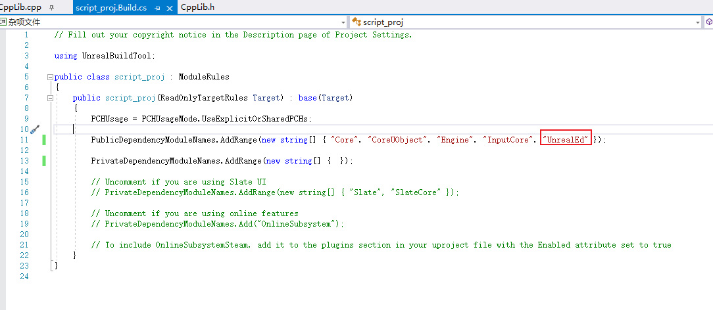

2. CppLib .h 文件代码  
    ```C++
    // Fill out your copyright notice in the Description page of Project Settings.

    #pragma once

    #include "CoreMinimal.h"
    #include "Kismet/BlueprintFunctionLibrary.h"
    #include "CppLib.generated.h"

    /**
    * 
    */
    UCLASS()
    class SCRIPT_PROJ_API UCppLib : public UBlueprintFunctionLibrary
    {
        GENERATED_BODY()
        
    public:
        UFUNCTION(BlueprintCallable, Category = "Unreal Python")
            static void CloseEditorForAssets(TArray<UObject*> Assets);

        UFUNCTION(BlueprintCallable, Category = "Unreal Python")
            static TArray<UObject*> GetAssetsOpenedInEditor();
    };

    ```

3. CppLib .cpp 文件代码  
    ```C++
    // Fill out your copyright notice in the Description page of Project Settings.


    #include "CppLib.h"
    #include "Editor.h"
    #include "Editor/UnrealEd/Public/Subsystems/AssetEditorSubsystem.h"

    void UCppLib::CloseEditorForAssets(TArray<UObject*> Assets) {
        UAssetEditorSubsystem* AssetEditorSubsystem = GEditor->GetEditorSubsystem<UAssetEditorSubsystem>();
        for (UObject* Asset : Assets) {
            AssetEditorSubsystem->CloseAllEditorsForAsset(Asset);
        }
    }

    TArray<UObject*> UCppLib::GetAssetsOpenedInEditor() {
        UAssetEditorSubsystem* AssetEditorSubsystem = GEditor->GetEditorSubsystem<UAssetEditorSubsystem>();
        TArray<UObject*> EditedAssets = AssetEditorSubsystem->GetAllEditedAssets();
            return EditedAssets;
    }
    ```
    注：教程上用的是 FAssetEditorManager ，但由于版本更新已经不适用，需要替换成 UAssetEditorSubsystem 。

4. AssetFunction_5.py 文件代码  
    ```python
    # coding: utf-8

    import unreal

    # ! 加载资产
    def openAssets():
        assets = [
            unreal.load_asset('/Game/MyAsset/Textures/dear'),
            unreal.load_asset('/Game/MyAsset/Sounds/easy'),
            unreal.load_asset('/Game/MyAsset/StaticMeshes/static_fbx')
        ]
        unreal.AssetToolsHelpers.get_asset_tools().open_editor_for_assets(assets)

    # ! 获取已经打开的资产列表
    def getAllOpenedAssets():
        return unreal.CppLib.get_assets_opened_in_editor()

    # ! 关闭所有打开的资产
    def closeAssets():
        assets = getAllOpenedAssets()
        unreal.CppLib.close_editor_for_assets(assets)
    ```

5. 在 UE4 中调试代码   
    ```python
    import AssetFunction_5 as af
    reload(af)
    print af.getAllOpenedAssets()
    af.closeAssets()
    ```
    打印出已经打开的资产窗口，以及关闭所有资产窗口。  
    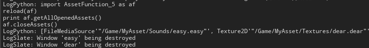


## L6 选择内容浏览器中的资产

### 利用 Python 选择指定资产
AssetFunction_6.py
```python
# coding: utf-8

import unreal

# import AssetFunction_6 as af
# reload(af)
# af.showAssetsInContentBrowser()

# ! 选择指定资产
def showAssetsInContentBrowser():
    paths = [
        '/Game/MyAsset/Sounds/easy',
        '/Game/MyAsset/Textures/dear'
    ]
    unreal.EditorAssetLibrary.sync_browser_to_objects(paths)
```
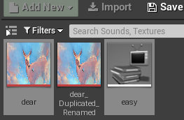

### 利用 C++ 和 Python 设置选择资产和文件夹
1. 添加 build.cs 依赖  
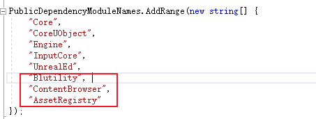

2. CppLib .h 文件代码  
    ```C++
    // Fill out your copyright notice in the Description page of Project Settings.

    #pragma once

    #include "CoreMinimal.h"
    #include "Kismet/BlueprintFunctionLibrary.h"
    #include "CppLib.generated.h"

    /**
    * 
    */
    UCLASS()
    class SCRIPT_PROJ_API UCppLib : public UBlueprintFunctionLibrary
    {
        GENERATED_BODY()
        
    public:

        UFUNCTION(BlueprintCallable, Category = "Unreal Python")
            static TArray<FString> GetSelectedAssets();

        UFUNCTION(BlueprintCallable, Category = "Unreal Python")
            static TArray<FString> GetSelectedFolders();

        UFUNCTION(BlueprintCallable, Category = "Unreal Python")
            static void SetSelectedAssets(TArray<FString> Paths);

        UFUNCTION(BlueprintCallable, Category = "Unreal Python")
            static void SetSelectedFolders(TArray<FString> Paths);
    };

    ```
3. CppLib .cpp 文件代码  
    ```C++
    // Fill out your copyright notice in the Description page of Project Settings.


    #include "CppLib.h"
    #include "Editor/ContentBrowser/Public/ContentBrowserModule.h"
    #include "Editor/ContentBrowser/Private/SContentBrowser.h"
    #include "Runtime/AssetRegistry/Public/AssetRegistryModule.h"

    TArray<FString> UCppLib::GetSelectedAssets() {
        FContentBrowserModule& ContentBrowserModule = FModuleManager::LoadModuleChecked<FContentBrowserModule>("ContentBrowser");
        // get selected assets
        TArray<FAssetData> SelectedAssets;
        ContentBrowserModule.Get().GetSelectedAssets(SelectedAssets);
        // convert assets to string
        TArray<FString> Result;
        for (FAssetData& AssetData : SelectedAssets) {
            Result.Add(AssetData.PackageName.ToString());
        }
        return Result;
    }

    void UCppLib::SetSelectedAssets(TArray<FString> Paths) {
        FContentBrowserModule& ContentBrowserModule = FModuleManager::LoadModuleChecked<FContentBrowserModule>("ContentBrowser");
        FAssetRegistryModule& AssetRegistryModule = FModuleManager::LoadModuleChecked<FAssetRegistryModule>("AssetRegistry");
        // convert the string to FName
        TArray<FName> PathsName;
        for (FString Path : Paths) {
            PathsName.Add(*Path);
        }
        FARFilter AssetFilter;
        AssetFilter.PackageNames = PathsName;
        // Find the assets
        TArray<FAssetData> AssetDatas;
        AssetRegistryModule.Get().GetAssets(AssetFilter, AssetDatas);
        // Ask the ContentBrowser to select them Different to python, the folder levels is also selected.
        ContentBrowserModule.Get().SyncBrowserToAssets(AssetDatas);
    }

    TArray<FString> UCppLib::GetSelectedFolders() {
        FContentBrowserModule& ContentBrowserModule = FModuleManager::LoadModuleChecked<FContentBrowserModule>("ContentBrowser");
        TArray<FString> SelectedFolders;
        ContentBrowserModule.Get().GetSelectedFolders(SelectedFolders);
        return SelectedFolders;
    }

    void UCppLib::SetSelectedFolders(TArray<FString> Paths) {
        FContentBrowserModule& ContentBrowserModule = FModuleManager::LoadModuleChecked<FContentBrowserModule>("ContentBrowser");
        TArray<FString> SelectedFolders;
        ContentBrowserModule.Get().SyncBrowserToFolders(Paths);
    }
    ```

4. Python 调用 C++ 测试运行  
    ```python
    # ! 调用 C++ 命令设置选择文件夹
    def getSelectedAssets():
        return unreal.CppLib.get_selected_assets(paths)

    # ! 调用 C++ 命令设置选择文件夹
    def setSelectedAssets():
        paths = [
            '/Game/MyAsset/Sounds/easy',
            '/Game/MyAsset/Textures/dear'
        ]
        return unreal.CppLib.set_selected_assets(paths)

    # ! 调用 C++ 命令获取选择文件夹
    def getSelectedFolders():
        return unreal.CppLib.get_selected_folders()

    # ! 调用 C++ 命令设置文件夹
    def setSelectedFolders():
        paths = [
            '/Game/MyAsset/Sounds',
            '/Game/MyAsset/Textures'
        ]
        return unreal.CppLib.set_selected_folders(paths)
    ```

&emsp;&emsp;⚠ 令人奇怪的是，在 UE4 中编译测试可以实现我们想要的效果，但是在Visual Studio中却会报错：```无法打开源文件 "SAssetSearchBox.h"12	```。然鹅在VS2017有小伙伴测试没有报错，不知道是不是版本的问题。

&emsp;&emsp;为了解决这个问题，我重新新建了一个项目，把代码重新编译，仍然不通过。我在VS 2019 的项目设置 VC++ 目录的包含目录中添加了一个新路径，在 bulid.cs 文件 *PublicDependencyModuleNames.AddRange()* 中添加"EditorWidgets"，重新生成项目，成功！😄

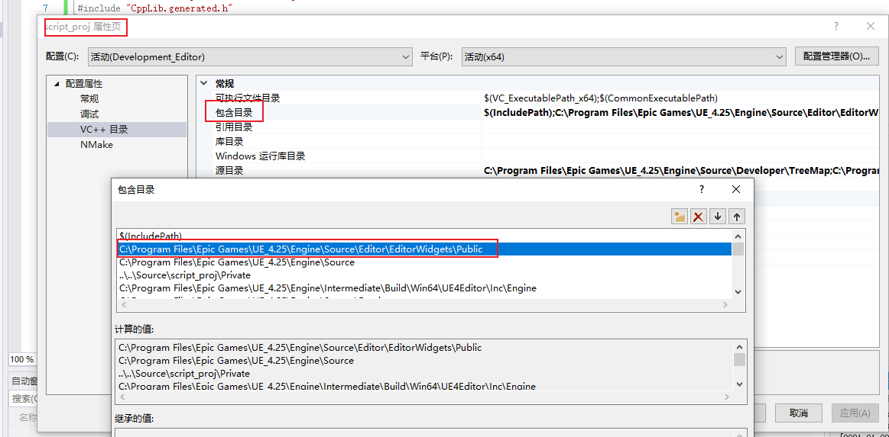

&emsp;&emsp;该路径是通过 C++ Api SAssetSearchBox 中找到的。

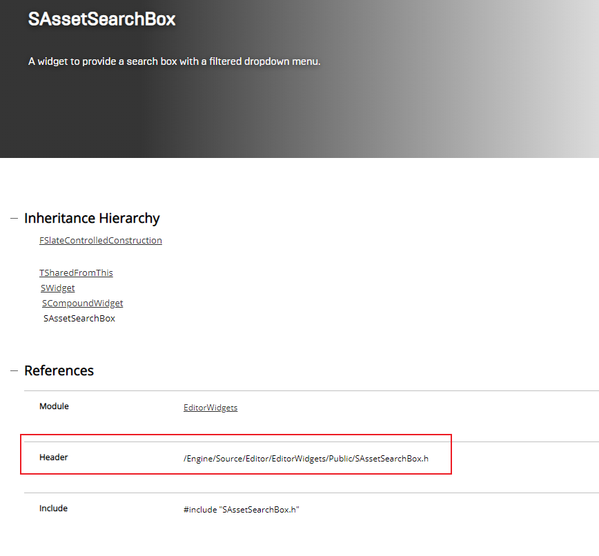


## L7 显示进度条

&emsp;&emsp;该部分实现效果为：在 UE4 中显示进度条框并执行相对应任务。

&emsp;&emsp;教程中可以完全使用 Python 来实现该功能，但实际测试时发现，当前版本某些方法已经弃用或找不到 Python 接口，如 unreal.EditorCppLib.begin_spawn_actor() 和 unreal.GameplayStatics.finish_spawning_actor()。因此还是结合 C++、Blueprint 以及 Python 实现。

EditorFunction_1.py
```python
# coding: utf-8

import unreal
import random
import time

def executeSlowTask():
    quantity_steps_in_slow_task = 10
    with unreal.ScopedSlowTask(quantity_steps_in_slow_task, 'My Slow Task Text ...') as slow_task:
        slow_task.make_dialog(True)
        for x in range(quantity_steps_in_slow_task):
            if slow_task.should_cancel():
                break
            slow_task.enter_progress_frame(1, 'My Slow Task Text ...' + str(x) + ' / ' + str(quantity_steps_in_slow_task))
            # Execute slow logic
            deferredSpawnActor()
            time.sleep(1)

def deferredSpawnActor():
    world = unreal.EditorLevelLibrary.get_editor_world()
    # ! blueprint actor
    actor_class = unreal.EditorAssetLibrary.load_blueprint_class('/Game/BluePrint/bp_actor')
    actor_location = unreal.Vector(random.uniform(0.0, 2000.0), random.uniform(0.0, 2000.0), 0.0)
    actor_rotation = unreal.Rotator(random.uniform(0.0, 360.0), random.uniform(0.0, 360.0), random.uniform(0.0, 360.0))
    actor_scale = unreal.Vector(random.uniform(0.1, 2.0), random.uniform(0.1, 2.0), random.uniform(0.1, 2.0))
    actor_transform = unreal.Transform(actor_location, actor_rotation, actor_scale)
    # ! "GameplayStatics.begin_spawning_actor_from_class()" is deprecated. Use BeginDeferredActorSpawnFromClass instead.
    # actor = unreal.GameplayStatics.begin_spawning_actor_from_class(world, actor_class, actor_transform)
    # unreal.GameplayStatics.finish_spawning_actor(actor, actor_transform)
    actor = unreal.EditorCppLib.begin_spawn_actor(world, actor_class, actor_transform)
    unreal.EditorCppLib.finish_spawn_actor(actor, actor_transform)
```

EditorCppLib.h
```C++
// Fill out your copyright notice in the Description page of Project Settings.

#pragma once

#include "CoreMinimal.h"
#include "Kismet/BlueprintFunctionLibrary.h"
#include "EditorCppLib.generated.h"

/**
 * 
 */
UCLASS()
class SCRIPT_PROJ_API UEditorCppLib : public UBlueprintFunctionLibrary
{
	GENERATED_BODY()
	
public:

	UFUNCTION(BlueprintCallable, Category = "Unreal Python")
		static AActor* BeginSpawnActor(const UObject* WorldContextObj,TSubclassOf < AActor > ActorClass, const FTransform& SpawnTransform);

	UFUNCTION(BlueprintCallable, Category = "Unreal Python")
		static void FinishSpawnActor(AActor* MyActor, const FTransform& SpawnTransform);
};
```
EditorCppLib.cpp
```C++
// Fill out your copyright notice in the Description page of Project Settings.


#include "EditorCppLib.h"
#include "Runtime/Engine/Classes/Kismet/GameplayStatics.h"

AActor* UEditorCppLib::BeginSpawnActor(const UObject* WorldContextObj, TSubclassOf < AActor > ActorClass, const FTransform& SpawnTransform) {
    return UGameplayStatics::BeginDeferredActorSpawnFromClass(WorldContextObj, ActorClass, SpawnTransform);
}

void UEditorCppLib::FinishSpawnActor(AActor* MyActor, const FTransform& SpawnTransform) {
    UGameplayStatics::FinishSpawningActor(MyActor, SpawnTransform);
}
```

&emsp;&emsp;在 C++ API 中可以查到函数需要的参数及类型。

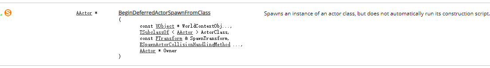

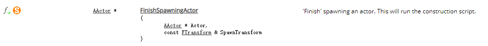


## L8 获取物体属性

&emsp;&emsp;利用 C++ 获取类的所有属性名，再用 Python 获取属性值。

CppLib.h文件
```C++
UFUNCTION(BlueprintCallable, Category = "Unreal Python")
    static TArray<FString> GetAllProperties(UClass* Class);
```

CppLib.cpp文件
```C++
TArray<FString> UCppLib::GetAllProperties(UClass* Class) {
    TArray<FString> Ret;
    if (Class != nullptr) {
        for (TFieldIterator<UProperty> It(Class); It; ++It) {
            UProperty* Property = *It;
            if (Property->HasAnyPropertyFlags(EPropertyFlags::CPF_Edit)) {
                Ret.Add(Property->GetName());
            }
        }
    }
    return Ret;
}
```

PythonHelpers.py文件
```python
# coding: utf-8

import unreal

def getAllProperties(object_class):
    return unreal.CppLib.get_all_properties(object_class)

def printAllProperties():
    obj = unreal.Actor()
    object_class = obj.get_class()
    for x in getAllProperties(object_class):
        name = x
        while len(name) < 50:
            name = ' ' + name
        print name + ':' + str(obj.get_editor_property(x))
```

效果展示：

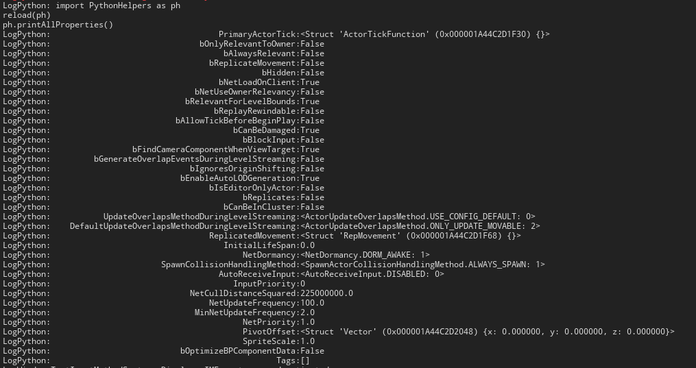


## L9 运行 Cmd

&emsp;&emsp;使用 Python 和 C++ 在 UE4 中运行 Cmd 指令。

CppLib.h文件
```C++
UFUNCTION(BlueprintCallable, Category = "Unreal Python")
    static void ExecuteConsoleCommand(FString ConsoleCommand);
```

CppLib.cpp文件

需要在cs文件中添加依赖项 "UnrealEd" -> PublicDependencyModuleNames）
```C++
#include "Editor/UnrealEd/Public/Editor.h"

void UCppLib::ExecuteConsoleCommand(FString ConsoleCommand) {
    if (GEditor) {
        UWorld* World = GEditor->GetEditorWorldContext().World();
        if (World) {
            GEditor->Exec(World, *ConsoleCommand, *GLog);
        }
    }
}
```

EditorFunction_2.py文件
```python
def executeConsoleCommand():
    console_commands = ['r.ScreenPercentage 0.1', 'r.Color.Max 6', 'stat fps', 'stat unit']
    for x in console_commands:
        unreal.CppLib.execute_console_command(x)
```

运行效果：
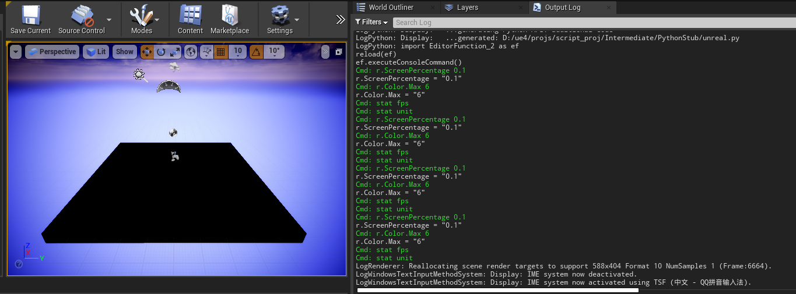


## L10 在场景中实例化 Actor

&emsp;&emsp;在 Python 中可以使用 ```unreal.EditorLevelLibrary.spawn_actor_from_class(actor_class, actor_location, actor_rotation)``` 进行实例化 Actor 。

WorldFunctions.py文件
```python
# coding: utf-8

import unreal

def spawnActor():
    actor_class = unreal.EditorAssetLibrary.load_blueprint_class('/Game/BluePrint/MyActor')
    actor_location = unreal.Vector(0.0, 0.0, 0.0)
    actor_rotation = unreal.Rotator(0.0, 0.0, 0.0)
    unreal.EditorLevelLibrary.spawn_actor_from_class(actor_class, actor_location, actor_rotation)

def deferredSpawnActor():
    world = unreal.EditorLevelLibrary.get_editor_world()
    actor_class = unreal.EditorAssetLibrary.load_blueprint_class('/Game/BluePrint/MyActor')
    actor_location = unreal.Vector(0.0, 0.0, 0.0)
    actor_rotation = unreal.Rotator(0.0, 0.0, 0.0)
    actor_scale = unreal.Vector(1.0, 1.0, 1.0)

    actor_transform = unreal.Transform(actor_location, actor_rotation, actor_scale)
    actor = unreal.EditorCppLib.begin_spawn_actor(world, actor_class, actor_transform)
    actor_tags = actor.get_editor_property('tags')
    actor_tags.append('My Python Tag')
    actor.set_editor_property('tag', actor_tags)
    unreal.EditorCppLib.finish_spawn_actor(actor, actor_transform)
```

&emsp;&emsp;为了更直观看到实例化过程，我们可以对蓝图 Actor 进行编辑并对节点连接，使得在实例化时会打印出内容。 
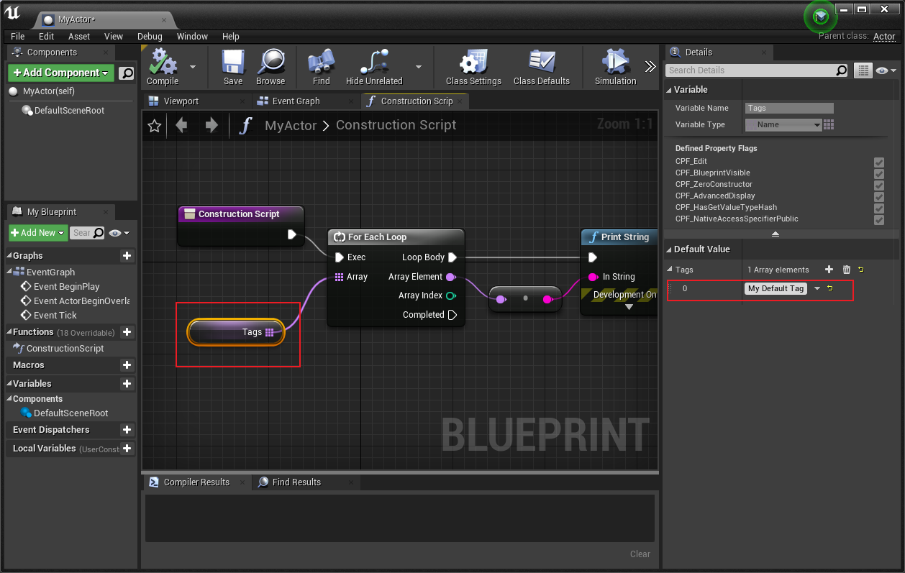

在 UE4 中运行效果：

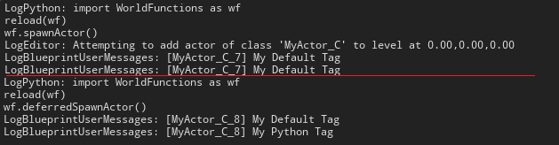

可以看到，使用 unreal.EditorLevelLibrary.spawn_actor_from_class() 时，虽然只创建了一次物体但实例化了两次，而后面的方法只实例化了一次。


## L11 类型转换

&emsp;&emsp;如果使用 Python 进行类型转换，转换不支持的类型时会引起崩溃，可以用 C++ 进行类型转换判断。

PythonHelpers_2.py文件
```python
# coding: utf-8

import unreal

def tryCast():
    # ! this run crash use python
    # if unreal.Actor.cast(unreal.load_asset('/Game/MyAsset/Textures/dear')):   
    if unreal.Texture2D.cast(unreal.load_asset('/Game/MyAsset/Textures/dear')):
        print 'Cast Succeeded'
    else:
        print 'Cast Failed'

def castObject():
    # ! this will not crash user C++
    if cast(unreal.load_asset('/Game/MyAsset/Textures/dear'), unreal.Actor):
        print 'Cast Succeeded'
    else:
        print 'Cast Failed'

def cast(object_to_cast, object_class):
    try:
        return object_class.cast(object_to_cast)
    except:
        return None
```


## L12 获取世界中的指定Actor

&emsp;&emsp;有三种方法筛选Actor：
- 获取选择的Actor：unreal.EditorLevelLibrary.get_selected_level_actors()
- 通过类型获取： unreal.GameplayStatics.get_all_actors_of_class()
- 通过 tag 获取： unreal.GameplayStatics.get_all_actors_of_class()

```python
# coding: utf-8

import unreal

def getSelectedActors():
    # ! Selected
    selected_actors = unreal.EditorLevelLibrary.get_selected_level_actors()
    return selected_actors

def getClassActors(actor_class):
    # ! Class
    world = unreal.EditorLevelLibrary.get_editor_world()
    class_actors = unreal.GameplayStatics.get_all_actors_of_class(world, actor_class)
    return class_actors

def getTagActors(actor_tag):
    # ! Tag
    world = unreal.EditorLevelLibrary.get_editor_world()
    tag_actors = unreal.GameplayStatics.get_all_actors_with_tag(world, actor_tag)
    return tag_actors

def getAllActors():
    # ! All
    world = unreal.EditorLevelLibrary.get_editor_world()
    all_actors = unreal.GameplayStatics.get_all_actors_of_class(world, unreal.Actor)
    return all_actors

def sortActors(use_selection = False, actor_class = None, actor_tag = None):
    """如果有指定，则筛选指定 Actors。否则返回全部 Actors

    """
    # ! return all actors
    if not use_selection and not actor_class and not actor_tag:
        return getAllActors()

    # ! get sort actors
    selected_actors, class_actors, tag_actors = [], [], []
    if use_selection:
        selected_actors = list(getSelectedActors())
    if actor_class:
        class_actors = list(getClassActors(actor_class))
    if actor_tag:
        tag_actors = list(getTagActors(actor_tag))

    final_actors = selected_actors + class_actors + tag_actors
    for actor in final_actors:
        if use_selection and actor in selected_actors:
            pass
        else:
            final_actors.remove(actor)
            continue
        if actor_class and actor in class_actors:
            pass
        else:
            final_actors.remove(actor)
            continue
        if actor_tag and actor in tag_actors:
            pass
        else:
            final_actors.remove(actor)
            continue
    if final_actors:
        return final_actors
    else:
        return getAllActors()


def cast(object_to_cast, object_class):
    try:
        return object_class.cast(object_to_cast)
    except:
        return getAllActors()
```

&emsp;&emsp;写这个的时候，发现获取出来的 Actors 存储都是用的 数组 array，虽然方法有些和列表 List 相同，但是使用起来效果不一样，最终打印结果数组显示和数组内元素显示有差异。

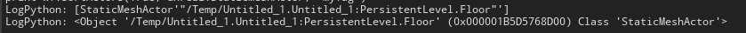


## L13 使用 Qt 进行界面开发
&emsp;&emsp;在 UE 中一样可以使用Qt Designer进行界面开发。
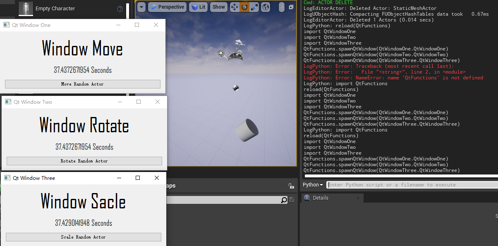

主函数 QtFunctions
```python 
# coding: utf-8

import unreal
import sys
sys.path.append('C:/Python27/Lib/site-packages')

from PySide import QtGui

def __QtAppTick__(delta_seconds):
    for window in opened_windows:
        window.eventTick(delta_seconds)

def __QtAppQuit__():
    unreal.unregister_slate_post_tick_callback(tick_handle)

def __QtWindowClosed__(window=None):
    if window in opened_windows:
        opened_windows.remove(window)

unreal_app = QtGui.QApplication.instance()
if not unreal_app:
    unreal_app = QtGui.QApplication(sys.argv)
    tick_handle = unreal.register_slate_post_tick_callback(__QtAppTick__)
    unreal_app.aboutToQuit.connect(__QtAppQuit__)
    existing_windows = {}
    opened_windows = []

def spawnQtWindow(desired_window_class=None):
    window = existing_windows.get(desired_window_class, None)
    if not window:
        window = desired_window_class()
        existing_windows[desired_window_class] = window
        window.aboutToClose = __QtWindowClosed__
    if window not in opened_windows:
        opened_windows.append(window)
    window.show()
    window.activateWindow()
```

实现位移函数 QtWindowOne
```python
# coding: utf-8

import unreal
import os
import sys
sys.path.append('C:/Python27/Lib/site-packages')

from PySide.QtGui import *
from PySide import QtUiTools

WINDOW_NAME = 'Qt Window One'
UI_FILE_FULLNAME = os.path.join(os.path.dirname(__file__), 'ui', 'window_move.ui').replace('\\','/')

class QtWindowOne(QWidget):
    def __init__(self, parent=None):
        super(QtWindowOne, self).__init__(parent)
        self.aboutToClose = None
        self.widget = QtUiTools.QUiLoader().load(UI_FILE_FULLNAME)
        self.widget.setParent(self)
        self.setWindowTitle(WINDOW_NAME)
        self.setGeometry(100, 100, self.widget.width(),self.widget.height())
        self.initialiseWidget()

    def clossEvent(self, event):  
        if self.aboutToClose:
            self.aboutToClose(self)
        event.accept()

    def eventTick(self, delta_seconds):
        self.myTick(delta_seconds)

    def initialiseWidget(self):
        self.time_while_this_window_is_open = 0.0
        self.random_actor = None
        self.random_actor_is_going_up = True
        self.widget.pushButton.clicked.connect(self.moveRandomActorInScene)

    def moveRandomActorInScene(self):
        import random
        import WorldFunctions_2
        all_actors = WorldFunctions_2.sortActors(use_selection=False, actor_class=unreal.StaticMeshActor, actor_tag=None)
        rand = random.randrange(0, len(all_actors))
        self.random_actor = all_actors[rand]

    def myTick(self, delta_seconds):
        self.time_while_this_window_is_open += delta_seconds
        self.widget.label.setText("{} Seconds".format(self.time_while_this_window_is_open))
        if self.random_actor:
            actor_location = self.random_actor.get_actor_location()
            speed = 300.0 * delta_seconds
            if self.random_actor_is_going_up:
                if actor_location.z > 1000.0:
                    self.random_actor_is_going_up = False
            else:
                speed = -speed
                if actor_location.z < 0.0:
                    self.random_actor_is_going_up = True
            self.random_actor.add_actor_world_offset(unreal.Vector(0.0, 0.0, speed), False, False)
```

实现旋转函数（部分） QtWindowTwo
```python
def myTick(self, delta_seconds):
    self.time_while_this_window_is_open += delta_seconds
    self.widget.label.setText("{} Seconds".format(self.time_while_this_window_is_open))
    if self.random_actor:
        speed = 90.0 * delta_seconds
        self.random_actor.add_actor_world_rotation(unreal.Rotator(0.0, 0.0, speed), False, False)
```

实现缩放函数（部分） QtWindowThree
```python
def myTick(self, delta_seconds):
    self.time_while_this_window_is_open += delta_seconds
    self.widget.label.setText("{} Seconds".format(self.time_while_this_window_is_open))
    if self.random_actor:
        actor_scale = self.random_actor.get_actor_scale3d()
        speed = 3.0 * delta_seconds
        if self.random_actor_is_going_up:
            if actor_scale.z > 2.0:
                self.random_actor_is_going_up = False
        else:
            speed = -speed
            if actor_scale.z < 0.5:
                self.random_actor_is_going_up = True
        self.random_actor.set_actor_scale3d(unreal.Vector(actor_scale.x + speed, actor_scale.y + speed, actor_scale.z + speed))
```

## L14 git 代码
&emsp;&emsp;emmm，学习到这里，才看到作者把代码放到 git 上了。-> [UnrealPythonLibrary](https://github.com/AlexQuevillon/UnrealPythonLibrary)

&emsp;&emsp;不用全部自己手打可以节省更多时间！

&emsp;&emsp;不过有些代码自己还会做一些修改，自己的代码也放到 git上了 -> [UnrealPythonStudy](https://github.com/VannyYuan/UnrealPythonStudy)


## L15 在世界中选择和取消选择物体
获取选择物体：unreal.EditorLevelLibrary.get_selected_level_actors()

设置选择物体：unreal.EditorLevelLibrary.set_selected_level_actors(actors_to_select)

WorldFunctions_3.py文件
```python
# coding: utf-8

import unreal

# return: obj List unreal.Actor : The selected actors in the world
def getSelectedActors():
    return unreal.EditorLevelLibrary.get_selected_level_actors()

# Note: Will always clear the selection before selecting.
# actors_to_select: obj List unreal.Actor : The actors to select.
def selectActors(actors_to_select=[]):
    unreal.EditorLevelLibrary.set_selected_level_actors(actors_to_select)

def selectActors_EXAMPLE():
    import WorldFunctions_2
    all_actors = WorldFunctions_2.sortActors()
    actors_to_select = []
    for x in range(len(all_actors)):
        if x % 2:
            actors_to_select.append(all_actors[x])
    selectActors(actors_to_select)

def clearActorSelection_EXAMPLE():
    selectActors()
```

## L16 在视口中聚焦物体
&emsp;&emsp;可以实现在全部/活跃视口中聚焦指定物体。

EditorFunction_3.py文件
```python
# coding: utf-8
import unreal
import random

# active_viewport_only: bool : If True, will only affect the active viewport
# actor: obj unreal.Actor : The actor you want to snap to
def focusViewportOnActor(active_viewport_only=True, actor=None):
    # ! focus command
    command = 'CAMERA ALIGN'
    if active_viewport_only:
        command += ' ACTIVEVIEWPORTONLY'
    if actor:
        command += ' NAME=' + actor.get_name()
    unreal.CppLib.execute_console_command(command)

def focusAllViewportsOnSelectedActors_EXAMPLE():
    focusViewportOnActor(False)

def focusActiveViewportOnRandomActor_EXAMPLE():
    actors_in_world = unreal.GameplayStatics.get_all_actors_of_class(unreal.EditorLevelLibrary.get_editor_world(), unreal.Actor)
    random_actor_in_world = actors_in_world[random.randrange(len(actors_in_world))]
    focusViewportOnActor(True, random_actor_in_world)
```

## L17 移动、旋转视口

&emsp;&emsp;结合 C++ 和 snapViewport 实现。

C++ .h 文件（部分）
```C++
UFUNCTION(BlueprintCallable, Category = "Unreal Python")
    static void SetViewportLocationAndRotation(int ViewportIndex, FVector Location, FRotator Rotation);

UFUNCTION(BlueprintCallable, Category = "Unreal Python")
    static int GetActiveViewportIndex();
```

C++ .cpp 文件（部分）
```C++
void UCppLib::SetViewportLocationAndRotation(int ViewportIndex, FVector Location, FRotator Rotation) {
    if (GEditor != nullptr && ViewportIndex < GEditor->GetLevelViewportClients().Num()) {
        FLevelEditorViewportClient* LevelViewportClient = GEditor->GetLevelViewportClients()[ViewportIndex];
        if (LevelViewportClient != nullptr) {
            LevelViewportClient->SetViewLocation(Location);
            LevelViewportClient->SetViewRotation(Rotation);
        }
    }
}

int UCppLib::GetActiveViewportIndex() {
    int Index = 1;
    if (GEditor != nullptr && GCurrentLevelEditingViewportClient != nullptr) {
        GEditor->GetLevelViewportClients().Find(GCurrentLevelEditingViewportClient, Index);
    }
    return Index;
}
```

Python EditorFunction_4.py 文件
```python
# coding: utf-8
import unreal
import random

# return: int : The index of the active viewport
def getActiveViewportIndex():
    return unreal.CppLib.get_active_viewport_index()

# viewport_index: int : The index of the viewport you want to affect
# location: obj unreal.Vector : The viewport location
# rotation: obj unreal.Rotator : The viewport rotation
def setViewportLocationAndRotation(viewport_index=1, location=unreal.Vector(), rotation=unreal.Rotator()):
    unreal.CppLib.set_viewport_location_and_rotation(viewport_index, location, rotation)

# viewport_index: int : The index of the viewport you want to affect
# actor: obj unreal.Actor : The actor you want to snap to
def snapViewportToActor(viewport_index=1, actor=None):
    setViewportLocationAndRotation(viewport_index, actor.get_actor_location(), actor.get_actor_rotation())

def setViewportLocationAndRotation_EXAMPLE():
    viewport_index = getActiveViewportIndex()
    setViewportLocationAndRotation(viewport_index, unreal.Vector(0.0, 0.0, 0.0), unreal.Rotator(0.0, 90.0, 0.0))

def snapViewportToActor_EXAMPLE():
    actors_in_world = unreal.GameplayStatics.get_all_actors_of_class(unreal.EditorLevelLibrary.get_editor_world(), unreal.Actor)
    random_actor_in_world = actors_in_world[random.randrange(len(actors_in_world))]
    viewport_index = getActiveViewportIndex()
    snapViewportToActor(viewport_index, random_actor_in_world)
```

## L18 创建 generic 资产

AssetFunction_7.py文件
```python
# coding: utf-8

import unreal


def createGenericAsset(asset_path='', unique_name=True, asset_class=None, asset_factory=None):
    if unique_name:
        asset_path, asset_name = unreal.AssetToolsHelpers.get_asset_tools().create_unique_asset_name(base_package_name=asset_path, suffix='')
    if not unreal.EditorAssetLibrary.does_asset_exist(asset_path=asset_path):
        path = asset_path.rsplit('/', 1)[0]
        name = asset_path.rsplit('/', 1)[1]
        return unreal.AssetToolsHelpers.get_asset_tools().create_asset(asset_name=name, package_path=path, asset_class=asset_class, factory=asset_factory)
    return unreal.load_asset(asset_path)

def createGenericAsset_EXAMPLE():
    base_path = '/Game/MyAsset/GenericAssets/'
    generic_assets = [
        [base_path + 'sequence',        unreal.LevelSequence,  unreal.LevelSequenceFactoryNew()],
        [base_path + 'material',        unreal.Material,       unreal.MaterialFactoryNew()],
        [base_path + 'world',           unreal.World,          unreal.WorldFactory()],
        [base_path + 'particle_system', unreal.ParticleSystem, unreal.ParticleSystemFactoryNew()],
        [base_path + 'paper_flipbook',  unreal.PaperFlipbook,  unreal.PaperFlipbookFactory()],
        [base_path + 'data_table',      unreal.DataTable,      unreal.DataTableFactory()], # Will not work
    ]
    for asset in generic_assets:
        print createGenericAsset(asset[0], True, asset[1], asset[2])
```


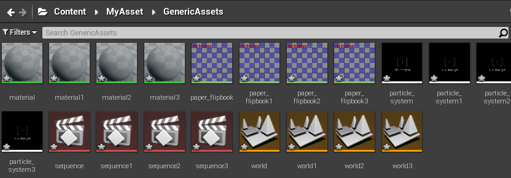


## L19 添加动画序列

pass

## L20 利用 Blueprint 运行Python代码

&emsp;&emsp;原理和利用 Blueprint 运行 cmd 代码相同。

build.cs 加上 "Python", "PythonScriptPlugin"

C++ .h（部分）
```C++
UFUNCTION(BlueprintCallable, Category = "Unreal Python")
    static void ExecutePythonScript(FString PythonScript);
```

C++ .cpp（部分）
```C++
#include "../Plugins/Experimental/PythonScriptPlugin/Source/PythonScriptPlugin/Private/PythonScriptPlugin.h"

void UCppLib::ExecutePythonScript(FString PythonScript) {
    FPythonScriptPlugin::Get()->ExecPythonCommand(*PythonScript);
}
```

蓝图节点
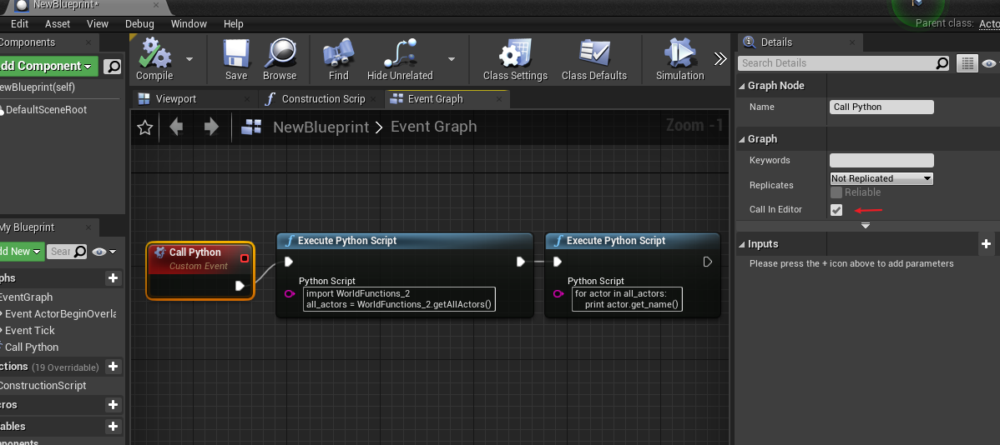

点击事件
