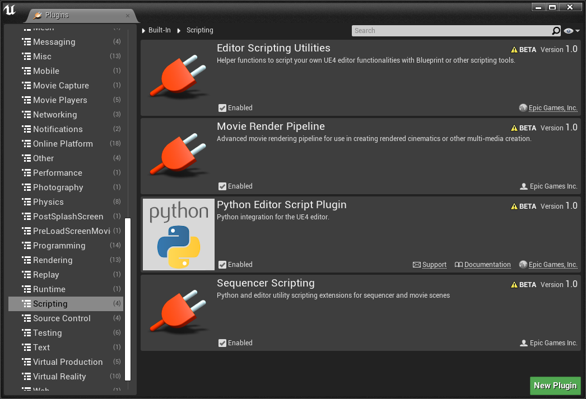
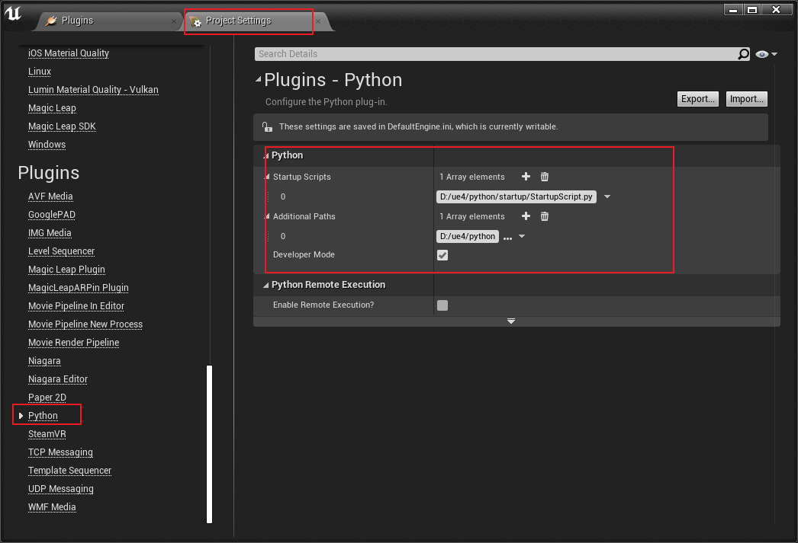
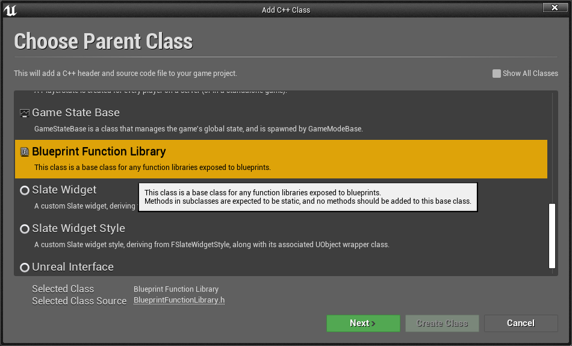
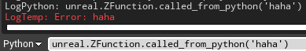

&emsp;&emsp;🛎 在 UE4 中使用 Python 开发入门。

&emsp;&emsp;视频学习链接：[虚幻引擎使用Python开发](https://www.bilibili.com/video/BV1b4411r7kX?p=9)

## L1 在 UE4 中配置 Python
### 加载插件
&emsp;&emsp;从菜单 “Edit - Plugins” 进入插件管理，从左侧列表找到 “Scripting”。勾选 Python Editor Script Plugin 后重启引擎。




### 配置路径
&emsp;&emsp;从菜单 “Edit - Project Settings” 进入项目设置，从左侧列表找到 “Python”。


- Startup Scripts: 指定 UE4 打开时运行的脚本文件。
- Additional Paths: UE4 可以读取到 Python 脚本的路径。

### Unreal Python API
Unreal Python [API 文档](https://docs.unrealengine.com/en-US/PythonAPI/index.html)


## L2 使用 Python 导入资产
### Example1 导入贴图和音频 
AssetFunction_1.py
```python
# coding: utf-8
import os

import unreal

# import AssetFunction_1 as af
# reload(af)
# af.importMyAssets()

asset_folder = 'D:/ue4/test/asset'
texture_jpg = os.path.join(asset_folder, 'dear.jpg').replace('\\','/')
sound_mp3 = os.path.join(asset_folder, 'easy.mp3').replace('\\','/')

def importMyAssets():
    texture_task = bulidImportTask(texture_jpg, '/Game/MyAsset/Textures')
    sound_task = bulidImportTask(sound_mp3, '/Game/MyAsset/Sounds')
    executeImportTasks([texture_task, sound_task])

# ! 设置导入资产属性
def bulidImportTask(filename, destination_path):
    task = unreal.AssetImportTask()
    task.set_editor_property('automated', True)
    task.set_editor_property('destination_name', '')
    task.set_editor_property('destination_path', destination_path)
    task.set_editor_property('filename', filename)
    task.set_editor_property('replace_existing', True)
    task.set_editor_property('save', True)
    return task

def executeImportTasks(tasks):
    unreal.AssetToolsHelpers.get_asset_tools().import_asset_tasks(tasks)
    for task in tasks:
        for path in task.get_editor_property('imported_object_paths'):
            print 'Imported {}'.format(path)
```

### Example2 导入fbx
AssetFunction_2.py
```python
# coding: utf-8
import os

import unreal

# import AssetFunction_2 as af
# reload(af)
# af.importMyAssets()

asset_folder = 'D:/ue4/test/asset'
static_mesh_fbx = os.path.join(asset_folder, 'static_fbx.fbx').replace('\\','/')
skeletal_mesh_fbx = os.path.join(asset_folder, 'skeletal_fbx.fbx').replace('\\','/')

def importMyAssets():
    # ! 静态网格
    static_mesh_task = bulidImportTask(static_mesh_fbx, '/Game/MyAsset/StaticMeshes', buildStaticMeshImportOptions())
    # ! 带骨骼的网格
    skeletal_mesh_task = bulidImportTask(skeletal_mesh_fbx, '/Game/MyAsset/SkeletalMeshes', buildSkeletalMeshImportOptions())
    executeImportTasks([static_mesh_task, skeletal_mesh_task])

def bulidImportTask(filename, destination_path, options=None):
    task = unreal.AssetImportTask()
    task.set_editor_property('automated', True)
    task.set_editor_property('destination_name', '')
    task.set_editor_property('destination_path', destination_path)
    task.set_editor_property('filename', filename)
    task.set_editor_property('replace_existing', True)
    task.set_editor_property('save', True)
    task.set_editor_property('options', options)
    return task

def executeImportTasks(tasks):
    unreal.AssetToolsHelpers.get_asset_tools().import_asset_tasks(tasks)
    for task in tasks:
        for path in task.get_editor_property('imported_object_paths'):
            print 'Imported {}'.format(path)

def buildStaticMeshImportOptions():
    options = unreal.FbxImportUI()
    # unreal.FbxImportUI
    options.set_editor_property('import_mesh', True)
    options.set_editor_property('import_textures', False)
    options.set_editor_property('import_materials', True)
    options.set_editor_property('import_as_skeletal', False) # Static Mesh
    # unreal.FbxMeshImportData
    options.static_mesh_import_data.set_editor_property('import_translation', unreal.Vector(50.0, 0.0, 0.0))
    options.static_mesh_import_data.set_editor_property('import_rotation', unreal.Rotator(0.0, 110.0, 0.0))
    options.static_mesh_import_data.set_editor_property('import_uniform_scale', 1.0)
    # unreal.FbxStaticMeshImportData
    options.static_mesh_import_data.set_editor_property('combine_meshes', True)
    options.static_mesh_import_data.set_editor_property('generate_lightmap_u_vs', True)
    options.static_mesh_import_data.set_editor_property('auto_generate_collision', True)
    return options

def buildSkeletalMeshImportOptions():
    options = unreal.FbxImportUI()
    # unreal.FbxImportUI
    options.set_editor_property('import_mesh', True)
    options.set_editor_property('import_textures', True)
    options.set_editor_property('import_materials', True)
    options.set_editor_property('import_as_skeletal', True) # Skeletal Mesh
    # unreal.FbxMeshImportData
    options.skeletal_mesh_import_data.set_editor_property('import_translation', unreal.Vector(0.0, 0.0, 0.0))
    options.skeletal_mesh_import_data.set_editor_property('import_rotation', unreal.Rotator(0.0, 0.0, 0.0))
    options.skeletal_mesh_import_data.set_editor_property('import_uniform_scale', 1.0)
    # unreal.FbxSkeletalMeshImportData
    options.skeletal_mesh_import_data.set_editor_property('import_morph_targets', True)
    options.skeletal_mesh_import_data.set_editor_property('update_skeleton_reference_pose', False)
    return options
```

### Example3 创建、复制、删除、重命名资产和文件夹
AssetFunction_3.py
```python
# coding: utf-8
import os

import unreal

# import AssetFunction_3 as af
# reload(af)
# af.createDirectory()

# ! 创建文件夹 ~/MyNewDirectory
def createDirectory():
    unreal.EditorAssetLibrary.make_directory('/Game/MyAsset/MyNewDirectory')

# ! 复制文件夹 ~/MyNewDirectory -> ~/MyNewDirectory_Duplicated
def duplicateDirectory():
    return unreal.EditorAssetLibrary.duplicate_directory('/Game/MyAsset/MyNewDirectory', '/Game/MyAsset/MyNewDirectory_Duplicated')

# ! 删除文件夹 ~/MyNewDirectory
def deleteDirectory():
    unreal.EditorAssetLibrary.delete_directory('/Game/MyAsset/MyNewDirectory')

# ! 重命名文件夹 ~/MyNewDirectory_Duplicated -> ~/MyNewDirectory_Renamed
def renameDirectory():
    return unreal.EditorAssetLibrary.rename_directory('/Game/MyAsset/MyNewDirectory_Duplicated', '/Game/MyAsset/MyNewDirectory_Renamed')

# ! 复制资产 ~/dear -> ~/dear_Duplicated
def duplicateAsset():
    return unreal.EditorAssetLibrary.duplicate_asset('/Game/MyAsset/Textures/dear', '/Game/MyAsset/Textures/dear_Duplicated')

# ! 删除资产 ~/dear
def deleteAsset():
    unreal.EditorAssetLibrary.delete_asset('/Game/MyAsset/Textures/dear')

# ! 判断资产是否存在
def assetExist():
    print unreal.EditorAssetLibrary.does_asset_exist('/Game/MyAsset/Textures/dear')
    print unreal.EditorAssetLibrary.does_asset_exist('/Game/MyAsset/Textures/dear_Duplicated')

# ! 重命名资产 ~/dear_Duplicated -> ~/dear_Renamed
def renameAsset():
    unreal.EditorAssetLibrary.rename_asset('/Game/MyAsset/Textures/dear_Duplicated', '/Game/MyAsset/Textures/dear_Renamed')

# ! 显示复制资产提示框 ~/dear_Renamed -> ~/dear_Duplicated
def duplicateAssetDialog(show_dialog=True):
    if show_dialog:
        unreal.AssetToolsHelpers.get_asset_tools().duplicate_asset_with_dialog('dear_Duplicated', '/Game/MyAsset/Textures', unreal.load_asset('/Game/MyAsset/Textures/dear_Renamed'))
    else:
        unreal.AssetToolsHelpers.get_asset_tools().duplicate_asset('dear_Duplicated', '/Game/MyAsset/Textures', unreal.load_asset('/Game/MyAsset/Textures/dear_Renamed'))

# ! 显示重命名提示框 
# ! ~/dear_Renamed -> ~/dear_Renamed_2
# ! ~/dear_Duplicated -> ~/dear_Duplicated_Renamed
def renameAssetDialog(show_dialog=True):
    first_renmae_data = unreal.AssetRenameData(unreal.load_asset('/Game/MyAsset/Textures/dear_Renamed'), '/Game/MyAsset/Textures', 'dear_Renamed_2')
    second_rename_data = unreal.AssetRenameData(unreal.load_asset('/Game/MyAsset/Textures/dear_Duplicated'), '/Game/MyAsset/Textures', 'dear_Duplicated_Renamed')
    if show_dialog:
        unreal.AssetToolsHelpers.get_asset_tools().rename_assets_with_dialog([first_renmae_data, second_rename_data])
    else:
        unreal.AssetToolsHelpers.get_asset_tools().rename_assets([first_renmae_data, second_rename_data])
```

## L3 使用 Python 调用 C++ 函数
&emsp;&emsp;可以通过公开蓝图类的方式使 Python 可以访问 C++ 的函数。
### 创建蓝图C++类
1. 首先，创建一个继承蓝图函数库的C++类，命名为“ ZFunction ”，创建成功后会自动打开 Visual Studio。  

2. 修改 .h 文件  
    ```C++
    // Fill out your copyright notice in the Description page of Project Settings.

    #pragma once

    #include "CoreMinimal.h"
    #include "Kismet/BlueprintFunctionLibrary.h"
    #include "ZFunction.generated.h"

    /**
    * 
    */
    UCLASS()
    class SCRIPT_PROJ_API UZFunction : public UBlueprintFunctionLibrary
    {
        GENERATED_BODY()

    public:
        UFUNCTION(BlueprintCallable)
            static void CalledFromPython(FString InputString);
    };
    ```
3. 修改 .cpp 文件  
    ```C++
    // Fill out your copyright notice in the Description page of Project Settings.


    #include "ZFunction.h"

    void UZFunction::CalledFromPython(FString InputString) {
        UE_LOG(LogTemp, Error, TEXT("%s"), *InputString);
    }
    ```
### 遍历函数和类
&emsp;&emsp;查看 UE4 中所有函数和类：
```python
for x in sorted(dir(unreal)):
	print x
```
&emsp;&emsp;查看类中所含方法，可以看到我们创建的 'called_from_python' 方法在其中。
```python
for x in sorted(dir(unreal.ZFunction)):
	print x
```

### 调用 C++ 方法
```python
unreal.ZFunction.called_from_python('haha')
```



