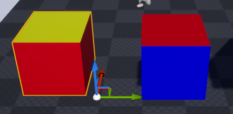
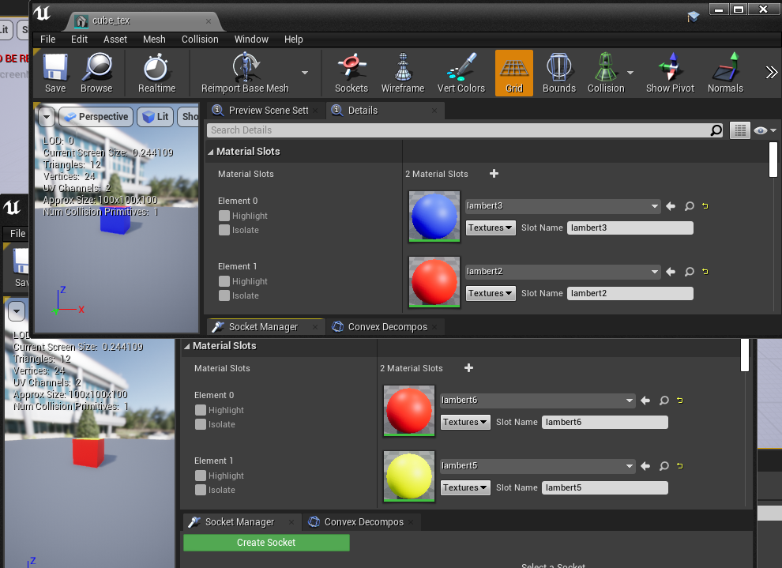
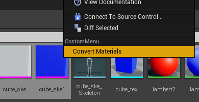
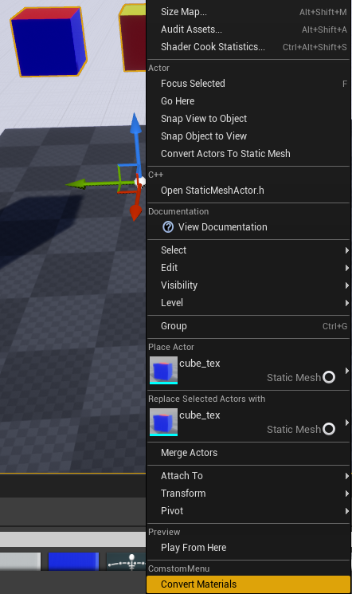
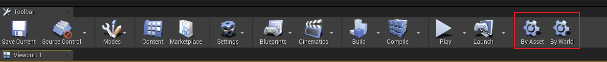
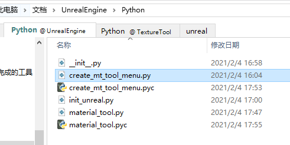

&emsp;&emsp;在学习了 UnrealPython 基础教程后，尝试开发了一下小功能：把 A 物体的材质一一对应赋给 B 物体。



&emsp;&emsp;UE4 里面不能对物体选面上材质，一些对物体的操作只能从其他三维软件中进行。在 UE4 中，会把物体的材质信息记录在一个属性当中，对于两个材质分组一致的物体，可以通过替换材质球达到显示一致的效果。




&emsp;&emsp;同时，如果两个物体的材质球数量不一样的话，会对多出来的进行忽略，序号一致的进行一一对应。

---

## 功能实现
material_tool.py
```python
# coding: utf-8

import unreal

def get_component(actor):
    if actor.static_class() == unreal.StaticMeshActor.static_class():
        return actor.static_mesh_component
    elif actor.static_class() == unreal.SkeletalMeshActor.static_class():
        return actor.skeletal_mesh_component
    else:
        print ("Error: unacceptable type: {}, {}".format(actor.name(), actor.static_class()))
        return None

def world_actor_function():
    selected_actors = unreal.EditorLevelLibrary.get_selected_level_actors()
    if len(selected_actors) < 2:
        print ("please select more than two objects")
        return
    ori_actor = selected_actors[0]
    des_actors = selected_actors[1:]

    ori_component = get_component(ori_actor)
    if not ori_component:
        return
    ori_materials_num = len(ori_component.get_materials())
    for des_actor in des_actors:
        des_component = get_component(des_actor)
        if not des_component:
            continue
        for index in range(ori_materials_num):
            index_material = ori_component.get_material(index)
            des_component.set_material(index, index_material)

def asset_function():
    selected_assets = unreal.EditorUtilityLibrary().get_selected_assets()
    if len(selected_assets) < 2:
        print( "please select more than two objects")
        return
    ori_asset = selected_assets[0]
    des_assets = selected_assets[1:]

    if ori_asset.static_class() == unreal.SkeletalMesh.static_class():
        ori_mat = ori_asset.get_editor_property('materials')
        for des_asset in des_assets:
            des_mat = des_asset.get_editor_property('materials')
            if len(ori_mat) > len(des_mat):
                mat = ori_mat[:len(des_mat)]
            elif len(ori_mat) < len(des_mat):
                mat = des_mat
                for i in range(len(ori_mat)):
                    mat[i] = ori_mat[i]
            else:
                mat = ori_mat
            des_asset.set_editor_property('materials', mat)

    elif ori_asset.static_class() == unreal.StaticMesh.static_class():
        ori_materials_num = 0
        loop = True
        interface_list = []
        while loop:
            material = ori_asset.get_material(ori_materials_num)
            if material:
                interface_list.append(material)
                ori_materials_num = ori_materials_num + 1
            else:
                loop = False

        for des_asset in des_assets:
            for index in range(ori_materials_num):
                index_material = ori_asset.get_material(index)
                des_asset.set_material(index, index_material)
    else:
        print ("Error: unacceptable type: {}, {}".format(ori_asset, ori_asset.static_class()))

def main(asset=True):
    if asset:
        # edit asset
        asset_function()
    else:
        # edit world actor
        world_actor_function()
```

注：
1. 可以转化资产材质，也可以转化世界中物体的材质。
2. 当选择物体类型不一致（StaticMesh / SkeletonMesh）时，在转换资产材质时会出错。
3. 可以实现一赋多，一套材质赋给多个物体。

---
## 创建快捷菜单
create_mt_tool_menu.py
```python
# coding: utf-8

import unreal

menus = unreal.ToolMenus.get()

# add contextbrowser menu
menu_name = "ContentBrowser.AssetContextMenu"
menu = menus.find_menu(menu_name)
entry = unreal.ToolMenuEntry(type=unreal.MultiBlockType.MENU_ENTRY)
entry.set_label("Convert Materials")
# NOTE 注册执行的命令
typ = unreal.ToolMenuStringCommandType.PYTHON
run_str = "import material_tool; material_tool.main()"
entry.set_string_command(typ, "", run_str)

menu.add_section('CustomControl', label='CustomMenu')
menu.add_menu_entry('CustomControl',entry)

# add viewport right clicked menu
viewport_menu_name = "LevelEditor.ActorContextMenu"
menu = menus.find_menu(viewport_menu_name)
entry = unreal.ToolMenuEntry(type=unreal.MultiBlockType.MENU_ENTRY)
entry.set_label("Convert Materials")
typ = unreal.ToolMenuStringCommandType.PYTHON
run_str = "import material_tool; material_tool.main(False)"
entry.set_string_command(typ, "", run_str)

menu.add_section('CustomControl', label='ComstomMenu')
menu.add_menu_entry('CustomControl',entry)

# add toolbar menu
toolbar_menu_name = "LevelEditor.LevelEditorToolBar"
menu = menus.find_menu(toolbar_menu_name)
menu.add_section('CustomControl', label='Convert Materials')
typ = unreal.ToolMenuStringCommandType.PYTHON

entry = unreal.ToolMenuEntry(type=unreal.MultiBlockType.TOOL_BAR_BUTTON)
entry.set_label("By Asset")
run_str = "import material_tool; material_tool.main()"
entry.set_string_command(typ, "", run_str)
menu.add_menu_entry('CustomControl',entry)

entry = unreal.ToolMenuEntry(type=unreal.MultiBlockType.TOOL_BAR_BUTTON)
entry.set_label("By World")
run_str = "import material_tool; material_tool.main(False)"
entry.set_string_command(typ, "", run_str)
menu.add_menu_entry('CustomControl',entry)


# add it to show the button
menus.refresh_all_widgets()
```

可以选择资产右键、或选择世界中物体右键、或在工具架上点击使用。








## 配置插件
&emsp;&emsp;一开始我是用 Startup Scripts 进行配置的，但是这种方式配置假如新建了项目，每次都要重新指定脚本路径，非常麻烦。

&emsp;&emsp;后来跟智伤帝探讨后发现可以像 Maya UserSetup 一样配置一个启动时自动运行的文件。创建一个名为 "init_unreal.py" 的文件，放置于我的文档 “Documents\UnrealEngine\Python” 文件夹中，Unreal 启动时就会自动读取该文件。

init_unreal.py
```python
import create_mt_tool_menu
```

&emsp;&emsp;为了方便，我直接把这几个文件也放进“Documents\UnrealEngine\Python” 文件夹。



&emsp;&emsp;这样，只需要在创建新项目时加载 Python 插件，重启引擎后就可以在菜单上看到配置好的工具了。

&emsp;&emsp;能不能让引擎在创建新项目的时候自动加载 Python 插件呢（以尽量减少操作为目的）？答案是可以的，智伤帝给出了修改启动 bat 的方式，这种方式以后再研究使用吧，暂时是用不上了。

&emsp;&emsp;至于加载 Python，项目只要加载过一次，下次就会自动加载了，所以动动手指也没有特别麻烦啦~

